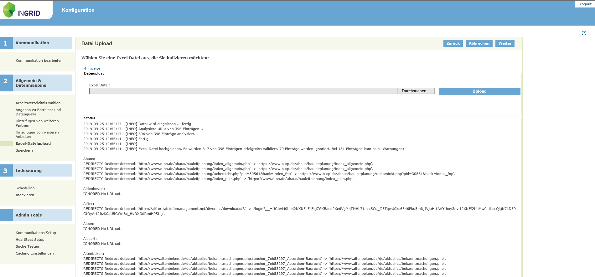
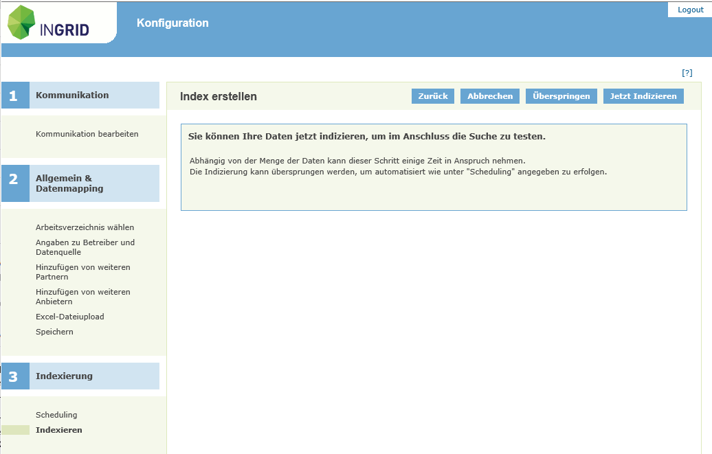

Upload von BLP-Daten
=====================

UVP-Testsystem: https://test.uvp-verbund.de/iplug-admin-blp-xx
(xx- durch das Kürzel des Bundeslandes ersetzten)

- Der Zugang zu der iPlug Admin GUI ist mit Benutzer " ... " und dem kommunizierten Passwort geschützt.
- In der Anmeldemaske bitte mit Name " ... ", Passwort " ... " anmelden.

**Upload der BLP-Excel Datei**

1. Menüpunkt "Excel Datei Upload" auswählen
2. Über die Schaltfläche "Durchsuchen" zur Excel-Datei navigieren
3. Schaltfläche "Upload" aktivieren

*Die BLP Einträge im Excelfile werden im Nachgang analysiert. Bitte warten bis die Analyse fertig ist!
Es wird ein Protokoll ausgegeben in dem evtl. auftretende Probleme angezeigt werden (z.B. nicht erreichbare URLs, fehlende Daten oder ähnliches). Bitte auch die kleine Hilfe unter dem Link "Hinweise" beachten.*

Abb.: Upload BLP-Daten

4. Menüpunkt "Indexieren" auswählen
5. Schaltfläche "Jetzt Indexieren" aktivieren

Abb.: Upload BLP-Daten
