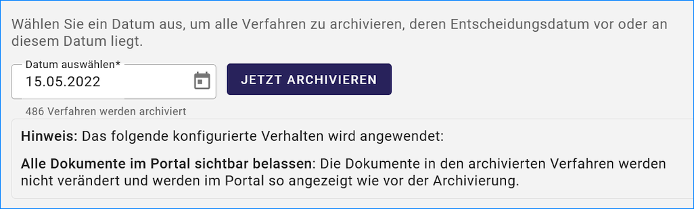
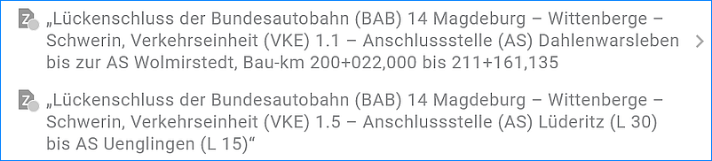
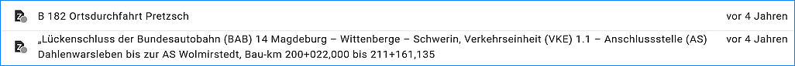

==========================
Archivierung von Verfahren
==========================

.. note:: Mit dem Software-Update im März 2025 wurde eine Archivierungsfunktion für den UVP-Editor eingeführt. Das Archivieren und das Zurückholen von Verfahren aus dem Archiv ist nur dem Katalogadministrator möglich.

Um Verfahren achivieren zu können, müssen durch den Katalogadministrator folgende Einstellung in der Katalogverwaltung vorgenommen werden.

1. Im Abschnitt Datensätze/Archivierung "Datensätze können archiviert werden." einschalten.

  **Optionen**

    | a) **Für Autoren nicht anzeigen**
    | b) **Für Metadaten-Administratoren nicht anzeigen**
    | c) **archivierte Datensätze im Portal anzeigen** 

2. Im Abschnitt UVP/UVP Archivierung muss die Erweiterungen für die Archivierung von UVP-Dokumenten aktiviert werden.

  **Optionen**

    | a) **Alle Dokumente im Portal ausblenden:** Alle Dokumente deren Gültig-Bis Datum nicht bereits in der Vergangenheit liegt, werden auf das gestrige Datum gesetzt und sind nach der Archivierung im Portal nicht mehr sichtbar.

    | b) **Alle Dokumente im Portal sichtbar belassen:** Die Dokumente in den archivierten Verfahren werden nicht verändert und werden im Portal so angezeigt wie vor der Archivierung.

    | c) **Nur Dokumente der Entscheidung sichtbar belassen:** Nur Dokumente aus der Entscheidung, werden weiterhin im Portal angezeigt. Alle anderen Dokumente werden ausgeblendet, indem die Gültigkeit auf das gestrige Datum gesetzt wird, insofern sich das Datum nicht bereits in der Vergangenheit befindet.

3. In der Menüleiste muss "UVP Achivierung" gewählt werden.

Abb.: UVP Archivierung

    Wählen Sie ein Datum aus, um alle Verfahren zu archivieren, deren Entscheidungsdatum vor diesem Datum oder an diesem Datum liegt.

Abb.: Verfahren archivieren - Angabe des Datums
    

.. hint:: Unter „Hinweis: Das folgende konfigurierte Verhalten wird angewendet:” wird die gewählte Konfiguration aus der Katalogeinstellung angezeigt.

Betätigen Sie den Button "JETZT ARCHIVIEREN"

    Es wird angezeigt:

    | Start: tt.mm.yyyy hh:mm:ss
    | Ende: tt.mm.yyyy hh:mm:ss
    | Archivierte Verfahren: xxx

.. important:: Nach der Archivierung ist diese nicht mehr rückgängig zu machen! Es ist jedoch möglich, einzelne Verfahren aus dem Archiv zu holen.

Abb.: Verfahren aus dem Archiv holen

Wenn Verfahren archiviert wurden, dann werden diese mit einem grauen Punkt im Symbol gekennzeichnet. Im Strukturbaum erscheinen die entsprechenden Symbole ausgegraut. Archivierte Verfahren können geändert werden, dazu muss nach der Änderung der Button "IM ARCHIV SPEICHERN" rechts oben betätigt werden.

Abb.: Verfahren archiviert

Abb.: zuletzt bearbeitete archivierte Verfahren

Einzelne Verfahren archivieren

Abb.: Archivierung von Verfahren

Verfahren im Archiv speichern

Abb.: Verfahren im Archiv speichern