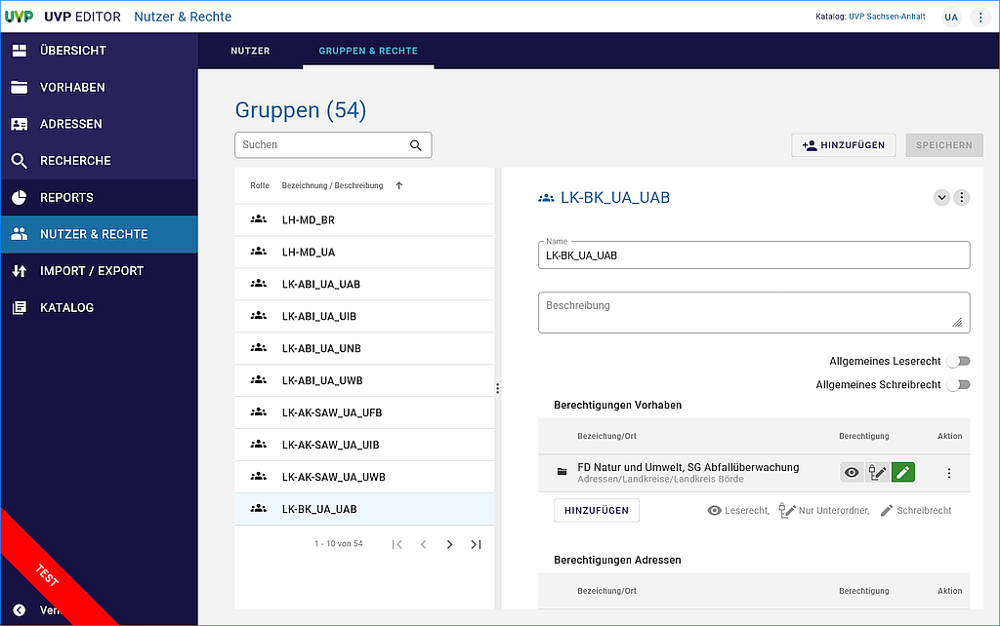

Gruppen & Rechte
=================

In der Gruppenverwaltung werden einen bestimmten Personenkreis die Lese- oder Schreibrechte auf Vorhaben und Adressen erteilt.

Gruppen anlegen
---------------

Abb.: Verwaltung von Gruppen

.. figure:: ../img-ige-ng/nutzerverwaltung/ige-ng_nutzerverwaltung_hinzufuegen.png
   :alt: Eine Gruppe hinzufügen - Schaltfläche HINZUFÜGEN betätigen
   :align: left
   :scale: 80
   :figwidth: 100%

Abb.: Eine Gruppe hinzufügen - Schaltfläche "HINZUFÜGEN" betätigen

Abb.: Fenster für das Anlegen einer Gruppe

Abb.: Vergabe von allgemeinen Rechten - ausgeschaltet

Abb.: Vergabe von allgemeinen Rechten -eingeschaltet

Rechte vergeben
---------------

