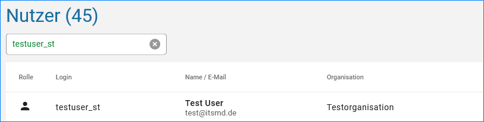
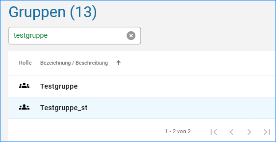

====================
Suche und CSV-Export
====================

Suche
-----

Über die Suche in der Benutzer und Gruppenverwaltung, lassen sich einfach die Benutzer oder angelegten Gruppen finden.
Während der Eigabe des Nutzers oder der Gruppe werden schon die Einträge selektiert.

Abb.: Suche nach einem Benutzer

Abb.: Suche nach einer Gruppe

CSV-Export
----------

Über die CSV-Exportfunktion, hat der Administrator die Möglichkeit die Nutzer als CSV-Datei zu exportieren und in eine Excel-Tabelle zu importieren. Diese Funktion ermöglicht den Katalogadministrator z.B. die E-Mail-Adressen der Nutzer aktuell zu selektieren, wenn die Benutzer angeschrieben werden sollen.

Abb.: Link für den CSV-Export

Abb.: CSV-Export