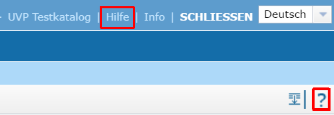
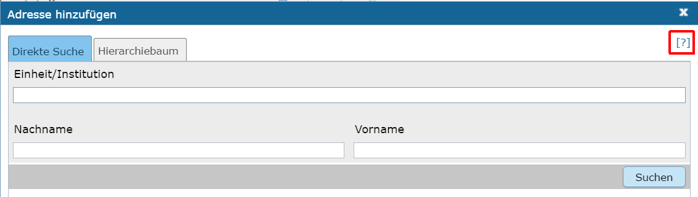
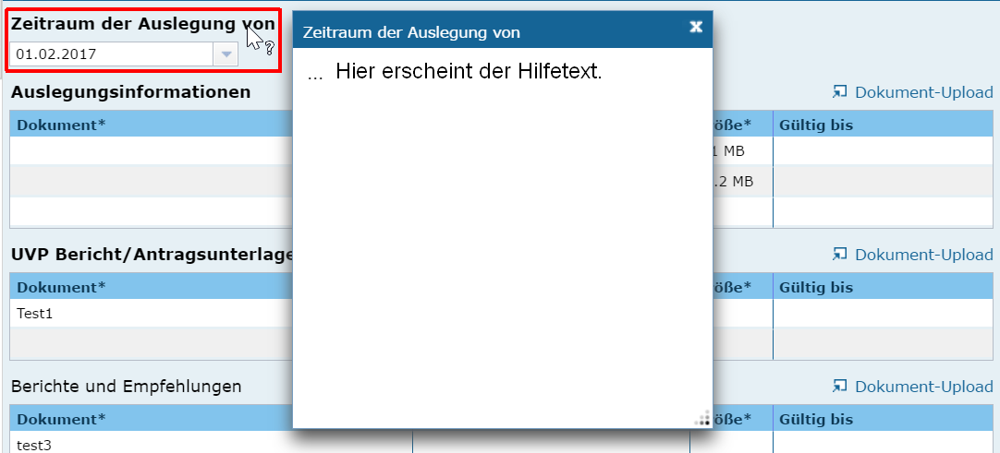

Hilfe für die Erfassung
===========================

Eine allgemeine Hilfe zum InGrid-Editor kann durch einen Klick auf das Fragezeichen-Symbol ganz rechts in der Toolbar oder durch einen Klick auf den Menüpunkt "Hilfe" in der Menüleiste aufgerufen werden. Sie enthält Hinweise und Ratschläge für die Nutzung des Editors.

Abb.: Menü - Hilfe
 
In den Dialogfenstern steht ebenfalls eine Hilfe zur Verfügung. Hinter dem Symbol [?] ist ein Link hinterlegt, über den der Hilfetext aufgerufen werden kann.

Abb.: Dialogfenster - Hilfe
 
Zusätzlich erhalten Sie Hilfe zu der Befüllung einzelner Felder, indem Sie den Mauszeiger über die Überschrift des jeweiligen Feldes ziehen. Er verändert dann seine Form zu einer Kombination aus Zeiger und Fragezeichen. Ein einfacher Klick mit der linken Maustaste öffnet ein Dialogfeld, welches einen Hilfetext zu dem zugehörigen Feld anzeigt. 

Abb.: Fedüberschriften - Hilfe-Dialog