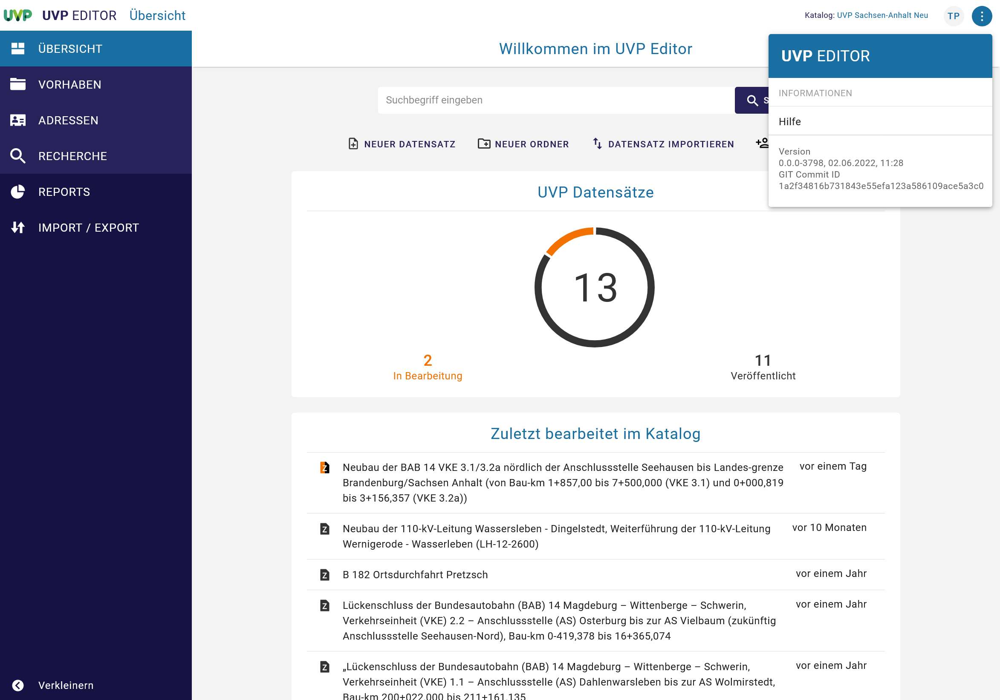
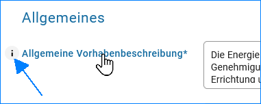

Hilfen für die Erfassung
========================

Die Bedienungsanleitung kann über die Hilfe im UVP-Editor geöffnet werden. Klicken Sie dazu im UVP-Editor oben rechts auf die drei Punkte.

Abb.: Menü - Hilfe

Tipp: *Nutzen sie für Ihre Recherchen in den Bedienungsanleitung auch die vorhandene Suche!* Achten Sie auf Hinweise, Beispiele und Tipps!

Abb.: Bedienungsanleitung - Suche

Eine Hilfe zu einem Eingabefeld kann aufgerufen werden, indem mit dem Mauszeiger über die Feldbezeichnung gefahren wird. Es erscheint links neben der Feldbezeichnung ein i. Wird die Bezeichnung mit der Maus angeklickt, öffnet sich für das jeweilige Eingabefeld ein Fenster mit der Beschreibung.

Abb.: Fedüberschriften mit hinterlegter Beschreibung

Abb.: Hilfe-Dialog zu den Eingabefeldern