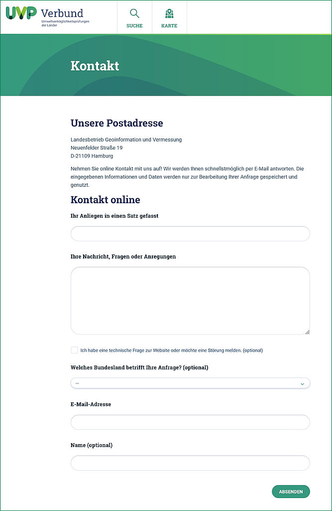

Kontakt
=======

Kontaktformular im UVP-Portal
-----------------------------

Bitte wählen Sie im `Kontaltformular <https://www.uvp-verbund.de/kontakt>`_ Ihr zuständiges Land aus.

Ticketsystem Zammad
-------------------

Hinter dem UVP Portal Kontaktformular verbirgt sich das Ticketsystem Zammad. Dieses ermöglicht, die Anfragen unterschiedlichen Personen zuzuordnen. Dabei greifen unterschiedliche Support-Level.

Support-Level
-------------

- First Level Support
- Second Level Support
- Gruppen in den Bundesländern

**First Level Support**

Der First Level Support wird angesprochen, wenn das Kontaktformular **ohne Angabe eines Bundeslandes und ohne Option Checkbox** "Ich habe eine technische Frage zur Website oder möchte eine Störung melden." versendet wird. Die Nachricht wird so an den **Support im LGV Hamburg** gerichtet. Dieser ist Ansprechpartner für das gesamte System.

**Second Level Support**

Der Second Level Support wird angesprochen, wenn das Kontaktformular **ohne Angabe eines Bundeslandes und mit der Option Checkbox** "Ich habe eine technische Frage zur Website oder möchte eine Störung melden." versendet wird. Die Nachricht wird an die **Software-Entwickler** gerichtet.

**Gruppen in den Bundesländern**

Eine Gruppe eines Bundeslandes wird angesprochen, wenn das Kontaktformular **mit Angabe eines Bundeslandes und ohne Option Checkbox** "Ich habe eine technische Frage zur Website oder möchte eine Störung melden." versendet wird. Die Nachricht wird an den **Katalogadministrator oder einen anderen Ansprechpartner des ausgewählten Bundeslandes** gerichtet.

Abb.: UVP Portal - Ansicht Kontaktformular
