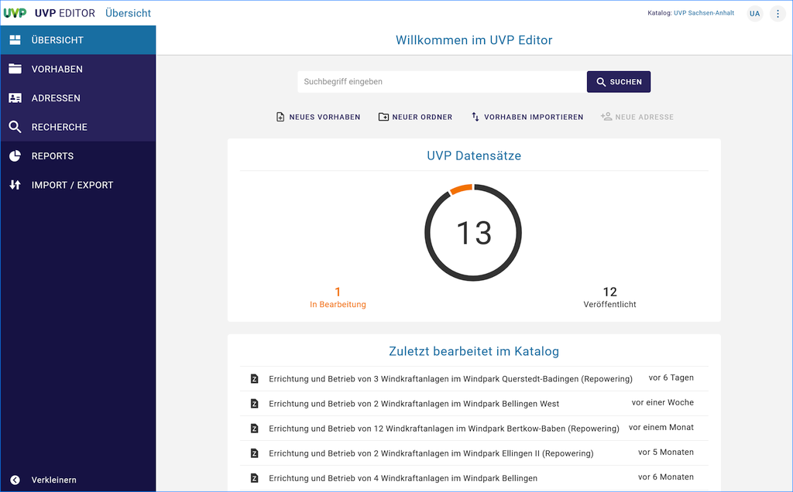

.. figure:: img-ige-ng/portal/logo-mit-tag.svg
   :align: left
   :scale: 40
   :figwidth: 100%

====================
Bedienungsanleitung 
====================
========================================
InGrid Editor - Neue Generation (IGE-NG)
========================================
====================
Profil: UVP-Verbund
====================

Version der Bedienungsanleitung
 - InGrid Editor-Version: 7.0.1, 11.01.2024, 19:09
 - letzte Änderung: 21.03.2023
 - Status: in Bearbeitung
 

   Abb.: UVP Editor - Übersicht

.. toctree::
   :maxdepth: 2
   :caption: Allgemeine Informationen
   
   uvp-editor/ige-ng_registrierung-anmeldung.rst
   uvp-editor/ige-ng_allgemeine-informationen.rst

.. toctree::
   :maxdepth: 3
   :caption: Erfassung von UVP-Vorhaben

   uvp-verfahren/ige-ng_anlegen-von-adressen.rst
   uvp-verfahren/ige-ng_erfassung-von-uvp-vorhaben.rst
   uvp-verfahren/ige-ng_erfassung-von-negativen-vorpruefungen.rst
   uvp-verfahren/ige-ng_adressen-oder-verfahren-bearbeiten.rst

.. toctree::
   :maxdepth: 2
   :caption: Funktionen im UVP-Editor
   
   suche/ige-ng_suche.rst
   reports/ige-ng_reports.rst
   hilfe/ige-ng_hilfe-erfassung.rst
   
.. toctree::
   :maxdepth: 2
   :caption: Funktionen im Portal
   
   portal/portal_startseite.rst
   karte/portal_karte.rst

   
.. toctree::
   :maxdepth: 1
   :caption: Fragen & Antworten 
   
   faq/faq.rst
   hilfe/ige-ng_kontakt.rst
      
.. toctree::
   :maxdepth: 3
   :caption: Administration
   
   benutzerverwaltung/ige-ng_benutzerverwaltung.rst

   
.. toctree::
   :maxdepth: 3
   :caption: Historie (Software)
   
   software/ingrid_historie.rst

