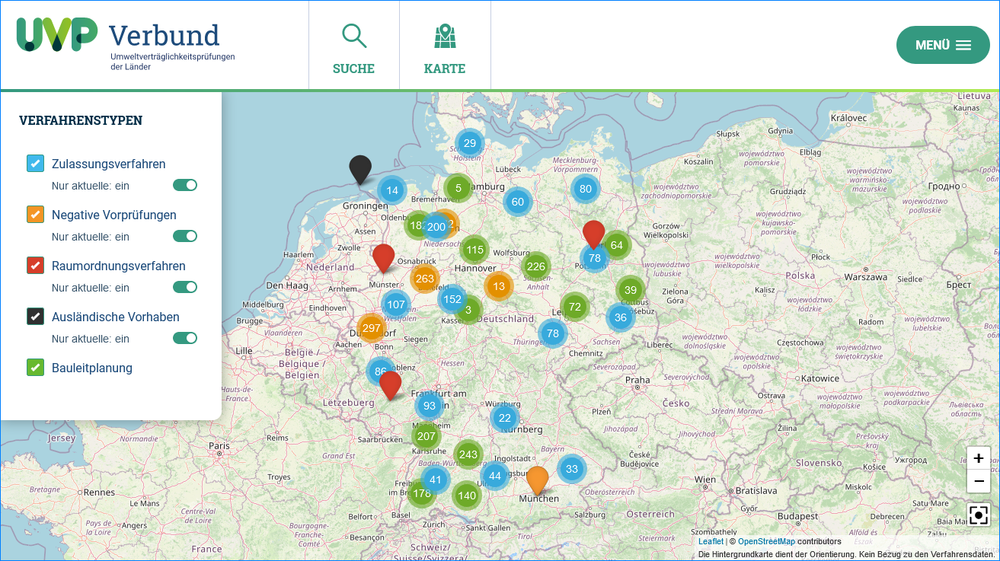
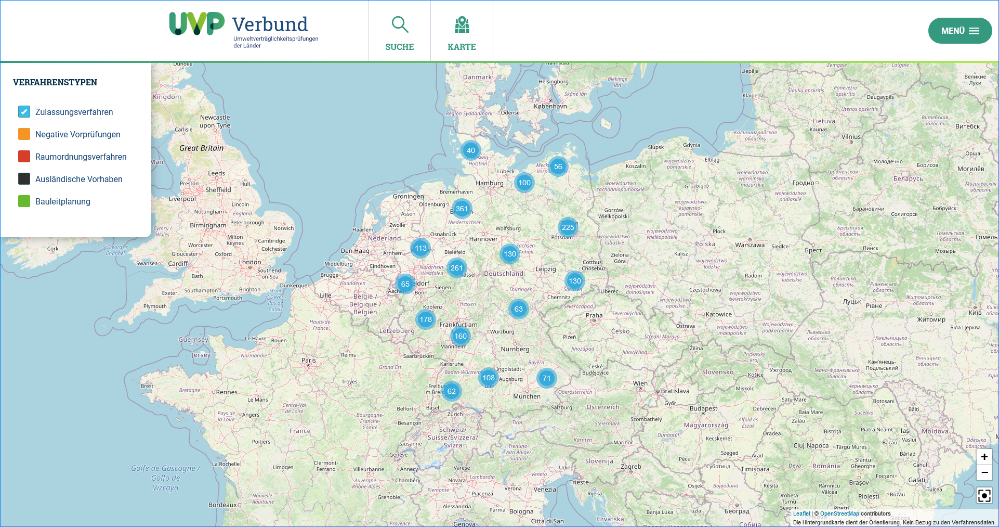
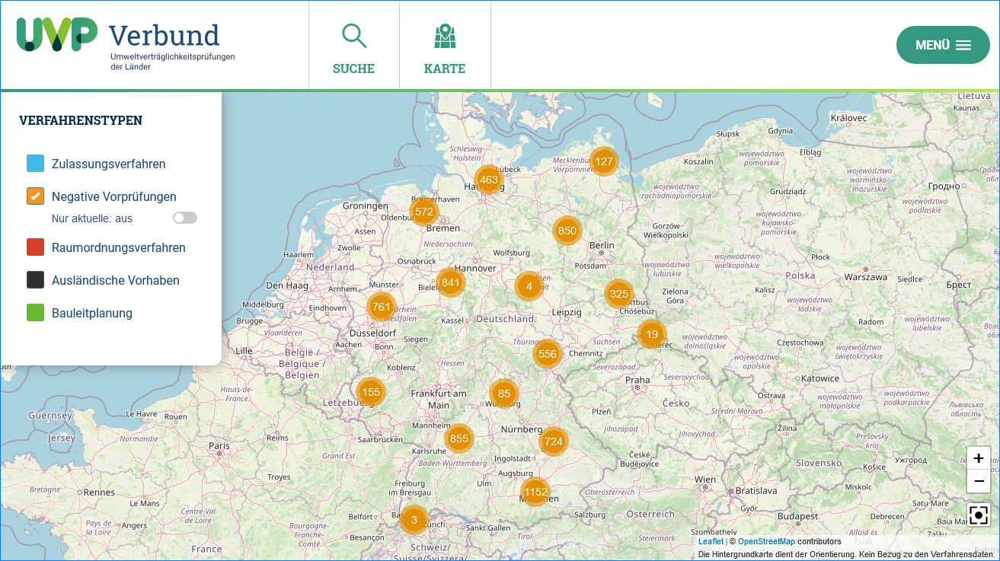
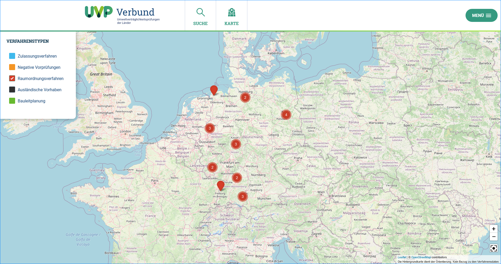
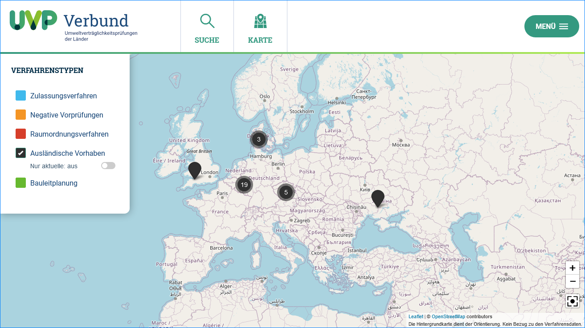
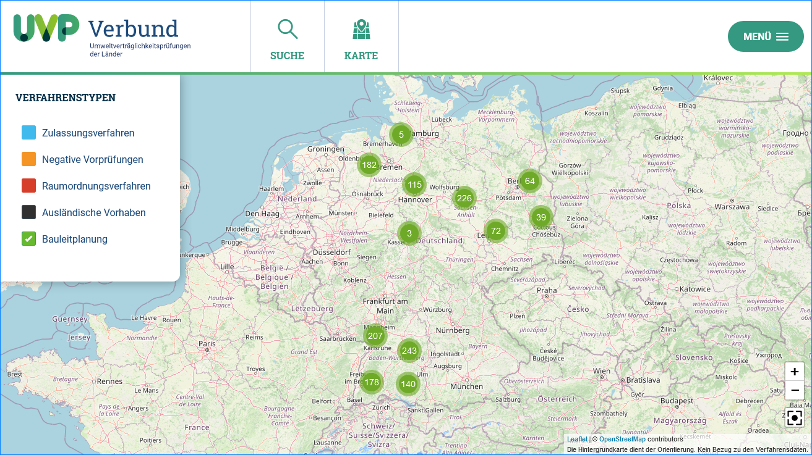

UVP Portal - Karte
==================

Legende: Auswahlschalter "Nur aktuelle: ein/aus"
---------------------------------------

Auf Grund der Vielzahl der erfassten Vorhaben, wurde der Auswahlschalter "Nur aktuelle: ein/aus" eingeführt. Dieser Schalter bietet die Möglichkeit, nur Vorhaben des zurückliegenden letzten Jahres anzuzeigen.

Abb: Auswahlschalter "Nur aktuelle: ein/aus" (Zeitraum: letztes Jahr)

Zulassungsverfahren
-------------------

Abb.: Karte - Layer Zulassungsverfahren

Negative Vorprüfungen
---------------------

Ob ein Bundesland negative Vorprüfungen in der Kartenansicht anzeigt oder nicht, obliegt dem jeweiligen Bundesland. Wenn negative Vorprüfungen dargestellt werden sollen, muss der Katalogadministrator die entsprechende Einstellung in der Katalogverwaltung vornehmen. Wurde die Einstellung vorgenommen, müssen die Autoren den Titel, die Beschreibung, den Raumbezug, das Datum der Entscheidung und das Dokument mit dem Ergebnis der UVP-Vorprüfung erfassen. (Querverweis: `Negative Vorprüfungen erfassen <https://uvp-verbund-bedienungsanleitung.readthedocs.io/de/igeng/uvp-verfahren/ige-ng_erfassung-von-negativen-vorpruefungen.html>`_)

Abb.: Karte - Layer negative Vorprüfungen

Raumordnungsverfahren
---------------------

Abb.: Karte - Layer Raumordnungsverfahren

Ausländische Vorhaben
---------------------

Abb.: Karte - Layer Ausländische Vorhaben

Bauleitplanung
--------------

Im UVP Portal wurden Bauleitplanungsdaten integriert. Die Daten werden über eine Excel-Datei erfasst und in die Suchmaschine übernommen. Im UVP Portal wurden die Bauleitplanungsdaten sowohl in der Kartendarstellung, als auch in der Volltextsuche integriert.

Wenn die Bauleitplanungsdaten eines Bundeslandes in die Kartendarstellung aufgenommen werden sollen, nutzen Sie bitte das `Kontaktformular des UVP-Portals <https://www.uvp-verbund.de/kontakt>`_.

Abb.: Karte - Layer Bauleitplanung
