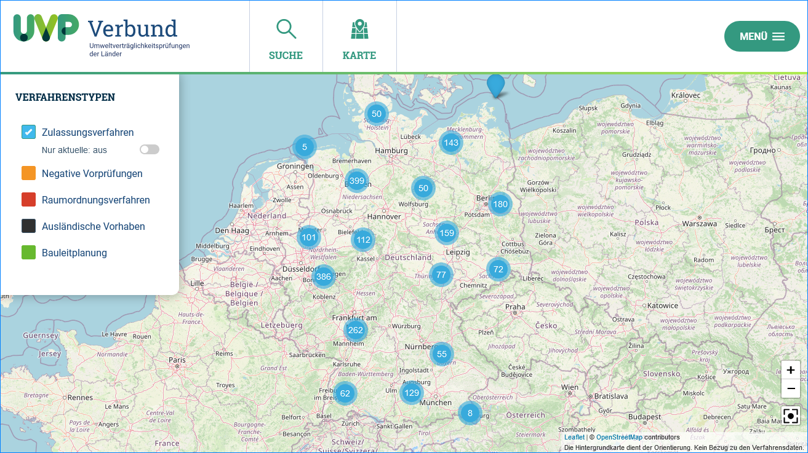
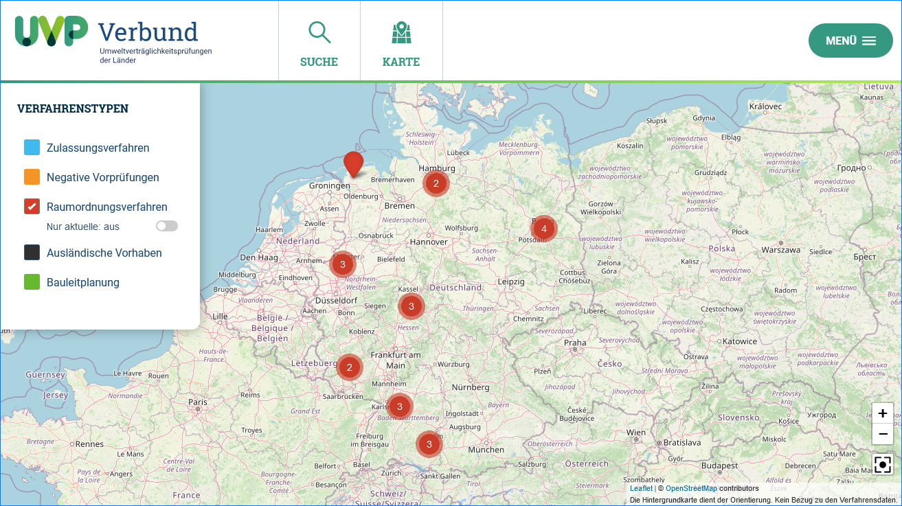

UVP Portal - Karte
==================

Zulassungsverfahren
-------------------

Abb.: Karte - Layer Zulassungsverfahren

Negative Vorprüfungen
---------------------

.. image:: ../img-ige-ng/karte/karte_layer-negative-vorpruefungen.png

Abb.: Karte - Layer Bauleitplanung

Raumordnungsverfahren
---------------------

Abb.: Karte - Layer Bauleitplanung

Ausländische Vorhaben
---------------------

Abb.: Karte - Layer Bauleitplanung

Bauleitplanung
--------------

Im UVP Portal wurden Bauleitplanungsdaten integriert. Die Daten werden über eine Excel-Datei erfasst und in die Suchmaschine übernommen. Im UVP Portal wurden die Bauleitplanungsdaten sowohl in der Kartendarstellung, als auch in der Volltextsuche integriert.

Wenn die Bauleitplanungsdaten eines Bundeslandes in die Kartendarstellung aufgenommen werden sollen, nutzen Sie bitte das Kontaktformular des UVP-Portals. https://www.uvp-verbund.de/kontakt

.. image:: ../img-ige-ng/karte/karte_layer-bauleitplanung.png

Abb.: Karte - Layer Bauleitplanung
