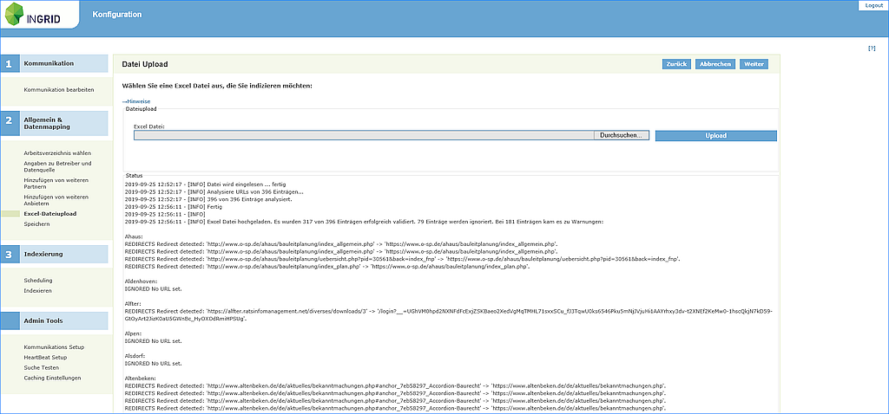
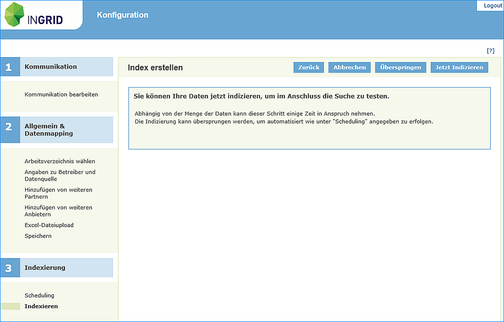
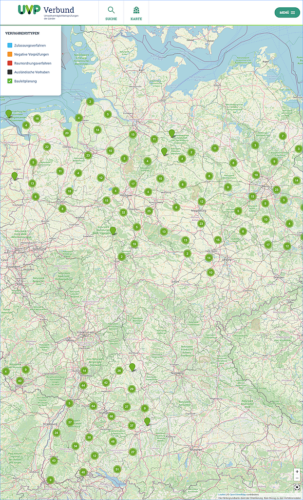

Upload von BLP-Daten
====================

UVP-Testsystem: https://uvp-verbund.de/iplug-admin-blp-xx
(xx- durch das Kürzel des Landes ersetzten)

- Der Zugang zu der iPlug Admin GUI ist mit Benutzer " ... " und dem kommunizierten Passwort geschützt.
- In der Anmeldemaske bitte mit Name " ... " und Passwort " ... " anmelden.

**Upload der BLP-Excel Datei**

1. Menüpunkt "Excel Datei Upload" auswählen
2. Über die Schaltfläche "Durchsuchen" zur Excel-Datei navigieren
3. Schaltfläche "Upload" aktivieren

.. hint:: Die Bebauungsplaneinträge in der Excel-Datei werden später ausgewertet. Bitte warten Sie bis die Analyse abgeschlossen ist!
Es wird ein Protokoll ausgegeben, in dem eventuell aufgetretene Probleme (z.B. nicht erreichbare URLs, fehlende Daten o.ä.) angezeigt werden. Bitte beachten Sie auch die kleine Hilfe unter dem Link "Hinweise".

Abb.: Upload BLP-Daten

4. Menüpunkt "Indexieren" auswählen
5. Schaltfläche "Jetzt Indexieren" aktivieren

Abb.: Upload BLP-Daten

Abb.: Karte mit Layer Bauleitplanung