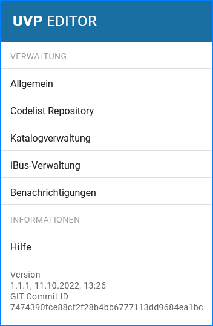
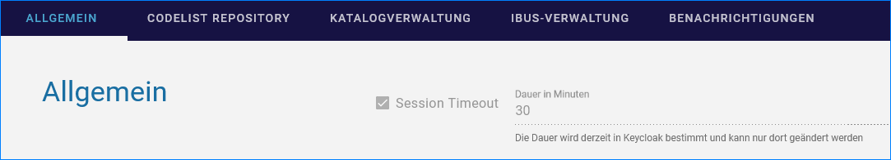
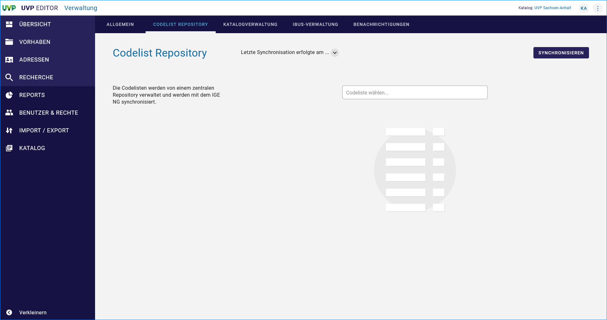
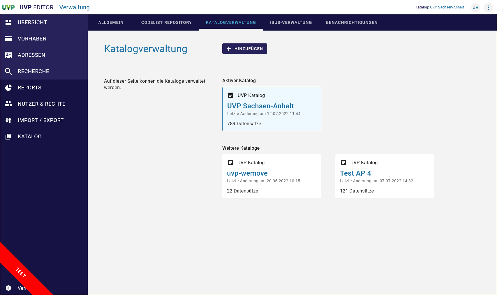
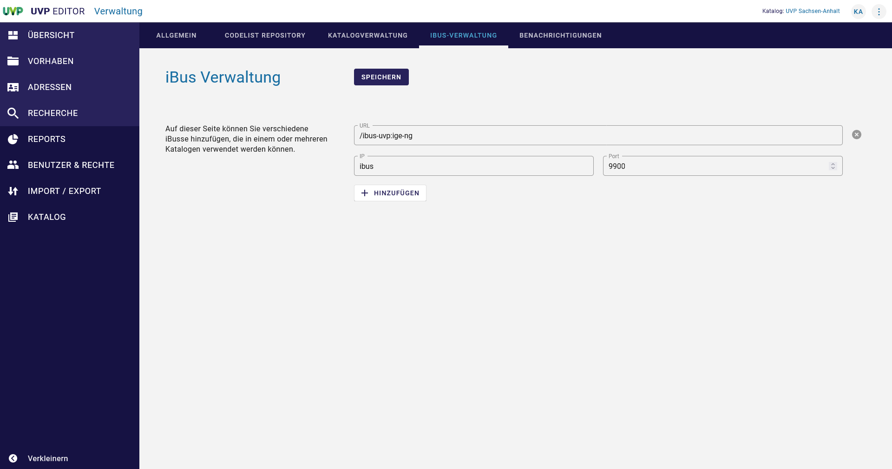
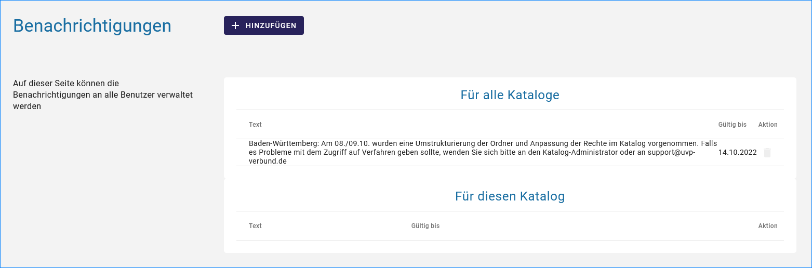
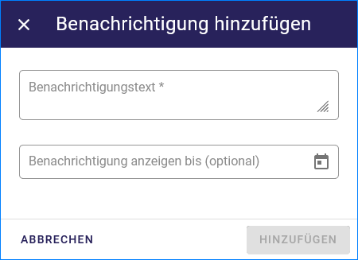
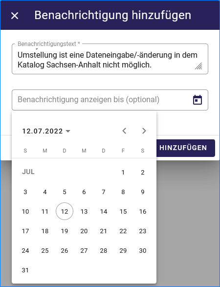
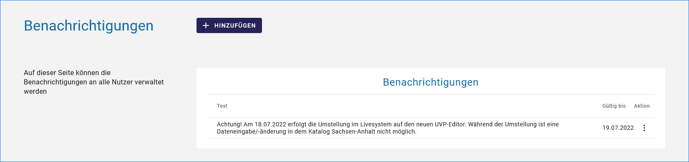
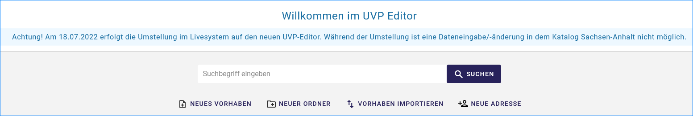

Verwaltung
==========

Abb.: Menü für die Verwaltung

Allgemein
---------

Die Dauer der Session - Timeout wird derzeit in Keycloak bestimmt und kann nur dort geändert werden.

Abb.: Session Timeout in Minuten

Codelist Repository
-------------------

Die Codelisten werden von einem zentralen Depot (Repository) verwaltet und werden mit dem IGE-NG synchronisiert. 

Abb.: Codelist Repository

Katalog-Verwaltung
------------------

Im IGE-NG besteht die Möglichkeit mehrere Kataloge zu verwalten.

Abb.: Katalogverwaltung

iBus-Verwaltung
----------------

Auf dieser Seite können verschiedene iBusse hinzugefügt werden, die in einem oder mehreren Katalogen verwendet werden können. 

Abb.: iBus Verwaltung

Benachrichtigungen
------------------

Der IGE-NG bietet die Möglichkeit die Benutzer im Editor über Ereignisse zu informieren (z.B. neue Felder, neue Features oder Softwareupdates).

Die Entwickler und der Superadministrator haben die Möglichkeit katalogübergreifende Meldungen zu erstellen, diese werden dann in allen Katalogen auf der Übersichtsseite des UVP Editors angezeigt.
Katalogadministratoren können nur Meldungen für den Katalog erstellen, für den sie die Berechtigungen haben.

Abb.: Benachrichtigungen + HINZUFÜGEN

Abb.: Fenster Benachrichtigung hinzufügen

Abb.: Fenster Benachrichtigung hinzufügen mit Kalenderfunktion

Abb.: Benachrichtigungen + HINZUFÜGEN mit Inhalt

Abb.: Benachrichtigung der Benutzer im UVP-Editor