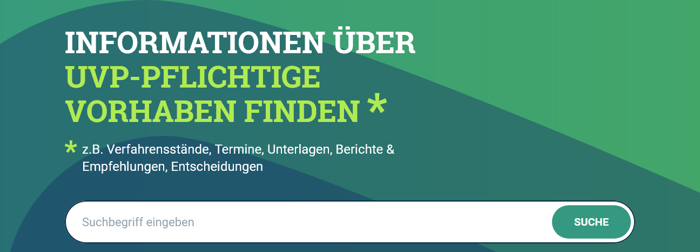
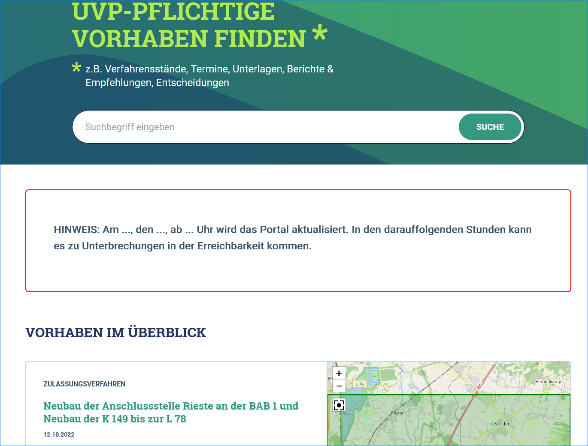
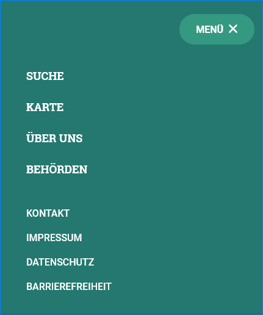
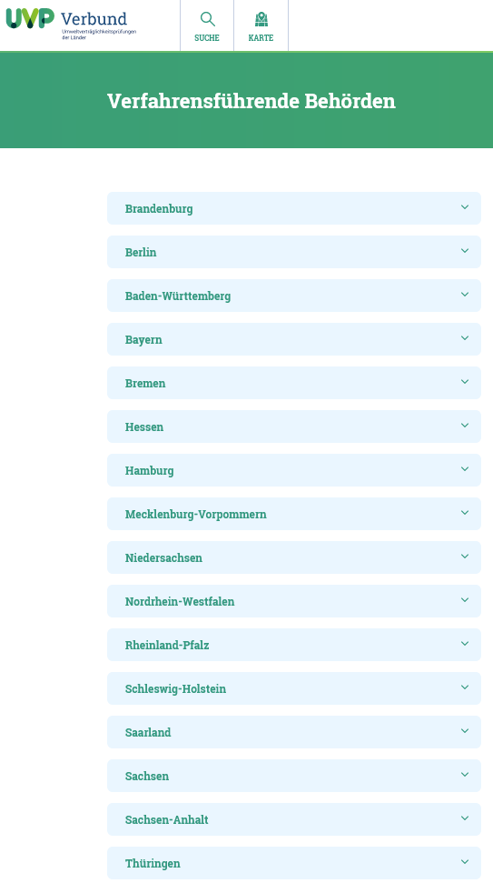
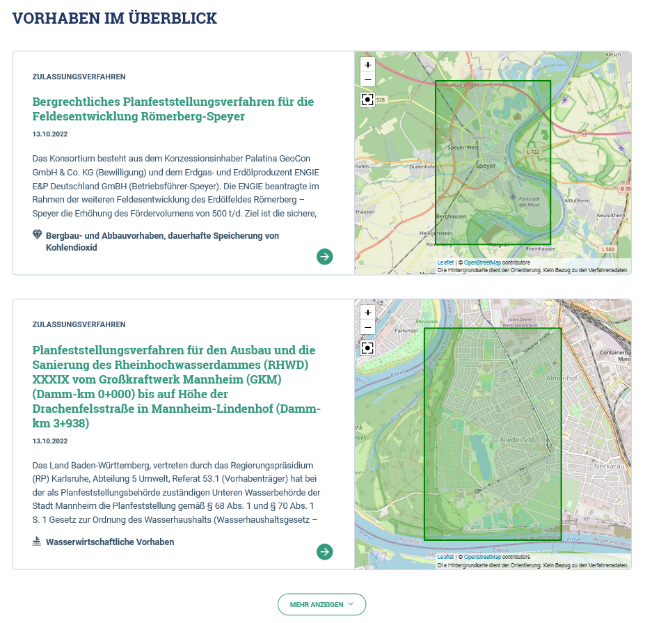
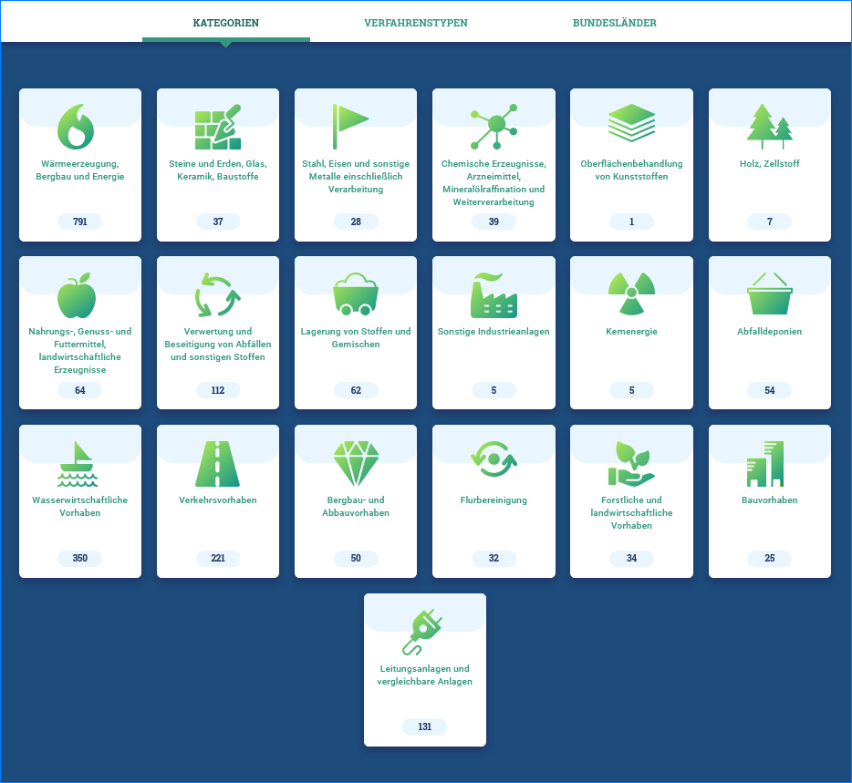
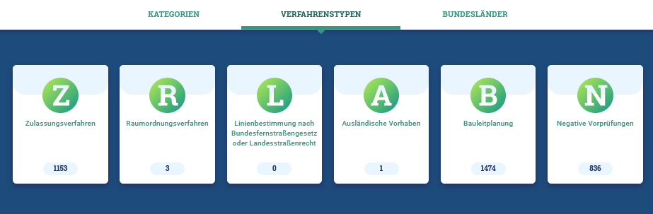
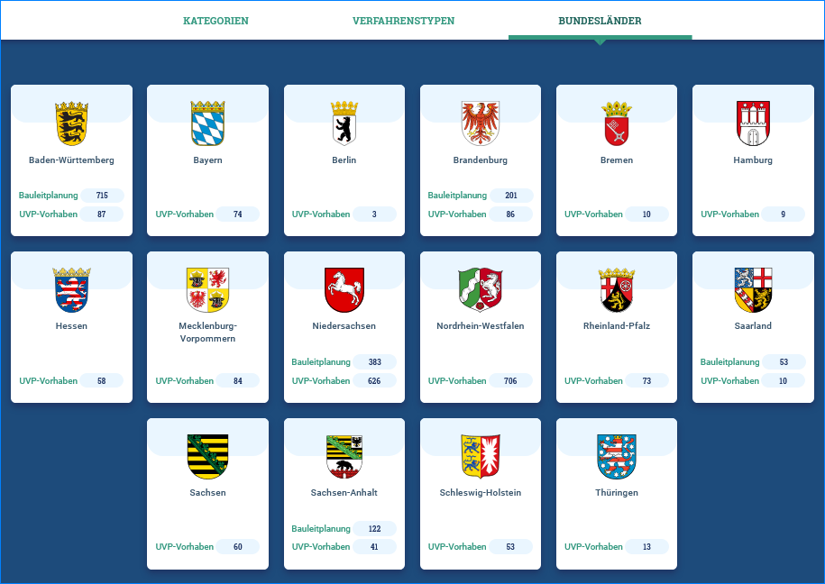

Startseite
==========

Suche
-----

Abb.: Portal - Startseite - Suche

Karte
-----

Über *KARTE* kann die Kartenanwendung im UVP-Portal geöffnet werden.

Abb.: Portal - Startseite - Karte

Ankündigungen
-------------

Auf der Startseite des UVP-Portals haben die Entwickler die Möglichkeit Meldungen anzuzeigen, z.B. dass in Kürze ein neues Update eingespielt wird und dass es zu Unterbrechungen der Erreichbarkeit kommen kann.

Abb.: Portal - Startseite - Ankündigungen

Menüpunkt Behörden
------------------

Über den Menüpunkt *Behörden* kann die Liste der Behörden aufgerufen werden, die Vorhaben in das Portal einstellen können.

Abb.: Portal - Startseite - Menüpunkt Behörden

Abb.: Portal - Startseite - Verfahrensführende Behörden

Vorhaben im Überblick
---------------------

An dieser Stelle werden die aktuellsten Vorhaben angezeigt.

Abb.: Portal - Startseite - Überblick

Kategorien, Verfahrenstypen, Bundesländer
-----------------------------------------

Über die Navigationspunkte *KATEGORIEN, VERFAHRENSTYPEN und BUNDESLÄNDER* können unterschiedliche Einstiegspunkte für die Recherche nach Vorhaben gewählt werden. 

Abb.: Portal - Startseite - Auswahl - Kategorien

Abb.: Portal - Startseite - Auswahl - Verfahrenstypen

Abb.: Portal - Startseite - Auswahl - Bundesländer

Informationen
-------------

Im Abschnitt Informationen wird über den Zweck der Umweltverträglichkeitsprüfung informiert und wie die Bürger am Entscheidungsprozess beteiligt werden. Am Ende des vollständigen Informationstextes befinden sich weiterführende Links zum Thema Umweltverträglichkeitsprüfung.

.. image:: ../img-ige-ng/portal/portal_informationen.png

Abb.: Portal - Startseite - Informationen