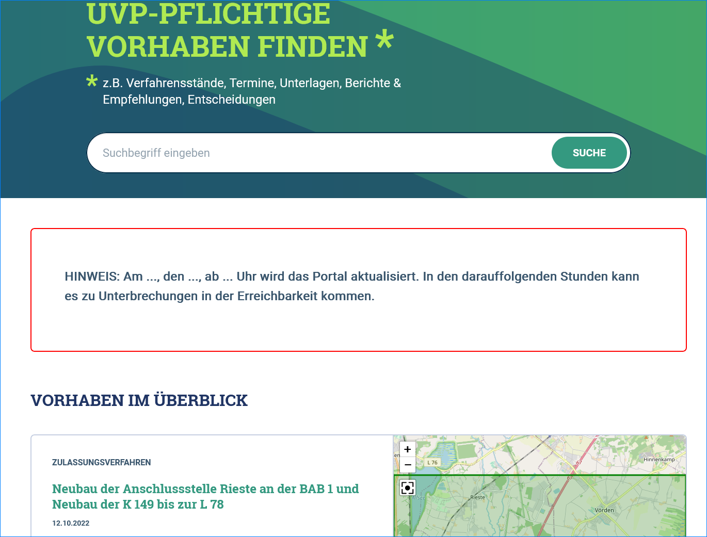
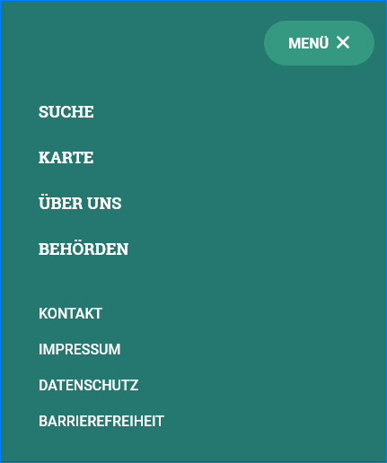
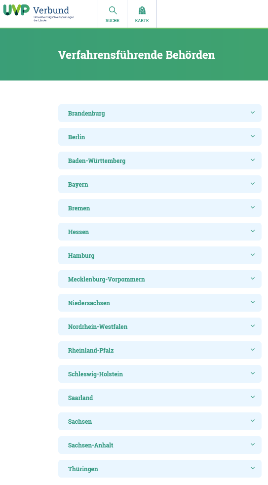
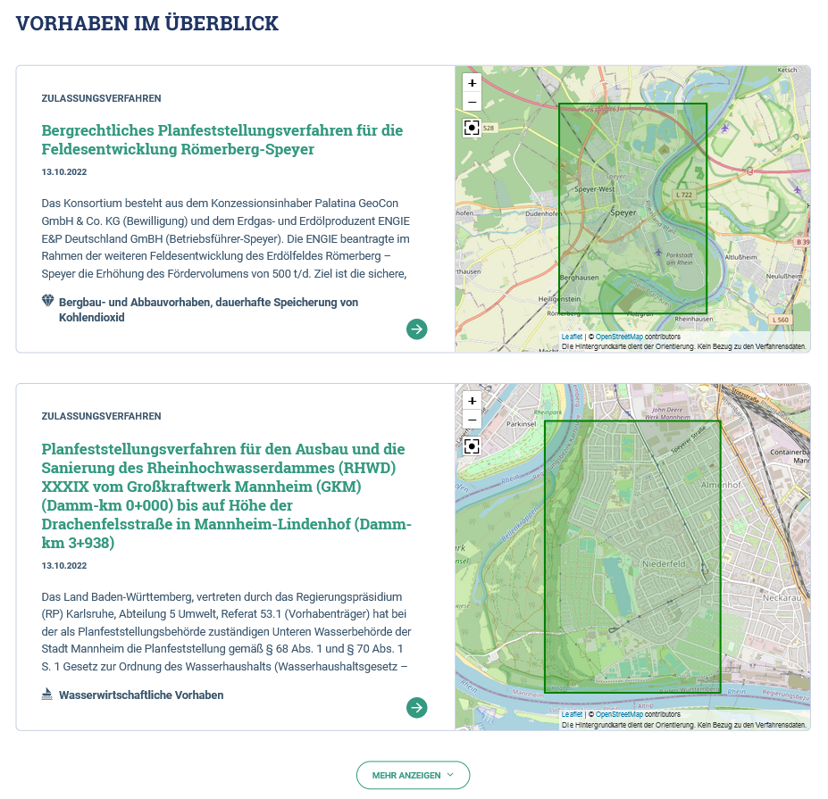
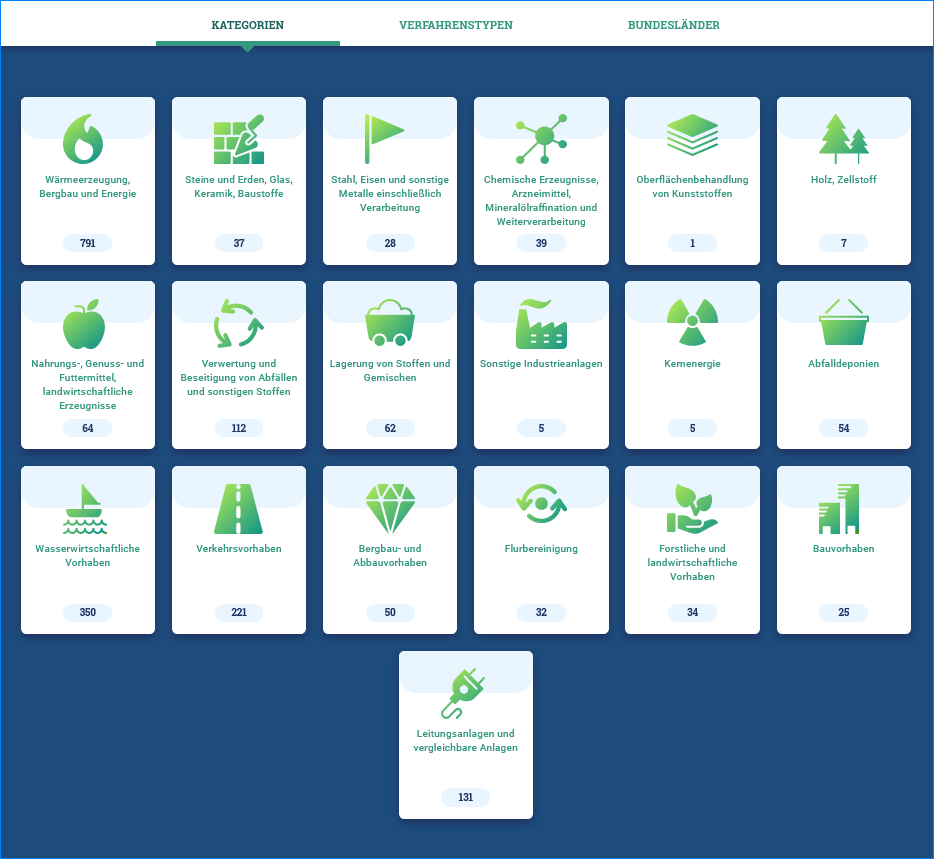
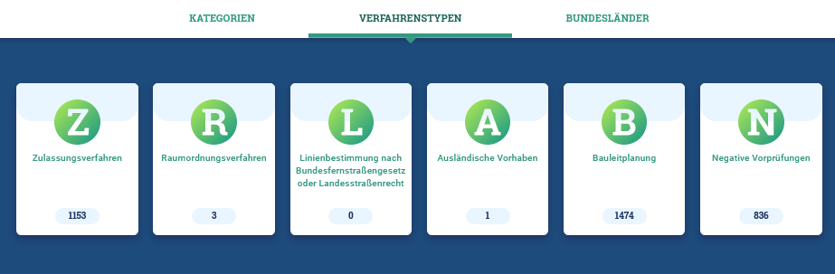
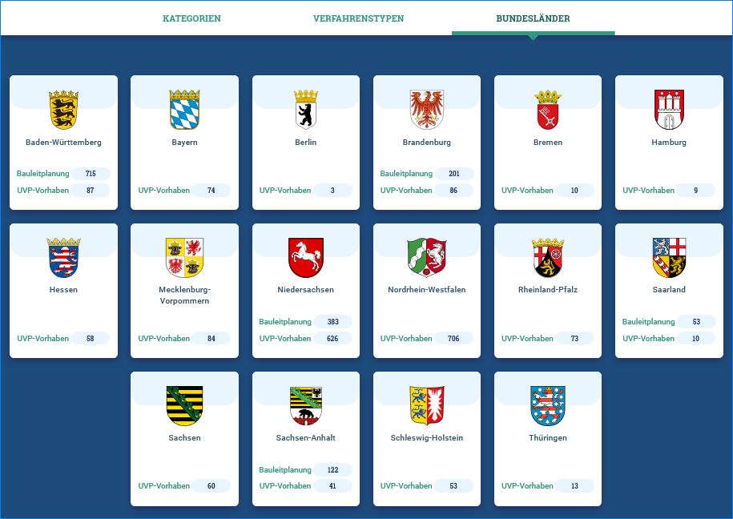
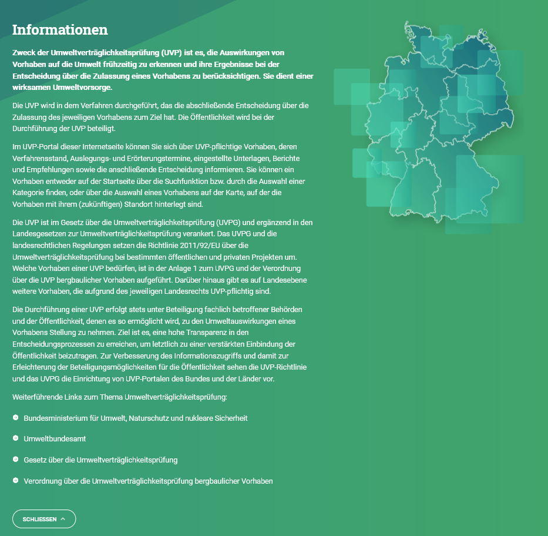
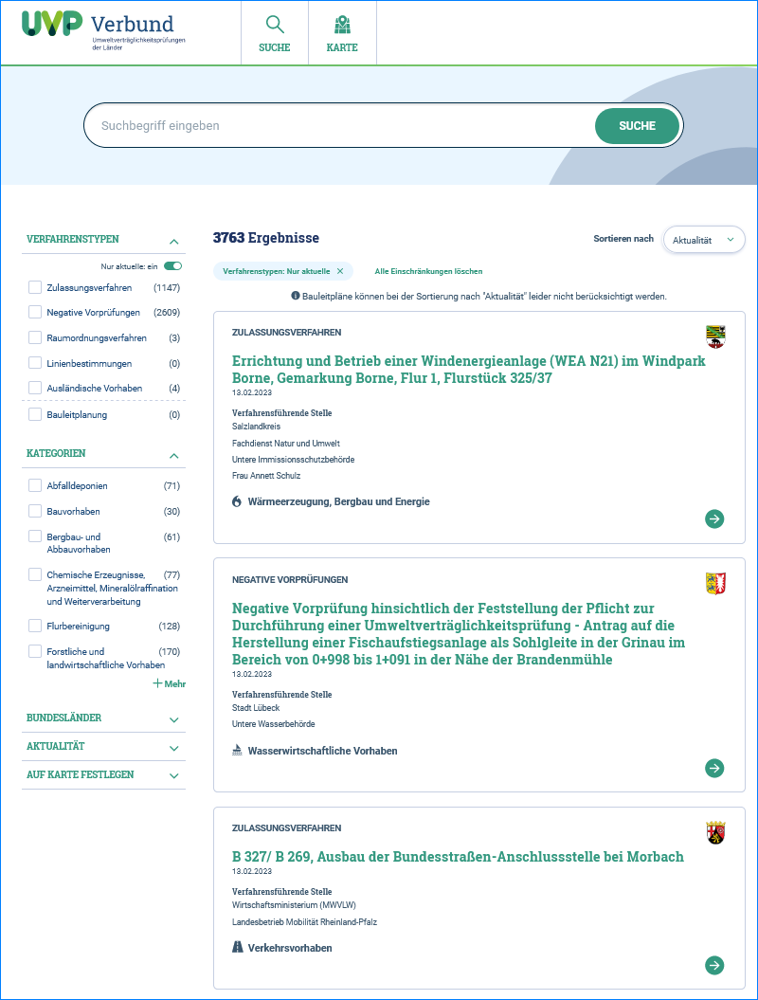
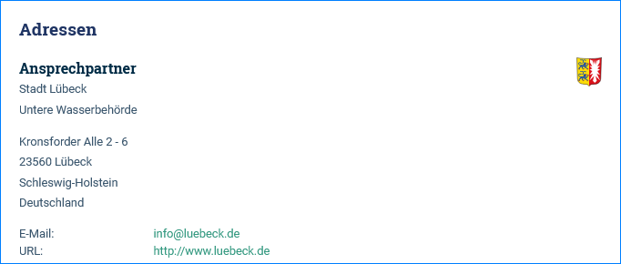

Startseite
==========

Suche
-----

Mit *SUCHE* kann die Suchergebnisliste mit der Facettierung (Einschränkungen) des UVP-Portals aufgerufen werden. Dafür muss kein Suchbegriff in die Suchzeile eingegeben werden.

Abb.: Portal - Startseite - Suche

Karte
-----

Über *KARTE* kann die Kartenanwendung im UVP-Portal geöffnet werden.

Abb.: Portal - Startseite - Karte

Ankündigungen
-------------

Auf der Startseite des UVP-Portals haben die Entwickler die Möglichkeit rot umrandete Meldungen anzuzeigen, z.B. dass in Kürze ein neues Update eingespielt wird und dass es zu Unterbrechungen der Erreichbarkeit kommen kann.

Abb.: Portal - Startseite - Ankündigungen

Menüpunkt Behörden
------------------

Über den Menüpunkt *Behörden* kann die Liste der Verfahrensführenden Behörden aufgerufen werden.

Abb.: Portal - Startseite - Menüpunkt Behörden

Abb.: Portal - Startseite - Verfahrensführende Behörden

Vorhaben im Überblick
---------------------

An dieser Stelle werden die aktuellsten Vorhaben angezeigt.

Abb.: Portal - Startseite - Überblick

Kategorien, Verfahrenstypen, Bundesländer
-----------------------------------------

Über die Navigationspunkte *KATEGORIEN, VERFAHRENSTYPEN und BUNDESLÄNDER* können unterschiedliche Einstiegspunkte für die Recherche nach Vorhaben gewählt werden. 

Abb.: Portal - Startseite - Auswahl der UVP-Kategorien

Abb.: Portal - Startseite - Auswahl der Verfahrenstypen

Abb.: Portal - Startseite - Auswahl der Bundesländer

Informationen
-------------

Im Abschnitt Informationen wird über den Zweck der Umweltverträglichkeitsprüfung informiert und wie die Bürger am Entscheidungsprozess beteiligt werden. Am Ende des vollständigen Informationstextes befinden sich weiterführende Links zum Thema Umweltverträglichkeitsprüfung.

Abb.: Portal - Startseite - Informationen

Suchergebnisse
==============

.. hint:: Auf Grund der Vielzahl der erfassten Vorhaben, wurde in der Facettierung der Auswahlschalter „Nur aktuelle Verfahren anzeigen: ein/aus“ eingeführt. Dieser Schalter bietet die Möglichkeit, sich nur die Vorhaben des letzten Jahres anzuzeigen zu lassen.

Abb.: Trefferliste - Darstellung der Länderwappen

Abb.: Adresse - Angabe des Bundeslandes und Darstellung des Wappens

