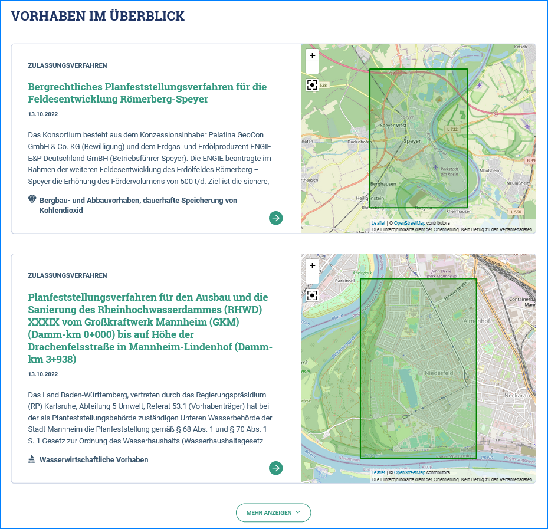
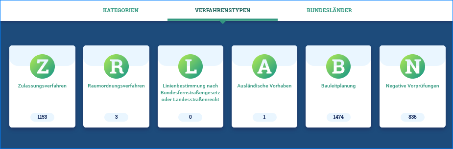
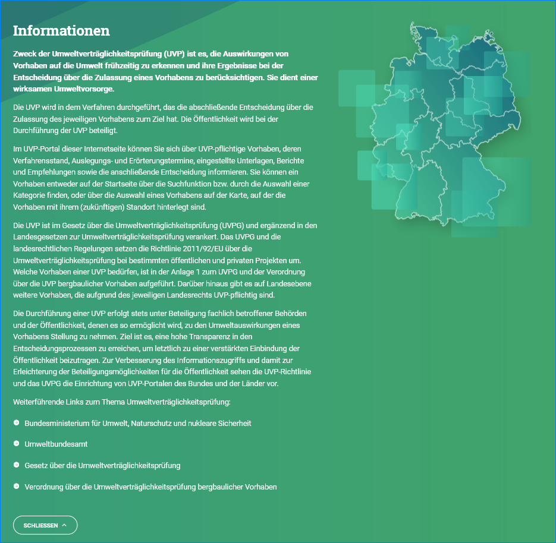
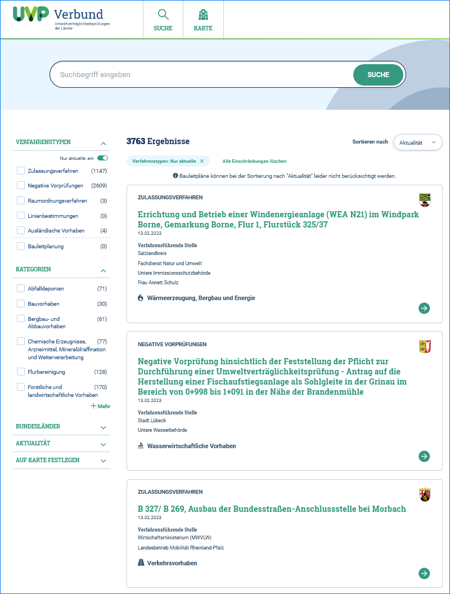
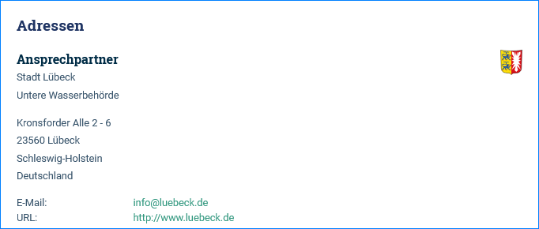

Startseite
==========

Suche
-----

Mit *SUCHE* kann die Suchergebnisliste mit der Facettierung (Einschränkungen) des UVP-Portals aufgerufen werden. Dafür muss kein Suchbegriff in die Suchzeile eingegeben werden.

.. image:: ../img-ige-ng/portal/portal_suche_1.png
.. image:: ../img-ige-ng/portal/portal_suche_2.png

Abb.: Portal - Startseite - Suche

Karte
-----

Über *KARTE* kann die Kartenanwendung im UVP-Portal geöffnet werden.

.. image:: ../img-ige-ng/portal/portal_suche_1.png

Abb.: Portal - Startseite - Karte

Ankündigungen
-------------

Auf der Startseite des UVP-Portals haben die Entwickler die Möglichkeit rot umrandete Meldungen anzuzeigen, z.B. dass in Kürze ein neues Update eingespielt wird und dass es zu Unterbrechungen der Erreichbarkeit kommen kann.

.. image:: ../img-ige-ng/portal/portal_ankuendigungen.png

Abb.: Portal - Startseite - Ankündigungen

Menüpunkt Behörden
------------------

Über den Menüpunkt *Behörden* kann die Liste der Verfahrensführenden Behörden aufgerufen werden.

Abb.: Portal - Startseite - Menüpunkt Behörden

.. image:: ../img-ige-ng/portal/portal_behoerden.png

Abb.: Portal - Startseite - Verfahrensführende Behörden

Vorhaben im Überblick
---------------------

An dieser Stelle werden die aktuellsten Vorhaben angezeigt.

Abb.: Portal - Startseite - Überblick

Kategorien, Verfahrenstypen, Bundesländer
-----------------------------------------

Über die Navigationspunkte *KATEGORIEN, VERFAHRENSTYPEN und BUNDESLÄNDER* können unterschiedliche Einstiegspunkte für die Recherche nach Vorhaben gewählt werden. 

Abb.: Portal - Startseite - Auswahl - Kategorien

Abb.: Portal - Startseite - Auswahl - Verfahrenstypen

Abb.: Portal - Startseite - Auswahl - Bundesländer

Informationen
-------------

Im Abschnitt Informationen wird über den Zweck der Umweltverträglichkeitsprüfung informiert und wie die Bürger am Entscheidungsprozess beteiligt werden. Am Ende des vollständigen Informationstextes befinden sich weiterführende Links zum Thema Umweltverträglichkeitsprüfung.

Abb.: Portal - Startseite - Informationen

Suchergebnisse
==============

Seit der Portalversion 6.0.0 werden die Wappen der Bundesländer in der Trefferliste angezeigt und in der Detaildarstellung wird in der Adresse das Bundesland angegeben, sowie das Wappen des Bundeslandes dargestellt.

Abb.: Trefferliste - Darstellung der Länderwappen

Abb.: Adresse - Angabe des Bundeslandes und Darstellung des Wappens

