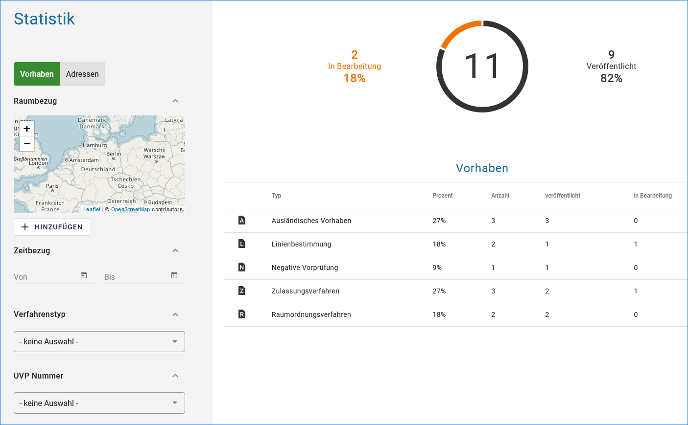
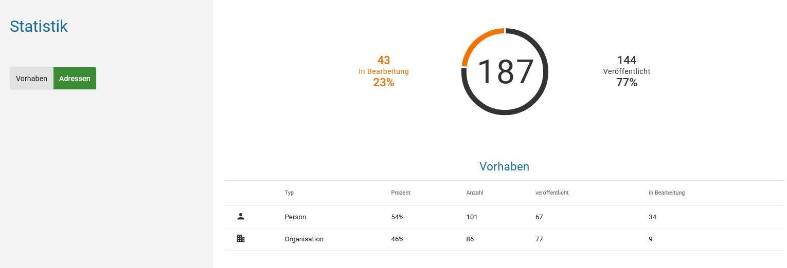
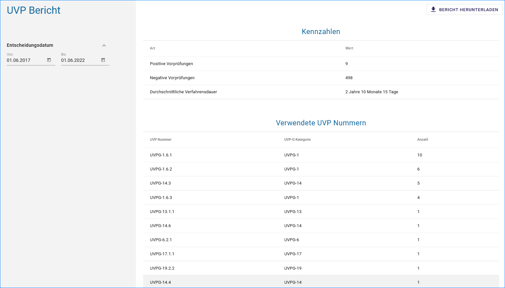

Reports erstellen
=================

Statistik
---------

   
Abb.: UVP Statistik - Vorhaben

   
Abb.: UVP Statistik - Adressen

UVP-Bericht
-----------

   
Abb.: UVP Statistik

Für die Berichtspflicht an die EU, müssen abgeschlossene Verfahren und negative Vorprüfungen im Strukturbaum erhalten bleiben und dürfen nicht gelöscht werden.
Soll ein Verfahren gelöscht werden, erscheint ein Löschhinweis. Es wird darauf verwiesen, dass gelöschte Verfahren in der Statistik für die Berichtspflicht an die EU nicht mehr berücksichtigt werden.

   
Abb.: UVP-Bericht als CSV-Datei herunterladen

.. image:: ../img-ige-ng/reports/ige-ng_reports_uvp-bericht-download.png
   :width: 200
   
Abb.: UVP-Bericht csv-Download