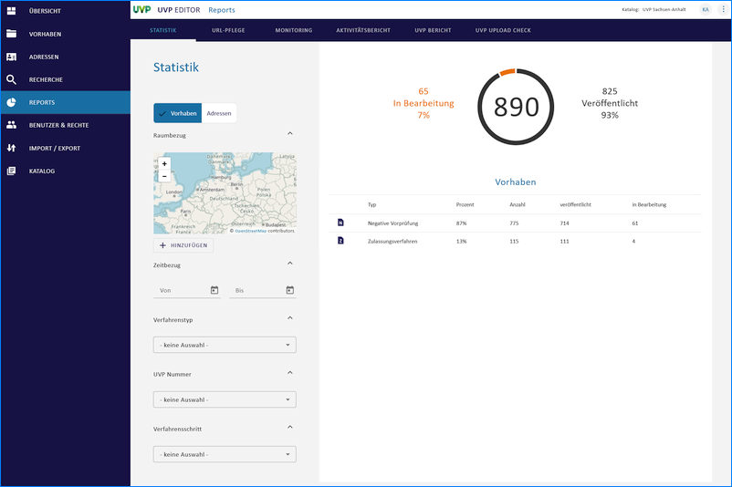
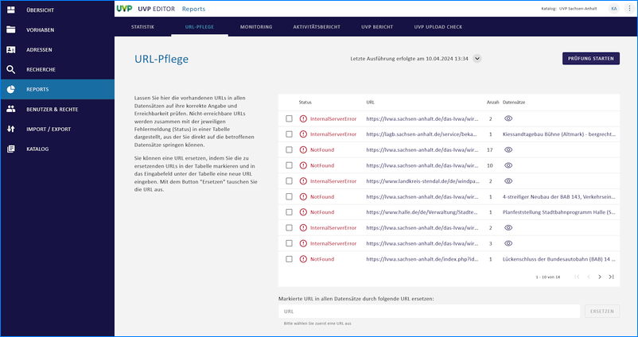
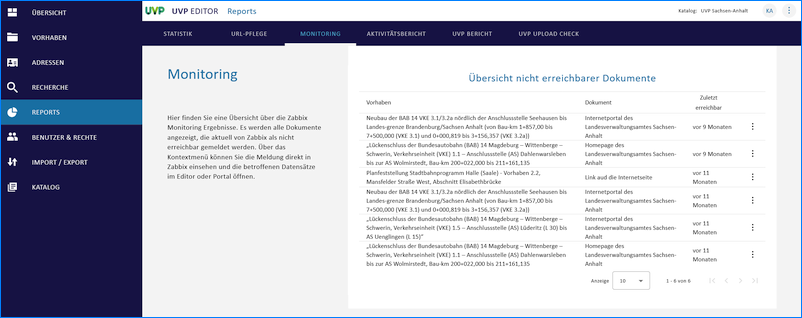
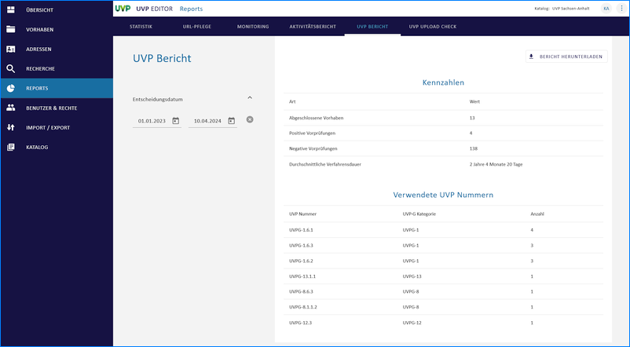
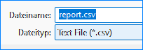
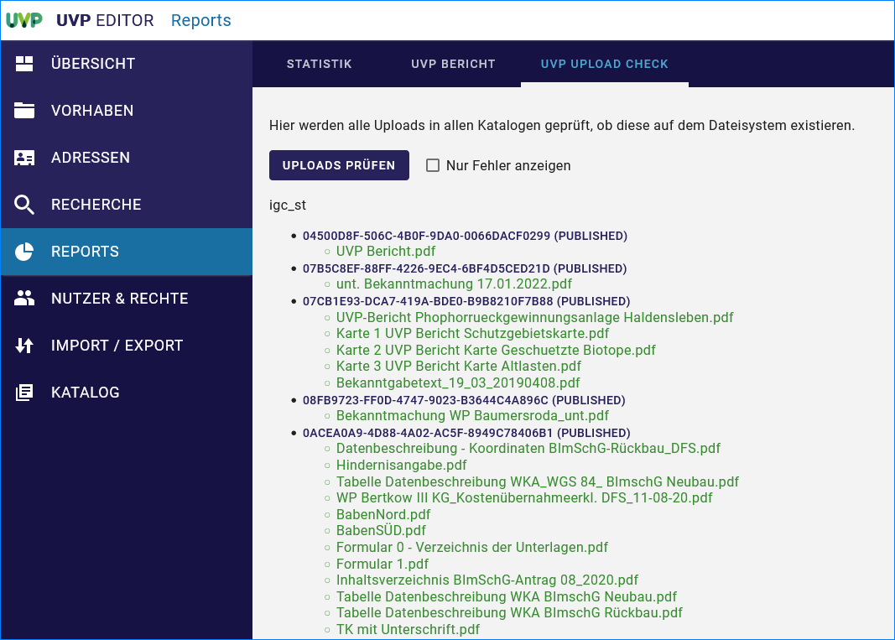
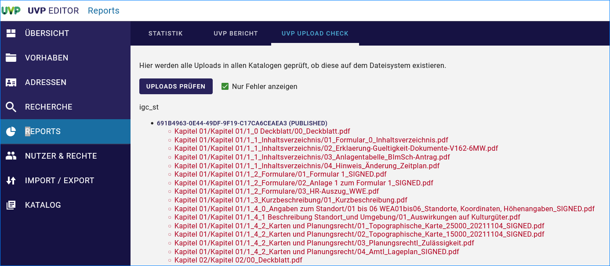

==================
Reports erstellen
==================

.. hint:: Um Reports zu erstellen, muss der Katalogadministrator die verschiedenen Optionen in den Katalogeinstellungen aktivieren. Nach der Aktivierung müss der Editor neu gestartet werden, damit die Optionen im Menü erscheinen.

Statistik
----------

Bei der Statistik können verschiedene Filter zur Einschränkung der Ergebnisse eingestellt werden. Der "Zeitbezug" bezieht sich auf das Änderungsdatum der Metadaten.

   Abb.: UVP Statistik - Vorhaben

.. figure:: ../img-ige-ng/reports/statistik_adressen.png
   
   :align: left
   :scale: 70
   :figwidth: 100%

   Abb.: UVP Statistik - Adressen

URL-Pflege
-----------

   
   :align: left
   :scale: 70
   :figwidth: 100%

Abb.: URL Pflege

Monitoring
-----------

   
   :align: left
   :scale: 70
   :figwidth: 100%

Abb.: UVP Monitoring

Integration eines vereinfachten, katalogspezifischen Reports über die Ereichbarkeit der Dokumente - Sichtbarkeit erweitern

Die Erreichbarkeit von Dokumenten bzw. Verfahren kann in Echtzeit abgefragt werden. Ist eine Abfrage mittels dem Monitoring-Tool Zabbix eingebunden, wird mit Version 7.1.0 im InGrid Editor (IGE-NG) im Menü-Punkt Reports Untermenü Monitoring angezeigt falls ein Dokument bzw. ein Vorhaben nicht erreichbar ist. Der Menüpunkt ist sichtbar abhänging von den Berechtigungen des jeweiligen Nutzers/der jeweiligen Nutzerin.

Aktivitätsbericht
------------------

.. figure:: ../img-ige-ng/reports/aktivitaetsbericht.png
   
   :align: left
   :scale: 70
   :figwidth: 100%

Abb.: UVP Aktivitätsbericht

Erweiterung Report über “Veröffentlichung zurückziehen”

Die Löschung von Verfahren sowie zurückgezogene Veröffentlichungen können nachvollzogen werden. Im Menüpunkt Reports Untermenü Aktivitätsbericht werden Verfahren angezeigt die gelöscht oder zurückgezogen wurden. Hierbei kann gefiltert werden nach:

 - Daum
 - Erstellung
 - Aktualisierung
 - Veröffentlichung
 - Löschung

UVP-Bericht
------------

Im Bereich "UVP-Bericht" können für verschiedene Zeiträume die Anzahl der abgeschlossenen Verfahren ermittelt werden. Die Angabe eines Zeitraums bezieht sich hier auf das "Datum der Entscheidung". Außerdem werden die in diesen Verfahren verwendeten UVP-Nummern zusammen mit der jeweiligen Anzahl an Verfahren angegeben. In der Tabelle werden Verfahren doppelt gezählt, wenn bei ihnen mehrere UVP-Nummern angegeben wurden.

   
   :align: left
   :scale: 70
   :figwidth: 100%

Abb.: UVP Statistik

Für die Berichtspflicht an die EU müssen abgeschlossene Verfahren und negative Vorprüfungen im Strukturbaum erhalten bleiben und dürfen nicht gelöscht werden.
Soll ein Verfahren gelöscht werden, erscheint ein Löschhinweis. Es wird darauf verwiesen, dass gelöschte Verfahren in der Statistik für die Berichtspflicht an die EU nicht mehr berücksichtigt werden.

   
   :align: left
   :scale: 70
   :figwidth: 100%

Abb.: UVP-Bericht als CSV-Datei herunterladen

   :align: left
   :scale: 70
   :figwidth: 100%

Abb.: UVP-Bericht csv-Download

UVP Upload Check
-----------------

.. figure:: ../img-ige-ng/reports/upload-check.png

   :align: left
   :scale: 70
   :figwidth: 100%

Abb.: UVP Upload Check - Uploads prüfen

   :align: left
   :scale: 70
   :figwidth: 100%

Abb.: UVP Upload Check - alles anzeigen

   :align: left
   :scale: 70
   :figwidth: 100%

Abb.: UVP Upload Check - nur Fehler anzeigen