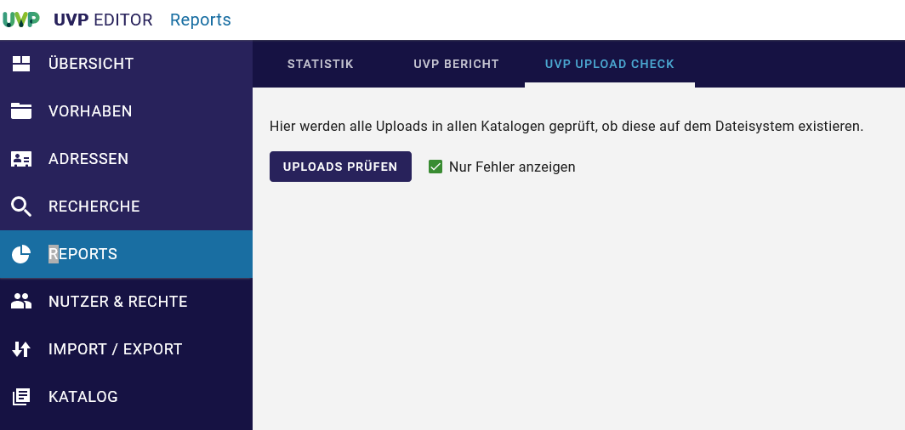
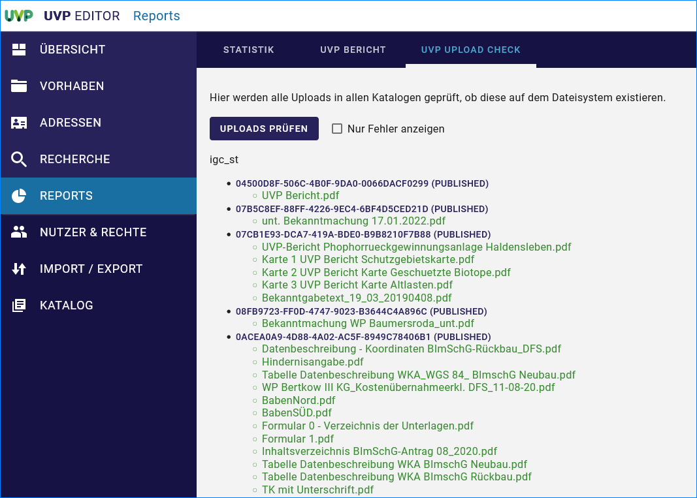

Reports erstellen
=================

Statistik
---------

Bei der Statistik können verschiedene Filter zur Einschränkung der Ergebnisse eingestellt werden. Der "Zeitbezug" bezieht sich auf das Änderungsdatum der Metadaten.

.. image:: ../img-ige-ng/reports/ige-ng_reports_statistik_vorhaben.png
   
Abb.: UVP Statistik - Vorhaben

.. image:: ../img-ige-ng/reports/ige-ng_reports_statistik_adressen.png
   
Abb.: UVP Statistik - Adressen

UVP-Bericht
-----------

Im Bereich "UVP-Bericht" können für verschiedene Zeiträume die Anzahl der abgeschlossenen Verfahren ermittelt werden. Die Angabe eines Zeitraums bezieht sich hier auf das "Datum der Entscheidung". Außerdem werden die in diesen Verfahren verwendeten UVP-Nummern zusammen mit der jeweiligen Anzahl an Verfahren angegeben. In der Tabelle werden Verfahren doppelt gezählt, wenn bei ihnen mehrere UVP-Nummern angegeben wurden.

.. image:: ../img-ige-ng/reports/ige-ng_reports_uvp-bericht.png
   
Abb.: UVP Statistik

Für die Berichtspflicht an die EU müssen abgeschlossene Verfahren und negative Vorprüfungen im Strukturbaum erhalten bleiben und dürfen nicht gelöscht werden.
Soll ein Verfahren gelöscht werden, erscheint ein Löschhinweis. Es wird darauf verwiesen, dass gelöschte Verfahren in der Statistik für die Berichtspflicht an die EU nicht mehr berücksichtigt werden.

.. image:: ../img-ige-ng/reports/ige-ng_reports_uvp-bericht-herunterladen.png
   :width: 200
   
Abb.: UVP-Bericht als CSV-Datei herunterladen

.. image:: ../img-ige-ng/reports/ige-ng_reports_uvp-bericht-download.png
   :width: 200
   
Abb.: UVP-Bericht csv-Download

UVP Upload Check
----------------

Abb.: UVP Upload Check - Uploads prüfen

Abb.: UVP Upload Check - alles anzeigen

Abb.: UVP Upload Check - nur Fehler anzeigen
