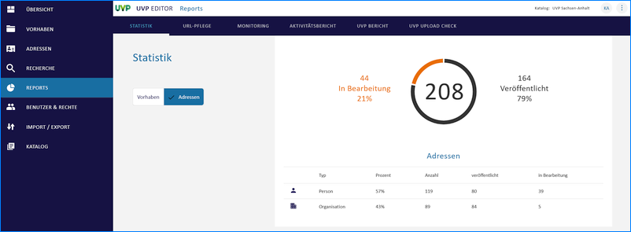

==================
Reports erstellen
==================

.. hint:: Um Reports zu erstellen, muss der Katalogadministrator die verschiedenen Optionen in den Katalogeinstellungen aktivieren. Nach der Aktivierung muss der Editor neu gestartet werden, damit die Optionen im Menü erscheinen.

Statistik
----------

In der Statistik können Sie verschiedene Filter einstellen, um die Ergebnisse zu begrenzen.

Die Statistik kann auf folgende Angaben eingegrenzt werden:

 - Vorhaben / Adressen
 - Raumbezug
 - Zeitbezug
 - Verfahrenstyp
 - UVP Nummer
 - Verfahrensschritt

.. hint:: Der "Zeitbezug" bezieht sich auf das Änderungsdatum der Metadaten.

.. figure:: ../img-ige-ng/reports/statistik_vorhaben.png

   :align: left
   :scale: 70
   :figwidth: 100%

Abb.: UVP Statistik - Vorhaben

   
   :align: left
   :scale: 70
   :figwidth: 100%

Abb.: UVP Statistik - Adressen

URL-Pflege
-----------

Bitte überprüfen Sie alle URLs in den Datensätzen auf ihre Richtigkeit und Erreichbarkeit. Nicht erreichbare URLs werden in einer Tabelle mit der entsprechenden Fehlermeldung (Status) aufgeführt. Sie können direkt zu den betroffenen Datensätzen springen.

Wenn Sie eine URL ersetzen möchten, markieren Sie die zu ersetzenden URLs in der Tabelle und geben Sie im Eingabefeld unter der Tabelle eine neue URL ein. Klicken Sie dann auf den Button 'Ersetzen', um die URL auszutauschen. 

.. figure:: ../img-ige-ng/reports/url-pflege.png
   
   :align: left
   :scale: 70
   :figwidth: 100%

Abb.: URL Pflege

Monitoring
-----------

Vereinfachter, katalogspezifischer Bericht zur Dokumentenverfügbarkeit

Die Erreichbarkeit von Dokumenten und Verfahren kann in Echtzeit überprüft werden. Wenn das Monitoring-Tool Zabbix integriert ist, wird im UVP Editor unter dem Menüpunkt "Reports" und dem Untermenü "Monitoring" angezeigt, ob ein Dokument oder Vorhaben nicht erreichbar ist. 

.. hint:: Die Sichtbarkeit dieses Menüpunkts hängt von den Berechtigungen der Benutzer ab.

.. figure:: ../img-ige-ng/reports/monitoring.png
   
   :align: left
   :scale: 70
   :figwidth: 100%

Abb.: UVP Monitoring

Aktivitätsbericht
------------------

Report zu der Funktion “Veröffentlichung zurückziehen”

Im Menüpunkt "Reports" und dem Untermenü "Aktivitätsbericht" können gelöschte oder zurückgezogene Verfahren eingesehen werden. Es ist möglich, nach folgenden Kriterien zu filtern:

 - Erstellt
 - Aktualisiert
 - Veröffentlicht
 - Veröffentlichung zurückgezogen
 - Gelöscht

.. figure:: ../img-ige-ng/reports/aktivitaetsbericht.png
   
   :align: left
   :scale: 70
   :figwidth: 100%

Abb.: UVP Aktivitätsbericht

UVP-Bericht
------------

Im Bereich "UVP-Bericht" können Sie die Anzahl der abgeschlossenen Verfahren für verschiedene Zeiträume ermitteln. Die Angabe eines Zeitraums bezieht sich hier auf das Datum der Entscheidung. Außerdem werden die in diesen Verfahren verwendeten UVP-Nummern zusammen mit der jeweiligen Anzahl an Verfahren angegeben.

.. hint:: Bitte beachten Sie, dass Verfahren in der Tabelle doppelt gezählt werden, wenn bei Ihnen mehrere UVP-Nummern angegeben wurden.

.. figure:: ../img-ige-ng/reports/uvp-bericht.png
   
   :align: left
   :scale: 70
   :figwidth: 100%

Abb.: UVP Bericht

Abgeschlossene Verfahren und negative Vorprüfungen im Strukturbaum müssen für die Berichtspflicht an die EU erhalten bleiben und dürfen nicht gelöscht werden. Wenn ein Verfahren gelöscht werden soll, erscheint ein Löschhinweis.

.. important:: Gelöschte Verfahren werden in der Statistik für die Berichtspflicht an die EU nicht berücksichtigt!

.. figure:: ../img-ige-ng/reports/uvp-bericht-herunterladen.png
   
   :align: left
   :scale: 70
   :figwidth: 100%

Abb.: UVP-Bericht als CSV-Datei herunterladen

.. figure:: ../img-ige-ng/reports/uvp-bericht-download.png

   :align: left
   :scale: 70
   :figwidth: 100%

Abb.: UVP-Bericht CSV-Download

UVP Upload Check
-----------------

Über den Menüpunkt "UVP UPLOAD CHECK" können Sie kontrollieren, ob alle Dokumente korrekt in den UVP Editor geladen wurden oder ob es fehlerhafte Uploads gibt.

.. figure:: ../img-ige-ng/reports/upload-check.png

   :align: left
   :scale: 70
   :figwidth: 100%

Abb.: UVP UPLOAD CHECK - Uploads prüfen

.. figure:: ../img-ige-ng/reports/upload-check_alles.png

   :align: left
   :scale: 70
   :figwidth: 100%

Abb.: UVP UPLOAD CHECK - Alles anzeigen

   :align: left
   :scale: 70
   :figwidth: 100%

Abb.: UVP UPLOAD CHECK - Nur Fehler anzeigen