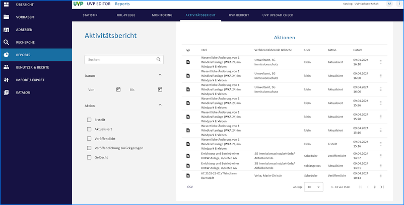
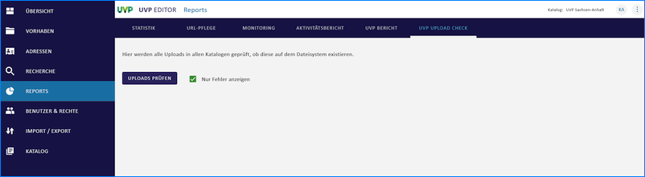

==================
Reports erstellen
==================

.. hint:: Um Reports zu erstellen, muss der Katalogadministrator die verschiedenen Optionen in den Katalogeinstellungen aktivieren. Nach der Aktivierung muss der Editor neu gestartet werden, damit die Optionen im Menü erscheinen.

Statistik
----------

In der Statistik können Sie unterschiedliche Filter einstellen, um die Ergebnisse einzugrenzen. 

.. hint:: Der "Zeitbezug" bezieht sich auf das Änderungsdatum der Metadaten.

.. figure:: ../img-ige-ng/reports/statistik_vorhaben.png

   :align: left
   :scale: 70
   :figwidth: 100%

Abb.: UVP Statistik - Vorhaben

.. figure:: ../img-ige-ng/reports/statistik_adressen.png
   
   :align: left
   :scale: 70
   :figwidth: 100%

Abb.: UVP Statistik - Adressen

URL-Pflege
-----------

   
   :align: left
   :scale: 70
   :figwidth: 100%

Abb.: URL Pflege

Monitoring
-----------

Integration eines vereinfachten, katalogspezifischen Berichts zur Dokumentenverfügbarkeit.

Die Erreichbarkeit von Dokumenten und Verfahren kann in Echtzeit abgefragt werden. Wenn das Monitoring-Tool Zabbix eingebunden ist, wird im UVP Editor unter dem Menüpunkt 'Reports' und dem Untermenü 'Monitoring' angezeigt, ob ein Dokument oder Vorhaben nicht erreichbar ist. Die Sichtbarkeit des Menüpunkts hängt von den Berechtigungen der Benutzer ab.

.. figure:: ../img-ige-ng/reports/monitoring.png
   
   :align: left
   :scale: 70
   :figwidth: 100%

Abb.: UVP Monitoring

Aktivitätsbericht
------------------

Erweiterung Report über die Funktionalität “Veröffentlichung zurückziehen”

Im Menüpunkt 'Reports' und dem Untermenü 'Aktivitätsbericht' können gelöschte oder zurückgezogene Verfahren eingesehen werden. Es ist möglich, nach folgenden Kriterien zu filtern:

 - Daum
 - Erstellung
 - Aktualisierung
 - Veröffentlichung
 - Löschung

   
   :align: left
   :scale: 70
   :figwidth: 100%

Abb.: UVP Aktivitätsbericht

UVP-Bericht
------------

Im Bereich 'UVP-Bericht' können Sie die Anzahl der abgeschlossenen Verfahren für verschiedene Zeiträume ermitteln. Die Angabe eines Zeitraums bezieht sich hier auf das Datum der Entscheidung. Außerdem werden die in diesen Verfahren verwendeten UVP-Nummern zusammen mit der jeweiligen Anzahl an Verfahren angegeben. Bitte beachten Sie, dass Verfahren in der Tabelle doppelt gezählt werden, wenn bei ihnen mehrere UVP-Nummern angegeben wurden.

   
   :align: left
   :scale: 70
   :figwidth: 100%

Abb.: UVP Statistik

Abgeschlossene Verfahren und negative Vorprüfungen im Strukturbaum müssen für die Berichtspflicht an die EU erhalten bleiben und dürfen nicht gelöscht werden. Wenn ein Verfahren gelöscht werden soll, erscheint ein Löschhinweis.

.. important: Gelöschte Verfahren werden in der Statistik für die Berichtspflicht an die EU nicht mehr berücksichtigt.

.. figure:: ../img-ige-ng/reports/uvp-bericht-herunterladen.png
   
   :align: left
   :scale: 70
   :figwidth: 100%

Abb.: UVP-Bericht als CSV-Datei herunterladen

.. figure:: ../img-ige-ng/reports/uvp-bericht-download.png

   :align: left
   :scale: 70
   :figwidth: 100%

Abb.: UVP-Bericht CSV-Download

UVP Upload Check
-----------------

   :align: left
   :scale: 70
   :figwidth: 100%

Abb.: UVP Upload Check - Uploads prüfen

.. figure:: ../img-ige-ng/reports/upload-check_alles.png

   :align: left
   :scale: 70
   :figwidth: 100%

Abb.: UVP Upload Check - alles anzeigen

.. figure:: ../img-ige-ng/reports/upload-check_fehler.png

   :align: left
   :scale: 70
   :figwidth: 100%

Abb.: UVP Upload Check - nur Fehler anzeigen