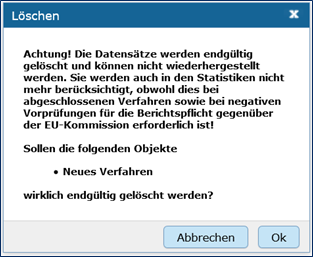
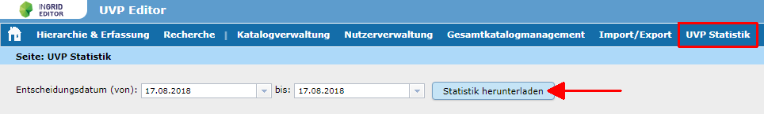

Integration von „UVP Statistik“ für die EU Berichtspflicht
===========================================================

Für die Berichtspflicht an die EU, müssen abgeschlossene Verfahren und negative Vorprüfungen im Strukturbaum erhalten bleiben und dürfen nicht gelöscht werden.
Soll ein Verfahren gelöscht werden, erscheint ein Löschhinweis. Es wird darauf verwiesen, dass gelöschte Verfahren in der Statistik für die Berichtspflicht an die EU nicht mehr berücksichtigt werden.

   
Abb.: Löschen von Verfahren - Fenster mit Warnung

Über das Menü im UVP Editor kann der Katalogadministrator die Seite UVP-Statistik aufrufen. Der Katalogadmin kann auf dieser Seite eine Statistik über verschiedene Aspekte der erfassten Verfahren generieren. Diese Auswertung bildet die Basis für die EU-Berichtpflicht.

   
Abb.: Katalogadministratoren - UVP Statistik
