Allgemeines zum UVP-Editor
==========================

UVP-Editor im Ausgangszustand
----------------------------
 
Nach dem Laden des Editors wird zuerst das Dashboard gezeigt. Hier wird dargestellt, welche Verfahren bzw. Adressen zuletzt bearbeitet wurden und wann das geschehen ist.
Es gibt zwei Darstellungen: die Verfahren/Adressen, für welche der User selbst verantwortlich ist („Meine Datensätze“), sowie eine Übersicht über alle Verfahren/Adressen des Katalogs („Alle Datensätze“). 

Im Bereich „Meine Datensätze“ gibt es drei Tabellen: 

1. Verfahren in Bearbeitung
Alle Verfahren des Benutzers, die in Bearbeitung sind (Zwischenspeicherung). Also Verfahren, die nach dem Neuanlegen noch nicht abschließend gespeichert wurden bzw. Verfahren, die schon veröffentlicht waren, aber geändert wurden und deren Änderungen bislang noch nicht wieder abschließend gespeichert wurden. 

2. Veröffentlichte Verfahren 
Alle Verfahren des Benutzers, die bereits veröffentlicht sind. 

3. Adressen in Bearbeitung
Alle Adressen des Benutzers, die in Bearbeitung sind (Zwischenspeicherung). Also Adressen, die nach dem Neuanlegen noch nicht abschließend gespeichert wurden bzw. Adressen, die schon veröffentlicht waren, aber geändert wurden und deren Änderungen bislang noch nicht wieder abschließend gespeichert wurden. 

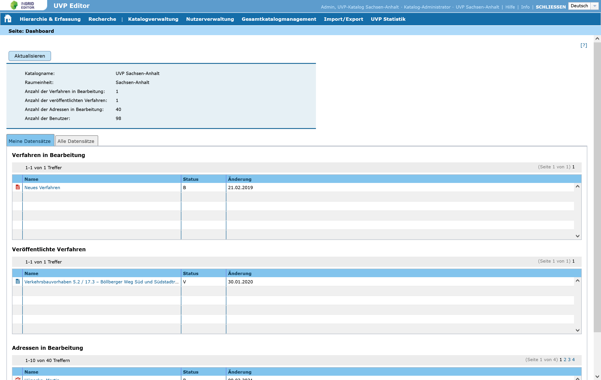
   
Abb.: UVP-Editor - Dashboard - Meine Datensätze

Im Bereich „Alle Datensätze“ gibt es nur die Tabellen, in denen die Verfahren und Adressen dargestellt werden, die sich in Bearbeitung befinden. Die so angezeigten Verfahren bzw. Adressen sind mit Links hinterlegt, so dass diese direkt zur Ansicht/Bearbeitung geöffnet werden können. 

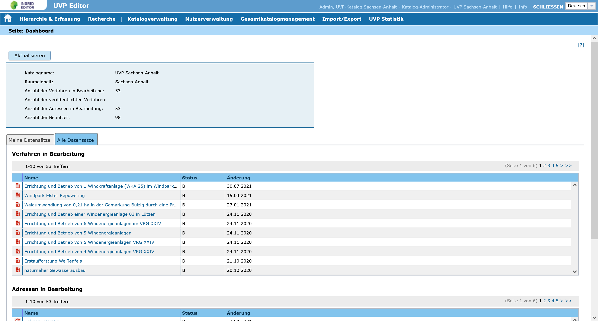
   
Abb.: UVP-Editor - Dashboard - Alle Datensätze

Aufbau der Benutzeroberfläche
------------------------------

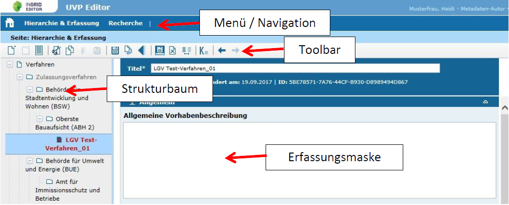
   
Abb.: UVP-Editor - Aufbau der Benutzeroberfläche

Strukturbaum
------------

Der UVP-Editor verfügt über einen Strukturbaum, den Sie über den Menüpunkt *Hierarchie & Erfassung* aufrufen. Er unterteilt sich in Verfahren und Adressen:

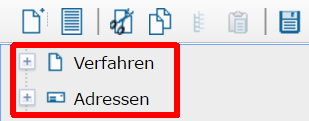
   
Abb.: UVP-Editor - Aufbau der Benutzeroberfläche 

Durch Klicken auf die Pluszeichen wird der Strukturbaum geöffnet bzw. durch Anklicken der Minuszeichen wieder geschlossen.

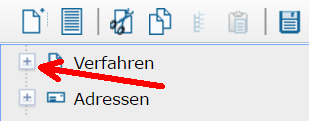
   
Abb.: UVP-Editor - Aufbau der Benutzeroberfläche 

Icons im Strukturbaum
---------------------

Im UVP-Editor gibt es verschiedene Verfahrenstypen bzw. Adresstypen. Jeder Typ besitzt ein eigenes Symbol (Icon), welches im Strukturbaum neben dem Verfahrensnamen bzw. dem Adresstitel dargestellt wird. 

**Hinweis:** *Die blauen und roten Symbole werden im Strukturbaum des UVP-Editors verwendet (Backend). Die schwarzen Symbole erscheinen in der Trefferliste der Portaloberfläche (Frontend).*

**Verfahren**

.. csv-table::
    :widths: 50 300

    Symbol , Bezeichnung
    .. image:: ../img/editor/icons/uvp_41x41_ordner.png , Ordner
	.. image:: ../img/editor/icons/uvp_40x40_zulassungsverfahren_blau.png , Zulassungsverfahren
	.. image:: ../img/editor/icons/uvp_40x40_linie-blau.png , Vorgelagerte Verfahren - Linien (Linienbestimmungen nach §16 BFStrG Landesstraßenrecht)
	.. image:: ../img/editor/icons/uvp_40x40_raumordnung-blau.png , Vorgelagerte Verfahren - Raumordnungsverfahren nach ROG mit UVP
	.. image:: ../img/editor/icons/uvp_40x40_vorprüfung-negativ-blau.png, Vorprüfung negativ
	.. image:: ../img/editor/icons/uvp_40x40_ausland-blau.png , Ausländische Vorhaben
	

**Adressen**

.. csv-table::
    :widths: 50 50

    Symbol , Bezeichnung
    .. image:: ../img/editor/icons/uvp_40x40_institution_blau.png , Institution
    .. image:: ../img/editor/icons/uvp_40x40_einheit_blau.png , Einheit
    .. image:: ../img/editor/icons/uvp_40x40_person_blau.png , Person

Bearbeitungsstand
-----------------

Neben dem Verfahrens- bzw. dem Adresstyp zeigen die Icons zusätzlich den jeweiligen Bearbeitungsstand an.

.. csv-table::
    :widths: 50 70 500

    Symbol , Farbe , Beschreibung
    .. image:: ../img/editor/icons/uvp_40x40_zulassungsverfahren_blau.png , blau , Verfahren bzw Adresse ist veröffentlicht
    .. image:: ../img/editor/icons/uvp_40x40_zulassungsverfahren_rot.png , rot , Verfahren bzw Adresse ist in Bearbeitung
    .. image:: ../img/editor/icons/uvp_40x40_zulassungsverfahren_blau-rot.png , blau und rot , Wird ein blaues Icon rot überlagert so gibt es eine veröffentlichte Version des Verfahrens bzw der Adresse und eine bearbeitete Version.

Ausgegraute Verfahren/Adressen im Strukturbaum
----------------------------------------------

Teilweise werden im Strukturbaum Verfahren oder Adressen nicht schwarz, sondern nur in grau angezeigt. Dieses hängt mit der Zuweisung von Berechtigungen zusammen. Ändern kann ein Erfasser nur die Verfahren/Adressen, die im Strukturbaum schwarz dargestellt sind.

Toolbar 
-------

Die Toolbar hat folgenden grundlegenden Aufbau: 

.. csv-table::
    :widths: 150 15 50

    .. image:: ../img/editor/toolbar/ige-uvp_toolbar_01.png , ... , .. image:: ../img/editor/toolbar/ige-uvp_toolbar_02.png

Abb.: Toolbar (Symbolleiste)

Hier im Einzelnen die zur Verfügung stehenden Werkzeuge: 

.. csv-table::
    :widths: 50 300

    Symbol , Bezeichnung
    .. image:: ../img/editor/toolbar/ige-uvp_toolbar_verfahren_neu_anlegen.png , Neu anlegen (Verfahren / Adressen)
    .. image:: ../img/editor/toolbar/ige-uvp_toolbar_ordner_neu_anlegen.png , Neuen Ordner anlegen
    .. image:: ../img/editor/toolbar/ige-uvp_toolbar_vorschau_und_druckansicht.png , Vorschau und Druckansicht 

.. csv-table::
    :widths: 50 300

    .. image:: ../img/editor/toolbar/ige-uvp_toolbar_ausschneiden.png , Verfahren / Adressen / Teilbaum ausschneiden 
    .. image:: ../img/editor/toolbar/ige-uvp_toolbar_kopieren.png , Verfahren / Adressen kopieren 
    .. image:: ../img/editor/toolbar/ige-uvp_toolbar_teilbäume_kopieren.png , Teilbäume kopieren 
    .. image:: ../img/editor/toolbar/ige-uvp_toolbar_teilbäume_kopieren.png , Einfügen (Verfahren / Adressen / Teilbaum)
	
.. csv-table::
    :widths: 50 300

    .. image:: ../img/editor/toolbar/ige-uvp_toolbar_zwischenspeichern.png , Zwischenspeichern 
    .. image:: ../img/editor/toolbar/ige-uvp_toolbar_rückgänig.png , Rückgängig 
    .. image:: ../img/editor/toolbar/ige-uvp_toolbar_änderung_verwerfen.png , Änderungen am aktuellen Verfahren / Adresse verwerfen

.. csv-table::
    :widths: 50 300
 
    .. image:: ../img/editor/toolbar/ige-uvp_toolbar_abschließendes_speichern_und_veröffentlichen.png , Abschließendes Speichern & Veröffentlichen 
    .. image:: ../img/editor/toolbar/ige-uvp_toolbar_löschen.png , Ausgewähltes Verfahren / Adresse / Teilbaum löschen 
    .. image:: ../img/editor/toolbar/ige-uvp_toolbar_änderungen_anzeigen.png , Änderungen anzeigen
	
.. csv-table::
    :widths: 50 300

    .. image:: ../img/editor/toolbar/ige-uvp_toolbar_kommentare.png , Kommentar ansehen / hinzufügen 
    .. image:: ../img/editor/toolbar/ige-uvp_toolbar_vorher.png , Klicken, um zum vorherigen Verfahren / Adresse zu gehen (gedrückt halten für Verlauf).
    .. image:: ../img/editor/toolbar/ige-uvp_toolbar_nachher.png , Klicken, um zum nächsten Vorhaben/Adresse zu gehen (gedrückt halten für Verlauf).
    .. image:: ../img/editor/toolbar/ige-uvp_toolbar_alle_felder_aufklappen.png , Alle Felder aufklappen
    .. image:: ../img/editor/toolbar/ige-uvp_toolbar_nur_pflichtfelder_aufklappen.png , Nur Pflichtfelder aufklappen
	
.. csv-table::
    :widths: 50 300
       
    .. image:: ../img/editor/toolbar/ige-uvp_toolbar_hilfe.png , Hilfe

Eingabefelder
-------------

Im UVP-Editor gibt es eine Vielzahl von Feldern, die ausgefüllt werden können, es müssen jedoch nicht immer alle Felder belegt werden. Für jedes Verfahren bzw. jede Adresse gibt es jedoch sogenannte Pflichtfelder, die auf jeden Fall ausgefüllt werden müssen. Ohne die Befüllung dieser Pflichtfelder, lässt sich der Datensatz nicht abspeichern! Gekennzeichnet sind diese Pflichtfelder durch fett gedruckte Überschriften oder durch ein Sternchen. 

.. csv-table::
    :widths: 150 300

    .. image:: ../img/editor/icons/uvp_feldueberschrift.png, Überschrift Eingabefeld (fett - Pflichtfeld)
    .. image:: ../img/editor/icons/uvp_eingabefeld_duenn.png, Überschrift Eingabefeld (optional)
    .. image:: ../img/editor/icons/uvp_eingabefeld.png, Überschrift Tabellenspalte (mit Sternchen - Pflichtfeld)	
´

Auf- und Zuklappen der Eingabefelder
------------------------------------

Die Eingabemaske der Erfassungsmaske ist für eine bessere Übersicht in Abschnitte unterteilt. In der Grundeinstellung des UVP-Editors ist nur das erste Eingabefeld ausgeklappt. Um alle Felder auszuklappen, muss das Symbol rechts in der Toolbar betätigt werden, zum Ausblenden aller Felder das Symbol erneut anklicken.

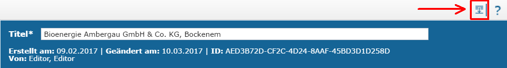

Abb.: Symbol zum Auf- und Zuklappen

.. csv-table::
    :widths: 50 300

    .. image:: ../img/editor/icons/uvp_aufklappen.png, Nur Pflichtfelder aufklappen
    .. image:: ../img/editor/icons/uvp_zuklappen.png, Alle Abschnitte zuklappen

Desweitern gibt es die Möglichkeit, die Abschnitte einzeln auf- bzw. zuzuklappen. Hierfür einfach auf das entsprechende Symbol vor dem Abschnittnamen klicken.

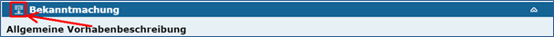

Abb.: Abschnitt auf- oder zuklappen

Unterschiedliche Feldtypen
--------------------------

**Textfelder**

Zum Füllen von Textfeldern klicken Sie einfach in das Feld. 

Zum Vergrößern des Feldes, ziehen Sie mit der Maus an der rechten unteren Ecke (linke Maustaste gedrückt halten).

**Hinweis:** *Das Vergrößern des Feldes funktioniert nicht in allen Browsern. Beim Internet Explorer (IE 11) ist es nicht möglich.*

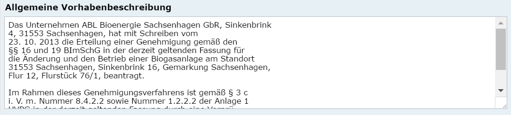

Abb.:  Feldtyp - Textfeld

**Auswahllisten**
Auswahllisten werden über den Pfeil an der rechten Seite des Feldes aufgeklappt. Das „Autocomplete Feature“ sorgt dafür, dass bei der Eingabe Vorschläge angezeigt werden.

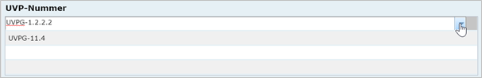

Abb.: Feldtyp - Auswahlliste

**Tabellen**
In den Tabellen werden Zeilen durch einen einfachen Mausklick markiert. Sie können mehrere Zeilen markieren, in dem Sie die Shift-Taste oder die Strg-Taste gleichzeitig mit einem einfachen Klick der linken Maustaste verwenden. Ein gleichzeitiges Drücken der Strg-Taste markiert eine Zeile, ohne die Markierung der bereits vorher markierten Zeilen aufzuheben. Ein gleichzeitiges Drücken der Shift-Taste markiert alle Zeilen zwischen der zuletzt markierten bis zu der angeklickten Zeile.

Mit der rechten Maustaste lässt sich ein Kontextmenü öffnen, über das Sie die markierten Zeilen bearbeiten (z.B. löschen) können. 

Um in den Editiermodus eines Feldes innerhalb einer Tabelle zu gelangen, müssen Sie einen Doppelklick mit der linken Maustaste auf das gewünschte Feld ausführen. Gleiches gilt z.B. auch für die Eingabe von Datumsangaben in einer Tabelle. 

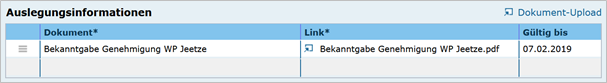

Abb.: Feldtyp - Tabelle

**Dialoge**
Manche Felder können nur über eigene Dialoge ausgefüllt werden. Die Dialoge sind direkt an den jeweiligen Feldern beschrieben.

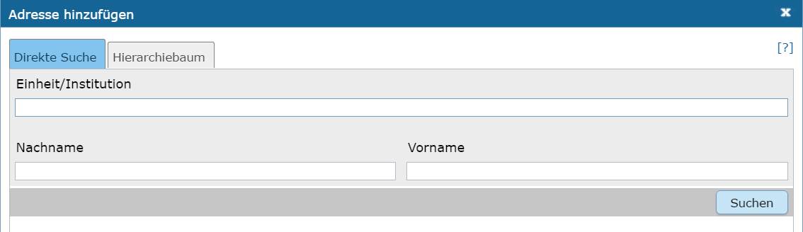

Abb.: Feldtyp - Dialoge

Zwischenspeichern, Speichern & Veröffentlichen
----------------------------------------------

Im UVP-Editor werden zwei Speicherarten unterschieden: 

.. csv-table::
    :widths: 50 300

    .. image:: ../img/editor/toolbar/ige-uvp_toolbar_zwischenspeichern.png, Zwischenspeichern
    .. image:: ../img/editor/toolbar/ige-uvp_toolbar_abschließendes_speichern_und_veröffentlichen.png, Abschließendes Speichern & Veröffentlichen

Das *Zwischenspeichern* speichert den geänderten bzw. neu erfassten Datensatz, die Daten werden allerdings noch nicht für die Veröffentlichung im Internet freigegeben, d.h. sie bleiben weiterhin nur im Strukturbaum des UVP-Editors sichtbar. Das Zwischenspeichern ist jederzeit möglich, auch wenn noch nicht alle Pflichtfelder ausgefüllt worden sind. 

Beim *abschließenden Speichern & Veröffentlichen* werden die Daten für das Internet freigegeben. 

Voraussetzung für das abschließende Speichern ist die Befüllung sämtlicher Pflichtfelder. Fehlen entsprechende Angaben, erscheint bei der Betätigung des Buttons „Abschließendes Speichern & Veröffentlichen“ eine Fehlermeldung und die Überschriften der entsprechenden Felder werden rot eingefärbt. 

.. image:: ../img/editor/meldungen/ige-uvp_abschließendes-speichern.png

Abb.: Hinweis - Alle Pflichtfelder befüllen

Um trotz der Fehlermeldung die Bearbeitung sichern zu können, wählen Sie die Funktion Zwischenspeichern. 

Zeitgesteuerte Veröffentlichung von Datensätzen
-----------------------------------------------

Datensätze können zu einem zukünftigen Zeitpunkt veröffentlicht werden. Bei der Veröffentlichung wird nach der Validierung ein Dialog geöffnet, in dem ein zukünftiges Veröffentlichungsdatum ausgewählt werden kann.

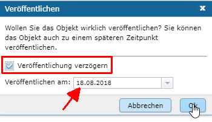

Abb.: Dialog - Auswahl für Veröffentlichungsdatum

Das Veröffentlichungsdatum wird danach im Kopfbereich des Datensatzes angezeigt.

.. image:: ../img/editor/ige-uvp_zeitgesteuerte-veröffentlichung_kopf.png

Abb.: Kopfbereich der Eingabemaske - Anzeige des Veröffentlichungsdatums

Session abgelaufen
------------------

Wenn eine längere Zeit (120min) keine Interaktion mit dem Editor stattfindet, läuft die Session (Besuchszeit) ab, man wird aus dem UVP-Editor ausgeloggt und muss sich am Editor neu anmelden. 

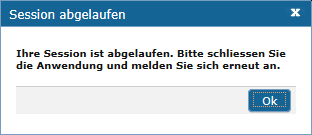

Abb.: Meldung - Session abgelaufen

Damit gehen leider auch alle Änderungen und Neueingaben verloren, die bis zu diesem Zeitpunkt noch nicht gespeichert worden sind. Es gibt keine automatische Zwischenspeicherung! Es empfiehlt sich daher, bei der Erfassung von Verfahrenen und Adressen immer wieder zwischendurch zwischen zu speichern.

UVP-Editor schließen
--------------------

Soll der UVP-Editor beendet werden, muss in der Menüleiste (rechts oben) der Menüpunkt *SCHLIESSEN* betätigt werden.

.. image:: ../img/editor/menü/ige-uvp_abmelden.png

Abb.: Menü - Editor schließen
 
Es erscheint eine Abfrage, ob der UVP-Editor verlassen werden soll. Wird der Button *Verlassen* betätigt, schließt sich der Editor samt der Registerkarte. 

.. image:: ../img/editor/meldung/ige-uvp_webseite-verlassen.png

Abb.: Frage - Webseite verlassen?
 
Sie müssen sich noch aus dem UVP-Portal abmelden. Hierfür betätigen Sie in der Seite Anmeldung auf den Link: *Logout*.
