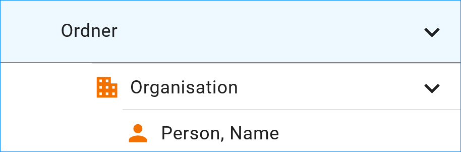
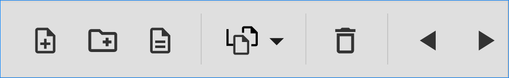

Allgemeines zum UVP-Editor
==========================

UVP-Editor im Ausgangszustand
----------------------------
 
Nach dem Laden des Editors wird zuerst die Übersicht angezeigt. Hier wird dargestellt, welche Verfahren bzw. Adressen zuletzt bearbeitet wurden und wann das geschehen ist.
Es gibt zwei Darstellungen: die Verfahren/Adressen, für welche der User selbst verantwortlich ist („Meine Datensätze“), sowie eine Übersicht über alle Verfahren/Adressen des Katalogs („Alle Datensätze“). 

.. image:: ../img-ige-ng/allgemein/ige-ng_uebersicht.png
   :width: 500
   

Aufbau der Benutzeroberfläche
------------------------------

.. image:: ../img-ige-ng/editor/ige-ng_benutzeroberflaeche.png
   :width: 500
   
Abb.: UVP-Editor - Aufbau der Benutzeroberfläche

Strukturierung der Daten
------------------------

Im UVP-Editor können die Daten mit Hilfe von Ordnern strukturiert werden.

.. image:: ../img-ige-ng/editor/ige-ng_icon_ordner.png
   :width: 50

Abb.: UVP-Editor - Ordnersymbol im Eingabeformular

   
Abb.: UVP-Editor - Aufbau der Ordnerstruktur

Durch Klicken auf den Pfeil nach rechts wird der Strukturbaum ausgeklappt bzw. durch Anklicken des Pfeils nach unten wird der Strukturbaum geschlossen.
 

Icons in der Datenstruktur
--------------------------

Im UVP-Editor gibt es verschiedene Vorhabentypen bzw. Adresstypen. 

**Vorhaben**

**Adressen**

Bearbeitungsstand
-----------------

Neben dem Verfahrens- bzw. dem Adresstyp zeigen die Icons zusätzlich den jeweiligen Bearbeitungsstand an.

.. csv-table::
    :widths: 50 70 500

    Symbol , Farbe , Beschreibung
    .. image:: ../img-ige-ng/editor/ige-ng_icon-gespeichert.png , orange , Das Vorhaben bzw. die Adresse wurde angelegt und gespeichert und befinden sich in Bearbeitung.
	.. image:: ../img-ige-ng/editor/ige-ng_icon-veroeffentlicht.png , schwarz , Das Vorhaben bzw. die Adresse ist veröffentlicht
    .. image:: ../img-ige-ng/editor/ige-ng_icon-in-bearbeitung.png , orange und schwarz ,  Es handelt sich um eine veröffentlichte Version des Vorhabens bzw der Adresse, der Datensatz wurde bearbeitet, aber noch nicht veröffentlicht.

Menue
-----

.. image:: ../img-ige-ng/editor/ige-ng_menue.png
   :width: 300

Symbolleiste
------------

   
Abb.: Symbolleiste

.. image:: ../img-ige-ng/editor/ige-ng_toolbar_submenue.png
   :width: 300

Abb.: Symbolleiste Untermenü

Hier im Einzelnen die zur Verfügung stehenden Werkzeuge: 

.. csv-table::
    :widths: 50 300

    Symbol , Bezeichnung
    .. image:: ../img-ige-ng/editor/ige-ng_toolbar_verfahren_neu_anlegen.png , Vorhaben / Adressen anlegen
    .. image:: ../img-ige-ng/editor/ige-ng_toolbar_ordner_neu_anlegen.png , Ordner anlegen
    .. image:: ../img-ige-ng/editor/ige-ng_toolbar_vorschau_und_kopieren-einfuegen.png , Kopieren, Ausschneiden, Einfügen
	.. image:: ../img-ige-ng/editor/ige-ng_toolbar_vorschau_und_loeschen.png , Löschen
	.. image:: ../img-ige-ng/editor/ige-ng_toolbar_vorschau_und_vor.png , vor
	.. image:: ../img-ige-ng/editor/ige-ng_toolbar_vorschau_und_zurueck.png , zurück

Eingabefelder
-------------

Im UVP-Editor gibt es eine Vielzahl von Feldern, die ausgefüllt werden können, es müssen jedoch nicht immer alle Felder belegt werden. Für jedes Verfahren bzw. jede Adresse gibt es jedoch sogenannte Pflichtfelder, die auf jeden Fall ausgefüllt werden müssen. Ohne die Befüllung dieser Pflichtfelder, lässt sich der Datensatz nicht abspeichern! Gekennzeichnet sind diese Pflichtfelder durch fett gedruckte Überschriften oder durch ein Sternchen. 

.. image:: ../img-ige-ng/editor/ige-ng_felder.png
   :width: 500

Abb.: Eingabefelder mit * sind Pflichtfelder

Unterschiedliche Feldtypen
--------------------------

**Textfelder**

Zum Füllen von Textfeldern klicken Sie in das Feld. 

Zum Vergrößern des Feldes, ziehen Sie mit der Maus an der rechten unteren Ecke (linke Maustaste gedrückt halten).

**Hinweis:** *Das Vergrößern des Feldes funktioniert nicht in allen Browsern. Beim Internet Explorer (IE 11) ist es nicht möglich.*

.. image:: ../img-ige-ng/editor/ige-ng_feldtyp_textfeld.png
   :width: 500

Abb.:  Feldtyp - Textfeld

**Datumsangaben**
Der Kalender wird über das Kalendersymbol an der rechten Seite des Feldes aufgeklappt.

**Auswahllisten**
Auswahllisten werden über den Pfeil an der rechten Seite des Feldes aufgeklappt. Das „Autocomplete Feature“ sorgt dafür, dass bei der Eingabe Vorschläge angezeigt werden.

.. image:: ../img/editor/ige/ige-uvp_feldtyp_auswahl.png
   :width: 500

Abb.: Feldtyp - Auswahlliste

Zwischenspeichern, Speichern & Veröffentlichen
----------------------------------------------

Im UVP-Editor werden zwei Speicherarten unterschieden: 

.. csv-table::
    :widths: 50 300

    .. image:: ../img/editor/toolbar/ige-uvp_toolbar_zwischenspeichern.png, Zwischenspeichern
    .. image:: ../img/editor/toolbar/ige-uvp_toolbar_abschließendes_speichern_und_veröffentlichen.png, Abschließendes Speichern & Veröffentlichen

Das *Zwischenspeichern* speichert den geänderten bzw. neu erfassten Datensatz, die Daten werden allerdings noch nicht für die Veröffentlichung im Internet freigegeben, d.h. sie bleiben weiterhin nur im Strukturbaum des UVP-Editors sichtbar. Das Zwischenspeichern ist jederzeit möglich, auch wenn noch nicht alle Pflichtfelder ausgefüllt worden sind. 

Beim *abschließenden Speichern & Veröffentlichen* werden die Daten für das Internet freigegeben. 

Voraussetzung für das abschließende Speichern ist die Befüllung sämtlicher Pflichtfelder. Fehlen entsprechende Angaben, erscheint bei der Betätigung des Buttons „Abschließendes Speichern & Veröffentlichen“ eine Fehlermeldung und die Überschriften der entsprechenden Felder werden rot eingefärbt. 

.. image:: ../img/editor/meldungen/ige-uvp_abschließendes-speichern.png
   :width: 200

Abb.: Hinweis - Alle Pflichtfelder befüllen

Um trotz der Fehlermeldung die Bearbeitung sichern zu können, wählen Sie die Funktion Zwischenspeichern. 

Zeitgesteuerte Veröffentlichung von Datensätzen
-----------------------------------------------

Datensätze können zu einem zukünftigen Zeitpunkt veröffentlicht werden. Bei der Veröffentlichung wird nach der Validierung ein Dialog geöffnet, in dem ein zukünftiges Veröffentlichungsdatum ausgewählt werden kann.

.. image:: ../img/editor/verfahren/ige-uvp_zeitgesteuerte-veröffentlichung_dialog.png
   :width: 200

Abb.: Dialog - Auswahl für Veröffentlichungsdatum

Das Veröffentlichungsdatum wird danach im Kopfbereich des Datensatzes angezeigt.

.. image:: ../img/editor/verfahren/ige-uvp_zeitgesteuerte-veröffentlichung_kopf.png
   :width: 500

Abb.: Kopfbereich der Eingabemaske - Anzeige des Veröffentlichungsdatums

Session abgelaufen
------------------

Wenn eine längere Zeit (120min) keine Interaktion mit dem Editor stattfindet, läuft die Session (Besuchszeit) ab, man wird aus dem UVP-Editor ausgeloggt und muss sich am Editor neu anmelden. 

Abb.: Meldung - Session abgelaufen

Damit gehen leider auch alle Änderungen und Neueingaben verloren, die bis zu diesem Zeitpunkt noch nicht gespeichert worden sind. Es gibt keine automatische Zwischenspeicherung! Es empfiehlt sich daher, bei der Erfassung von Verfahrenen und Adressen immer wieder zwischendurch zwischen zu speichern.

UVP-Editor schließen
--------------------

Soll der UVP-Editor beendet werden, muss in der Menüleiste (rechts oben) der Menüpunkt *SCHLIESSEN* betätigt werden.

.. image:: ../img/editor/menü/ige-uvp_abmelden.png
   :width: 150

Abb.: Menü - Editor schließen
 
Es erscheint eine Abfrage, ob der UVP-Editor verlassen werden soll. Wird der Button *Verlassen* betätigt, schließt sich der Editor samt der Registerkarte. 

Abb.: Frage - Webseite verlassen?
 
Sie müssen sich noch aus dem UVP-Portal abmelden. Hierfür betätigen Sie in der Seite Anmeldung auf den Link: *Logout*.
