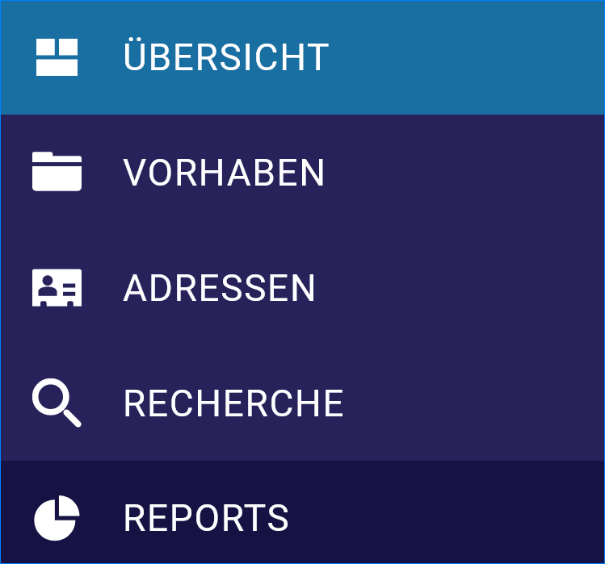
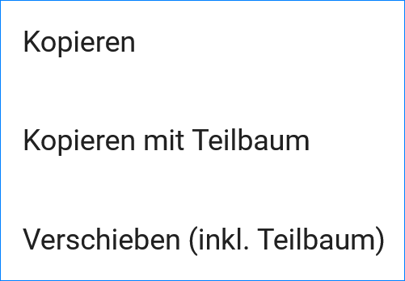
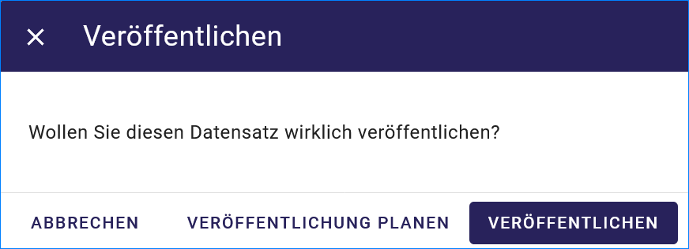

Allgemeines zum UVP-Editor
==========================

UVP-Editor im Ausgangszustand
----------------------------
 
Nach dem Laden des Editors wird zuerst die Übersicht angezeigt. Hier wird dargestellt, welche Verfahren bzw. Adressen zuletzt bearbeitet wurden und wann das geschehen ist.
Es gibt zwei Darstellungen: die Verfahren/Adressen, für welche der User selbst verantwortlich ist („Meine Datensätze“), sowie eine Übersicht über alle Verfahren/Adressen des Katalogs („Alle Datensätze“). 

.. image:: ../img-ige-ng/allgemein/ige-ng_uebersicht.png
   
Abb.: Übersicht

Aufbau der Benutzeroberfläche
------------------------------

   
Abb.: UVP-Editor - Benutzeroberfläche

Aufbau der Benutzeroberfläche: Links - Navigation, Mitte - Ordnerstruktur, Rechts - Datenerfassung

Strukturierung der Daten
------------------------

Im UVP-Editor können die Daten mit Hilfe von Ordnern strukturiert werden.

Abb.: UVP-Editor - Ordnersymbol im Eingabeformular

.. image:: ../img-ige-ng/editor/ige-ng_datenstruktur.png
   :width: 400
   
Abb.: UVP-Editor - Aufbau der Ordnerstruktur

Durch Klicken auf den Pfeil nach rechts wird der Strukturbaum ausgeklappt bzw. durch Anklicken des Pfeils nach unten wird der Strukturbaum geschlossen.
 

Icons in der Datenstruktur
--------------------------

Im UVP-Editor gibt es verschiedene Vorhabentypen bzw. Adresstypen. 

**Vorhaben**

.. image:: ../img-ige-ng/editor/ige-ng_icons-typen-vorhaben.png
   :width: 400

**Adressen**

.. image:: ../img-ige-ng/editor/ige-ng_icons-adressen.png
   :width: 400

Bearbeitungsstand
-----------------

Neben dem Verfahrens- bzw. dem Adresstyp zeigen die Icons zusätzlich den jeweiligen Bearbeitungsstand an.

.. csv-table::
    :widths: 50 70 300

    Symbol , Farbe , Beschreibung
    .. image:: ../img-ige-ng/editor/ige-ng_icon_gespeichert.png , orange , Das Vorhaben bzw. die Adresse wurde angelegt und gespeichert und befinden sich in Bearbeitung.
	.. image:: ../img-ige-ng/editor/ige-ng_icon-veroeffentlicht.png , schwarz , Das Vorhaben bzw. die Adresse wurde veröffentlicht
    .. image:: ../img-ige-ng/editor/ige-ng_icon-in-bearbeitung.png , orange und schwarz ,  Es handelt sich um eine veröffentlichte Version des Vorhabens bzw der Adresse, der Datensatz wurde bearbeitet, aber noch nicht veröffentlicht.

Menü
----

   
Abb.: Menü

   
Abb.: Menü verkleinern

.. image:: ../img-ige-ng/editor/ige-ng_menue_verkleinert.png
   :height: 300
   
Abb.: Menü verkleinernert

   
Abb.: Menü vergrößern

Symbolleiste
------------

.. image:: ../img-ige-ng/editor/ige-ng_toolbar.png
   :width: 400
   
Abb.: Symbolleiste

Hier im Einzelnen die zur Verfügung stehenden Werkzeuge: 

.. csv-table::
    :widths: 50 300

    Symbol , Bezeichnung
    .. image:: ../img-ige-ng/editor/ige-ng_symbolleiste_vorhaben-anlegen.png , Neues Vorhaben anlegen
    .. image:: ../img-ige-ng/editor/ige-ng_symbolleiste_ordner-erstellen.png , Ordner erstellen
    .. image:: ../img-ige-ng/editor/ige-ng_symbolleiste_kopieren-verschieben.png , Kopieren / Verschieben
	.. image:: ../img-ige-ng/editor/ige-ng_symbolleiste_loeschen.png , Löschen
	.. image:: ../img-ige-ng/editor/ige-ng_symbolleiste_zum-letzten-dokument.png , Springe zum letzten Dokument
	.. image:: ../img-ige-ng/editor/ige-ng_symbolleiste_zum-naechsten-dokument.png , Springe zum nächsten Dokument

Abb.: Symbolleiste - Untermenü für Kopieren / Verschieben

Eingabefelder
-------------

Im UVP-Editor gibt es eine Vielzahl von Feldern, die ausgefüllt werden können, es müssen jedoch nicht immer alle Felder belegt werden. Für jedes Verfahren bzw. jede Adresse gibt es jedoch sogenannte Pflichtfelder, die auf jeden Fall ausgefüllt werden müssen. Ohne die Befüllung dieser Pflichtfelder, lässt sich der Datensatz nicht abspeichern! Gekennzeichnet sind diese Pflichtfelder durch fett gedruckte Überschriften oder durch ein Sternchen. 

Abb.: Eingabefelder mit * sind Pflichtfelder

Unterschiedliche Feldtypen
--------------------------

**Textfelder**

Zum Füllen von Textfeldern klicken Sie in das Feld. 

Zum Vergrößern des Feldes, ziehen Sie mit der Maus an der rechten unteren Ecke (linke Maustaste gedrückt halten).

**Hinweis:** *Das Vergrößern des Feldes funktioniert nicht in allen Browsern. Beim Internet Explorer (IE 11) ist es nicht möglich.*

Abb.:  Feldtyp - Textfeld

**Datumsangaben**

Der Kalender wird über das Kalendersymbol an der rechten Seite des Feldes aufgeklappt.

**Auswahllisten**

Auswahllisten werden über den Pfeil an der rechten Seite des Feldes aufgeklappt. Das „Autocomplete Feature“ sorgt dafür, dass bei der Eingabe Vorschläge angezeigt werden.

Abb.: Feldtyp - Auswahl

Zwischenspeichern, Speichern & Veröffentlichen
----------------------------------------------

Im UVP-Editor werden zwei Speicherarten unterschieden: 

Das *Zwischenspeichern* speichert den geänderten bzw. neu erfassten Datensatz, die Daten werden allerdings noch nicht für die Veröffentlichung im Internet freigegeben, d.h. sie bleiben weiterhin nur im Strukturbaum des UVP-Editors sichtbar. Das Zwischenspeichern ist jederzeit möglich, auch wenn noch nicht alle Pflichtfelder ausgefüllt worden sind.

Abb.: Speichern

Beim *abschließenden Speichern & Veröffentlichen* werden die Daten für das Internet freigegeben.

Abb.: Veröffentlichen

Voraussetzung für das abschließende Speichern ist die Befüllung sämtlicher Pflichtfelder. Fehlen entsprechende Angaben, erscheint bei der Betätigung des Buttons „Abschließendes Speichern & Veröffentlichen“ eine Fehlermeldung und die Überschriften der entsprechenden Felder werden rot eingefärbt. 

Abb.: Hinweis - Alle Pflichtfelder ausfüllen

Um trotz der Fehlermeldung die Bearbeitung sichern zu können, wählen Sie die Funktion Zwischenspeichern. 

Zeitgesteuerte Veröffentlichung von Datensätzen
-----------------------------------------------

Datensätze können zu einem zukünftigen Zeitpunkt veröffentlicht werden. Bei der Veröffentlichung wird nach der Validierung das Dialogfenster "Veröffentlichen" angezeigt, in dem ein zukünftiges Veröffentlichungsdatum "VERÖFFENTLICHUNG PLANEN" ausgewählt werden kann. Es öffnet sich dann ein weiteres Fenster "Veröffentlichen planen" mit einer Kalenderfunktion, hier kann das Veröffentlichungsdatum gewählt werden.

Abb.: Dialogfenster - Auswahl für Veröffentlichungsvarianten
   

Abb.: Dialogfenster - Auswahl für Veröffentlichungsdatum

Das Veröffentlichungsdatum wird danach im Kopfbereich des Datensatzes angezeigt.

Abb.: Kopfbereich der Eingabemaske - Anzeige des Veröffentlichungsdatums

Unter dem Veröffentlichungsdatum befindet sich der Button "VERÖFFENTLICHUNG ABBRECHEN UND VORHABEN BEARBEITEN". Nach Betätigung erscheint ein grünes Feld mit dem Hinweis: "Die geplante Veröffentlichung wurde abgebrochen."

Session abgelaufen
------------------

Wenn eine längere Zeit (120min) keine Interaktion mit dem Editor stattfindet, läuft die Session (Besuchszeit) ab, man wird aus dem UVP-Editor ausgeloggt und muss sich am Editor neu anmelden. 

Abb.: Meldung - Session abgelaufen

Damit gehen leider auch alle Änderungen und Neueingaben verloren, die bis zu diesem Zeitpunkt noch nicht gespeichert worden sind. Es gibt keine automatische Zwischenspeicherung! Es empfiehlt sich daher, bei der Erfassung von Verfahrenen und Adressen immer wieder zwischendurch zwischen zu speichern.

UVP-Editor schließen
--------------------

Soll der UVP-Editor beendet werden, muss auf der Seite (oben rechts) der Punkt für die Profilverwaltung betätigt werden.

Abb.: Profilverwaltung mit Button "ABMELDEN"