Allgemeines zum neuen UVP-Editor
================================

UVP-Editor im Ausgangszustand
-----------------------------
 
Nach dem Laden des UVP-Editors wird die Übersicht angezeigt. Dargestellt werden Verfahren bzw. Adressen die zuletzt bearbeitet wurden und eine Statistik wie viele Daten sich in Bearbeitung befinden und wie viele veröffentlicht sind.

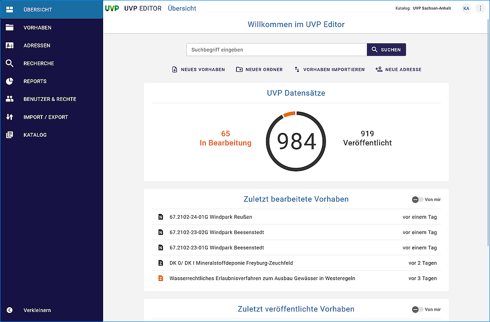
   
Abb.: Übersicht

Aufbau der Benutzeroberfläche
-----------------------------

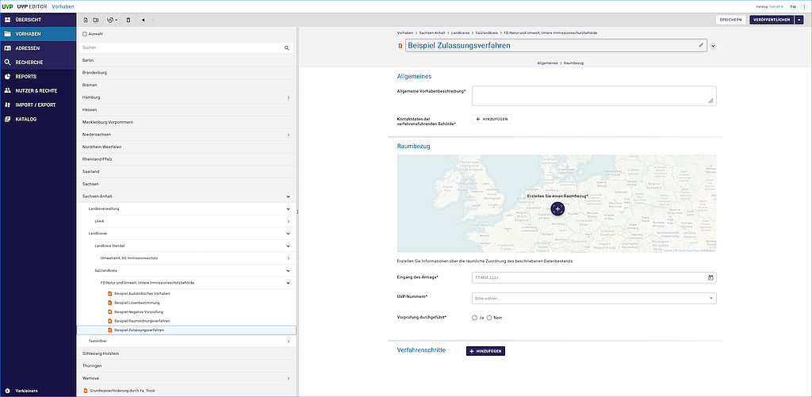
   
Abb.: UVP-Editor - Benutzeroberfläche

Aufbau der Benutzeroberfläche:

* Links - Navigation
* Mitte - Ordnerstruktur
* Rechts - Datenerfassung

Strukturierung der Daten
------------------------

Im UVP-Editor können die Daten mit Hilfe von Ordnern strukturiert werden.

Abb.: UVP-Editor - Ordnersymbol im Eingabeformular

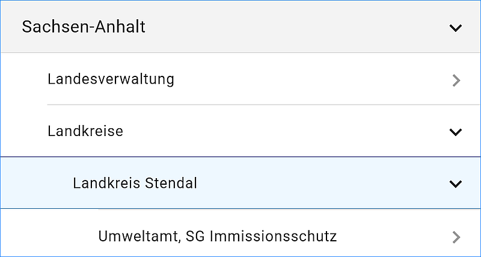
   
Abb.: UVP-Editor - Aufbau der Ordnerstruktur

Durch Klicken auf den Pfeil nach rechts wird die Ordnerstruktur ausgeklappt bzw. durch Anklicken des Pfeils nach unten wird die Struktur geschlossen.
 

Icons in der Datenstruktur
--------------------------

Im UVP-Editor gibt es verschiedene Vorhabentypen bzw. Adresstypen. 

**Vorhaben**

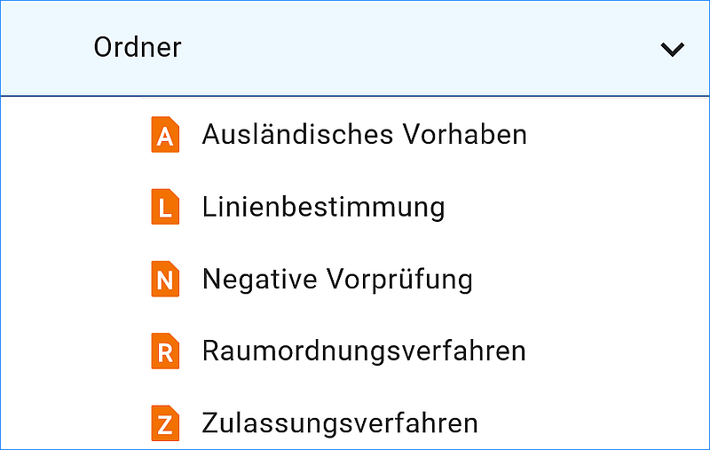

Abb.: Vorhabentypen in der Ordnerstruktur

**Adressen**

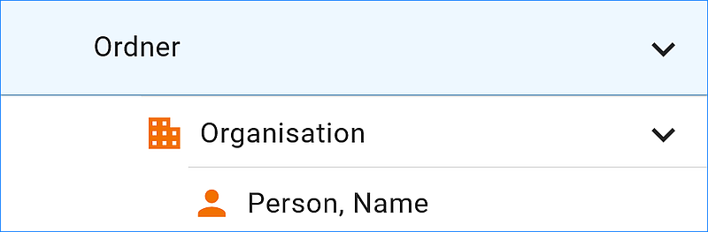

Abb.: Adresstypen in der Ordnerstruktur

Icons - Bearbeitungsstatus
--------------------------

Neben dem Verfahrens- bzw. dem Adresstyp zeigen die Icons zusätzlich den jeweiligen Bearbeitungsstatus an.

.. csv-table::
    :widths: 50 150 300

    Symbol , Farbe , Beschreibung
    .. figure:: ../img-ige-ng/editor/ige-ng_icon_gespeichert.png , orange , Das Vorhaben bzw. die Adresse wurde angelegt und gespeichert und befinden sich in Bearbeitung.
	.. figure:: ../img-ige-ng/editor/ige-ng_icon_veroeffentlicht.png, schwarz , Das Vorhaben bzw. die Adresse wurde veröffentlicht
    .. figure:: ../img-ige-ng/editor/ige-ng_icon_in-bearbeitung.png , orange und schwarz , Es handelt sich um eine veröffentlichte Version des Vorhabens bzw. der Adresse - der Datensatz wurde bearbeitet aber noch nicht erneut veröffentlicht.

Menü
----

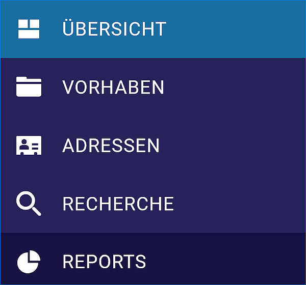
   
Abb.: Menü Symbole mit Beschriftung

   
Abb.: Menü verkleinern

   
Abb.: Menü (verkleinernert) - Symbole

   
Abb.: Menü erweitern

Symbolleiste
------------

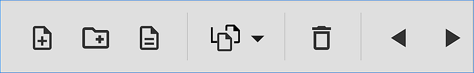
   
Abb.: Symbolleiste

Hier im Einzelnen die zur Verfügung stehenden Werkzeuge: 

.. csv-table::
    :widths: 50 300

    Symbol , Bezeichnung
    .. figure:: ../img-ige-ng/editor/ige-ng_symbolleiste_vorhaben-anlegen.png , Neues Vorhaben anlegen
    .. figure:: ../img-ige-ng/editor/ige-ng_symbolleiste_ordner-erstellen.png , Ordner erstellen
	.. figure:: ../img-ige-ng/editor/ige-ng_symbolleiste_vorschau-druckfunktion.png, Vorschau- und Druckfunktion 
    .. figure:: ../img-ige-ng/editor/ige-ng_symbolleiste_kopieren-verschieben.png , Kopieren / Verschieben
	.. figure:: ../img-ige-ng/editor/ige-ng_symbolleiste_loeschen.png , Löschen
	.. figure:: ../img-ige-ng/editor/ige-ng_symbolleiste_zum-letzten-dokument.png , Springe zum letzten Dokument (Wird dieses Symbol länger gedrückt erscheint eine Historie.)
	.. figure:: ../img-ige-ng/editor/ige-ng_symbolleiste_zum-naechsten-dokument.png , Springe zum nächsten Dokument (Wird dieses Symbol länger gedrückt erscheint eine Historie.)

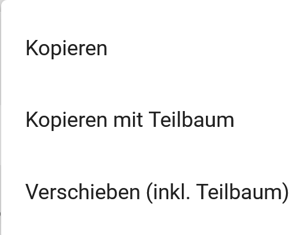

Abb.: Symbolleiste - Untermenü für Kopieren / Verschieben

Eingabefelder
-------------

Im UVP-Editor gibt es eine Vielzahl von Feldern, die ausgefüllt werden können, es müssen jedoch nicht immer alle Felder belegt werden. Für jedes Verfahren bzw. jede Adresse gibt es jedoch sogenannte Pflichtfelder, die auf jeden Fall ausgefüllt werden müssen. Ohne die Befüllung dieser Pflichtfelder lässt sich der Datensatz nicht abspeichern! Gekennzeichnet sind diese Pflichtfelder durch ein Sternchen. 

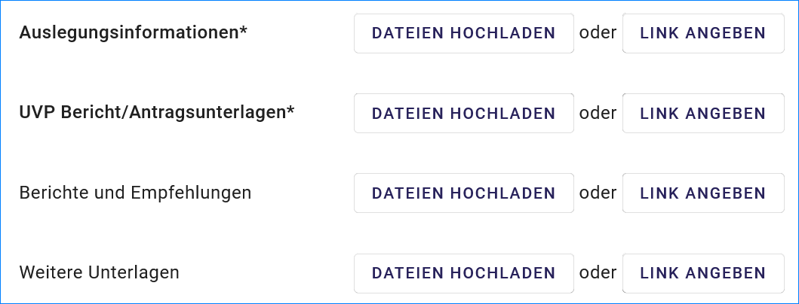

Abb.: Eingabefelder mit * sind Pflichtfelder

Unterschiedliche Feldtypen
--------------------------

**Textfelder**

Zum Füllen von Textfeldern klicken Sie in das Feld. Zum Vergrößern des Feldes, ziehen Sie mit der Maus an der rechten unteren Ecke (linke Maustaste gedrückt halten).

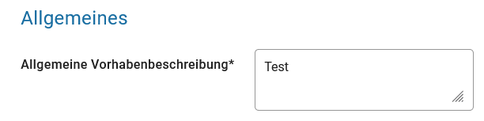

Abb.:  Feldtyp - Textfeld

In Textfeldern dürfen die folgenden Tags verwendet werden:
<b></b>, <i></i>, <u></u>, 

,    , <strong></strong>, <ul></ul>, <ol></ol>, <li></li>

**Datumsangaben**

Der Kalender wird über das Kalendersymbol an der rechten Seite des Feldes aufgeklappt.

**Auswahllisten**

Auswahllisten werden über den Pfeil an der rechten Seite des Feldes aufgeklappt. Das „Autocomplete Feature“ sorgt dafür, dass bei der Eingabe Vorschläge angezeigt werden.

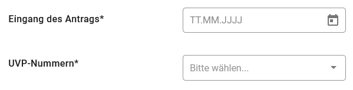

Abb.: Feldtyp - Auswahl

Speichern & Veröffentlichen
---------------------------

Im UVP-Editor werden zwei Speicherarten unterschieden: 

Das "SPEICHERN" speichert den geänderten bzw. neu erfassten Datensatz, die Daten werden allerdings noch nicht für die Veröffentlichung im Internet freigegeben, d.h. sie bleiben weiterhin nur in der Ordnerstruktur des UVP-Editors sichtbar. Das Speichern ist jederzeit möglich, auch wenn noch nicht alle Pflichtfelder ausgefüllt sind.

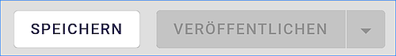

Abb.: Speichern

Mit dem abschließenden "VERÖFFENTLICHEN" werden die Daten für das Internet freigegeben.

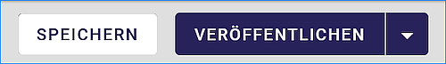

Abb.: Veröffentlichen

Voraussetzung für das "VERÖFFENTLICHEN" ist die Befüllung sämtlicher Pflichtfelder. Fehlen entsprechende Angaben, erscheint bei der Betätigung des Buttons "VERÖFFENTLICHEN" eine Fehlermeldung und die Überschriften der entsprechenden Felder werden in rot angezeigt. 

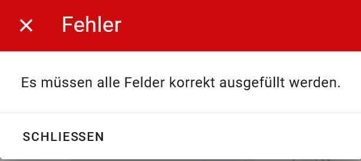

Abb.: Hinweis - Alle Pflichtfelder ausfüllen

Um trotz der Fehlermeldung die Bearbeitung sichern zu können, wählen Sie die Funktion "SPEICHERN".

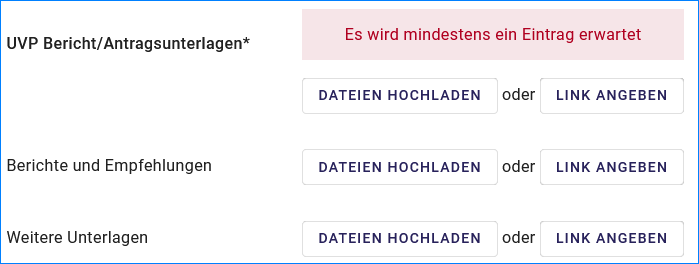

Abb.: Hinweis am Feld - Es wird mindestens ein Eintrag erwartet

Felder, die nicht korrekt ausgefüllt sind, werden mit der Anmerkung "Es wird mindestens ein Eintrag erwartet" gekennzeichnet.

Zeitgesteuerte Veröffentlichung
-------------------------------

   
Abb.: VERÖFFENTLICHEN

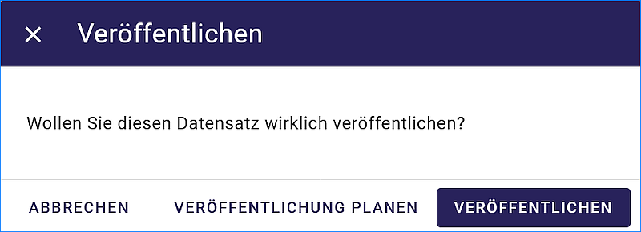

Abb.: Dialogfenster - Auswahl für Veröffentlichungsvarianten

   
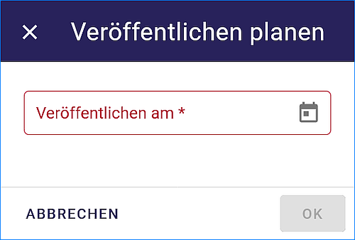

Abb.: Dialogfenster - Auswahl für Veröffentlichungsdatum

Das Veröffentlichungsdatum wird danach im Kopfbereich des Datensatzes angezeigt.

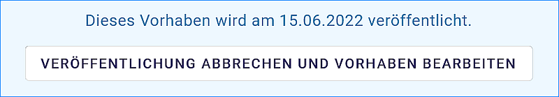

Abb.: Kopfbereich der Eingabemaske - Anzeige des Veröffentlichungsdatums

Unter dem Veröffentlichungsdatum befindet sich der Button "VERÖFFENTLICHUNG ABBRECHEN UND VORHABEN BEARBEITEN". Nach Betätigung erscheint ein grünes Feld mit dem Hinweis: "Die geplante Veröffentlichung wurde abgebrochen."

Optionen für die Veröffentlichung
---------------------------------
   
Rechts von VERÖFFENTLICHEN befindet sich der Button für verschiedene Optionen (Pfeil nach unten).

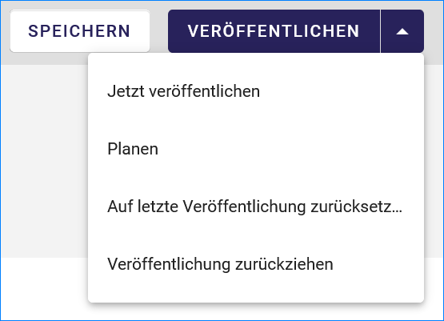
   
Abb.: Fenster mit Optionen für die Veröffentlichung
   

Option: "Jetzt veröffentlichen"
^^^^^^^^^^^^^^^^^^^^^^^^^^^^^^^

Der Button VERÖFFENTLICHEN und die Option "Jetzt veröffentlichen" haben die selbe Funktionalität.

Abb.: Dialogfenster - Auswahl für Veröffentlichungsvarianten

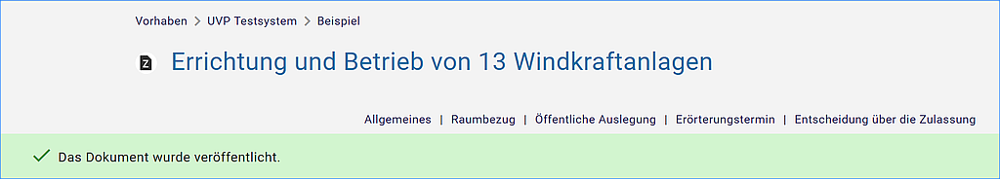

Abb.: Meldung: Das Dokument wurde veröffentlicht

Option: "Veröffentlichung planen"
^^^^^^^^^^^^^^^^^^^^^^^^^^^^^^^^

Datensätze können zu einem zukünftigen Zeitpunkt veröffentlicht werden. Bei der Veröffentlichung wird nach der Validierung das Dialogfenster "Veröffentlichen" angezeigt, in dem ein zukünftiges Veröffentlichungsdatum "VERÖFFENTLICHUNG PLANEN" ausgewählt werden kann. Es öffnet sich dann ein weiteres Fenster "Veröffentlichen planen" mit einer Kalenderfunktion, hier kann das Veröffentlichungsdatum gewählt werden.

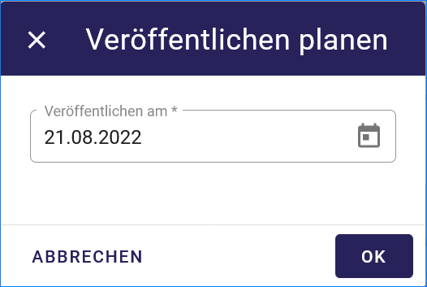

Abb.: Funktion Veröffentlichung planen - Angabe eines Datums
   
   
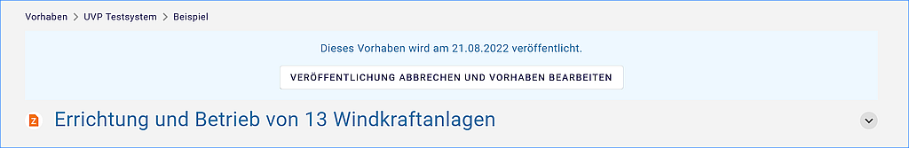

Abb.: Meldung für die geplante Veröffentlichung

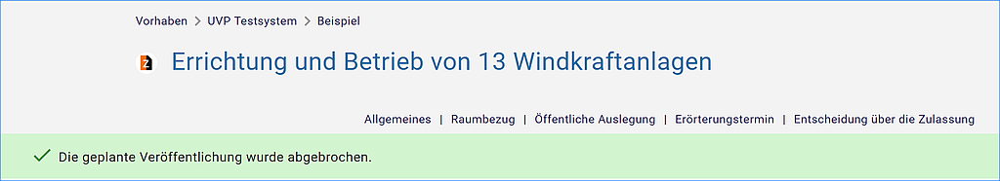

Abb.: Meldung für: VERÖFFENTLICHUNG ABBRECHEN UND VORHABEN BEARBEITEN

Option: "Auf letzte Veröffentlichung zurücksetzten"
^^^^^^^^^^^^^^^^^^^^^^^^^^^^^^^^^^^^^^^^^^^^^^^^^^^

Wurde ein Vorhaben veröffentlicht und danach eine Änderung in das Vorhaben eingefügt und gespeichert (Symbol orange/schwarz), so lässt sich diese Änderung über die Funktion "Auf letzte Veröffentlichung zurücksetzen" rückgängig machen (Symbol schwarz).

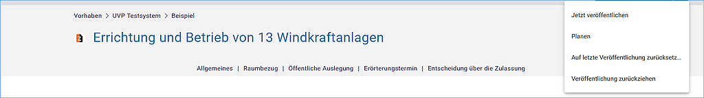

Abb.: Auf letzte Veröffentlichung zurücksetzen

Option: "Veröffentlichung zurückziehen"
^^^^^^^^^^^^^^^^^^^^^^^^^^^^^^^^^^^^^^^

Für diese Option müssen im jeweiligen Bundesland Festlegungen getroffen werden, wann veröffentlichte Vorhaben zurückgezogen werden dürfen.

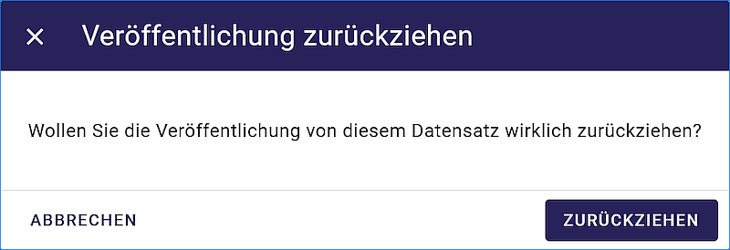

Abb.: Abfrage ob die Veröffentlichung wirklich zurückgezogen werden soll

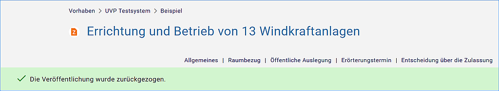

Abb.: Meldung, dass für dieses Vorhaben die Veröffentlichung zurückgezogen wurde.

Dokumente bearbeiten
--------------------

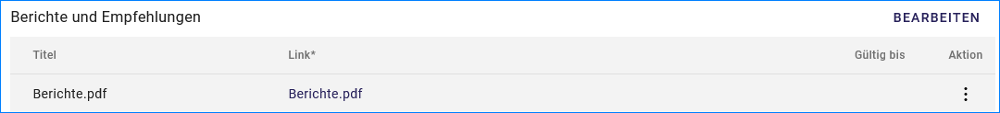

Abb.: Dokumente - Bearbeiten

Wurden Dokumente in ein Vorhaben geladen, erscheint auf der rechten Seite über den Dokumenten, der Link "BEARBEITEN". Wird dieser betätigt, öffnet sich ein Untermenü mit den Optionen "Bearbeiten" und "Löschen". Wird bearbeiten gewäht, erscheint unter der Symbolleiste eine Checkbox für die Auswahl der zu bearbeitenden Dokumente.

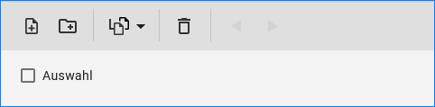

Abb.: Dokumente - Bearbeiten - Checkbox "Auswahl"

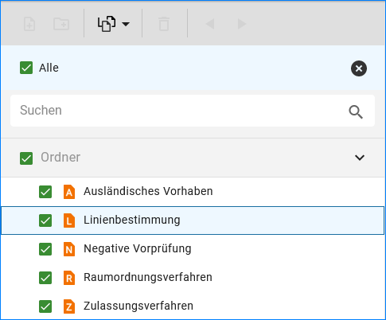

Abb.: Dokumente - Bearbeiten - Alle Dokumente auswählen

.. figure:: ../img-ige-ng/editor/ige-ng_editor_ausgewaehlte-kopieren.png
   :alt: Dokumente - Bearbeiten - Dokumente auswählen
   :align: left
   :scale: 80
   :figwidth: 100%

Abb.: Dokumente - Bearbeiten - Dokumente auswählen

Es besteht die Möglichkeit über das Untermenü des Symbols "Kopieren / Verschieben" eine Option zu wählen. Anschließend wird der Ordner gewählt, in den die Dokumente kopiert / verschoben werden sollen.

Adressen und Vorhaben suchen
-----------------------------

Die Beschreibung wie Adressen oder Vorhaben gesucht werden können, steht unter dem Block "Funktionen im UVP-Editor", Abschnitt `"Suche" <../suche/ige-ng_suche.html>`_.

Metadaten anzeigen
------------------

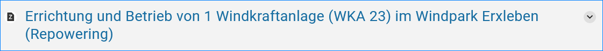

Abb.: Vorhaben - Metadaten anzeigen

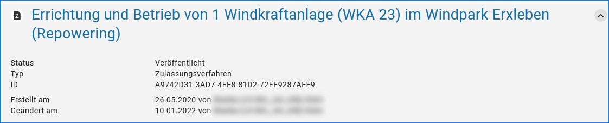

Abb.: Vorhaben - Metadaten

Besuchszeit ist abgelaufen (Logout)
-------------------------------------------

Wenn eine längere Zeit (30 Minuten) keine Interaktion mit dem Editor stattfindet, läuft die Besuchszeit ab. 5 Minuten vor Ablauf der Besuchszeit erscheint oben in der Seite ein Countdown. Ist der Countdown angelaufen wird der Benutzer aus dem UVP-Editor ausgeloggt und muss sich am Editor neu anmelden. Optional kann der "Refresh-Button" betätigt werden, dann beginnt der Countdown erneut. 

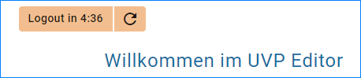

Abb.: Countdown für den Logout und "Session-refresh-Button"

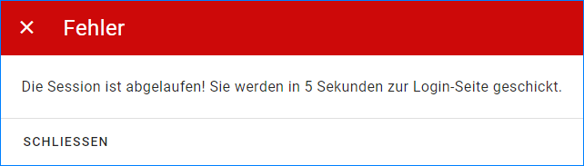

Abb.: Meldung - Besuchszeit abgelaufen

Damit gehen leider auch alle Änderungen und Neueingaben verloren, die bis zu diesem Zeitpunkt noch nicht gespeichert worden sind. Es gibt keine automatische Zwischenspeicherung! Es empfiehlt sich daher, bei der Erfassung von Verfahrenen und Adressen immer wieder zwischendurch zwischen zu speichern. (Ein automatisches Zwischenspeichern ist zukünftig vorgesehen.)

UVP-Editor schließen
--------------------

Soll der UVP-Editor beendet werden, muss auf der Seite (oben rechts) der Punkt für die Profilverwaltung betätigt werden.

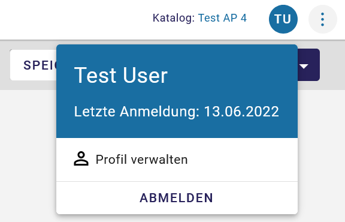

Abb.: Profilverwaltung mit Button "ABMELDEN"
