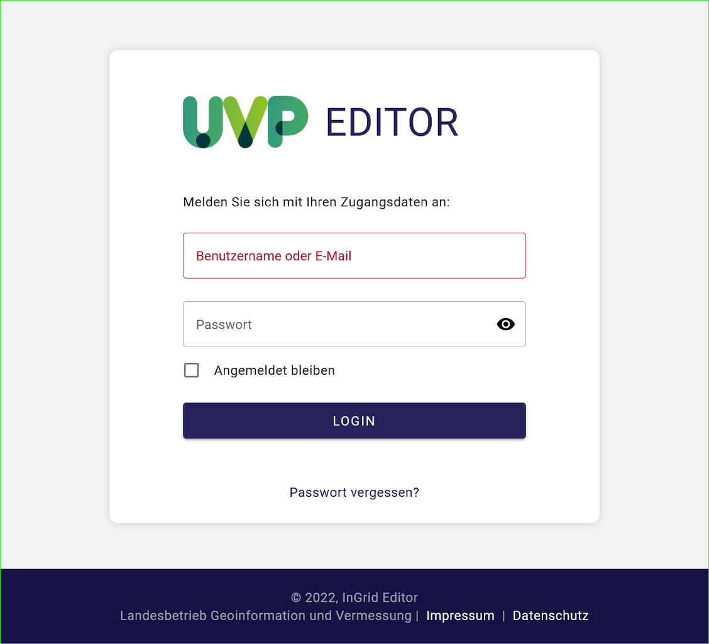
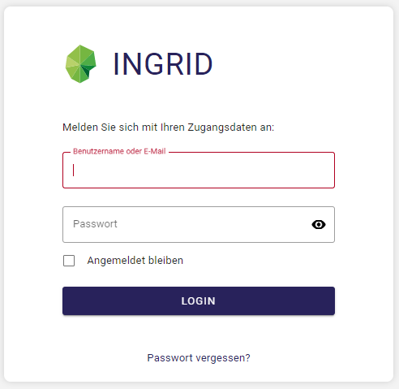
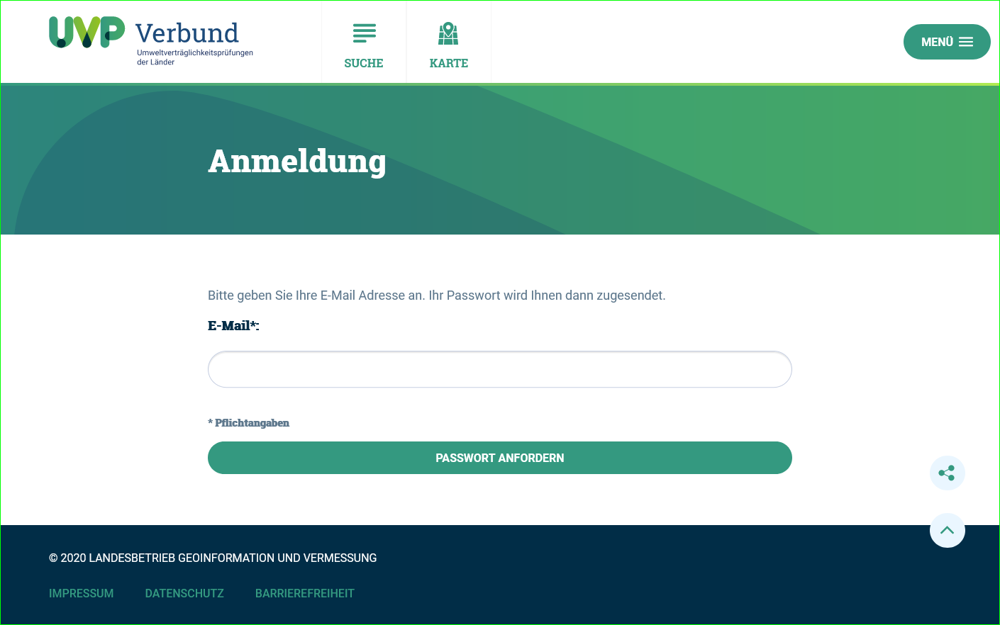
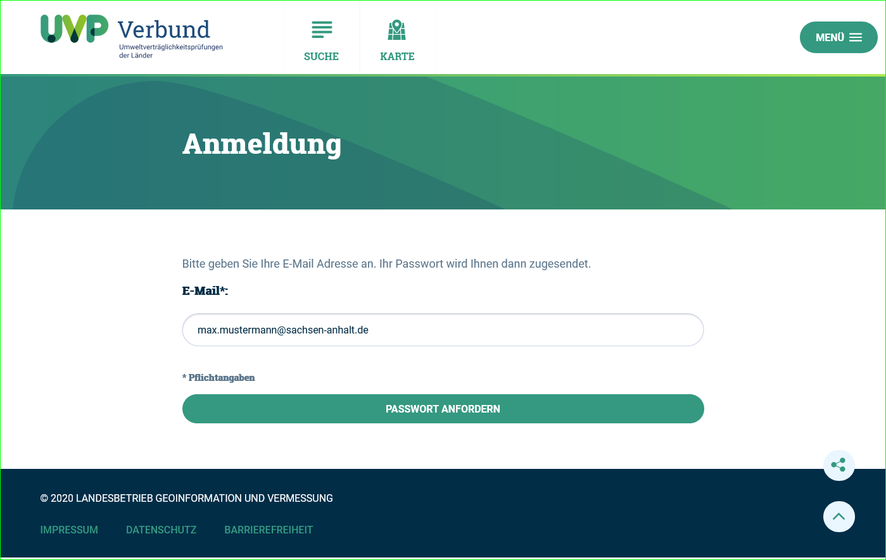
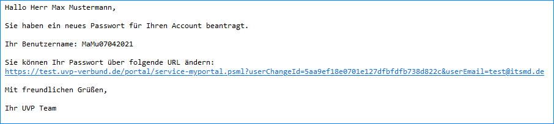
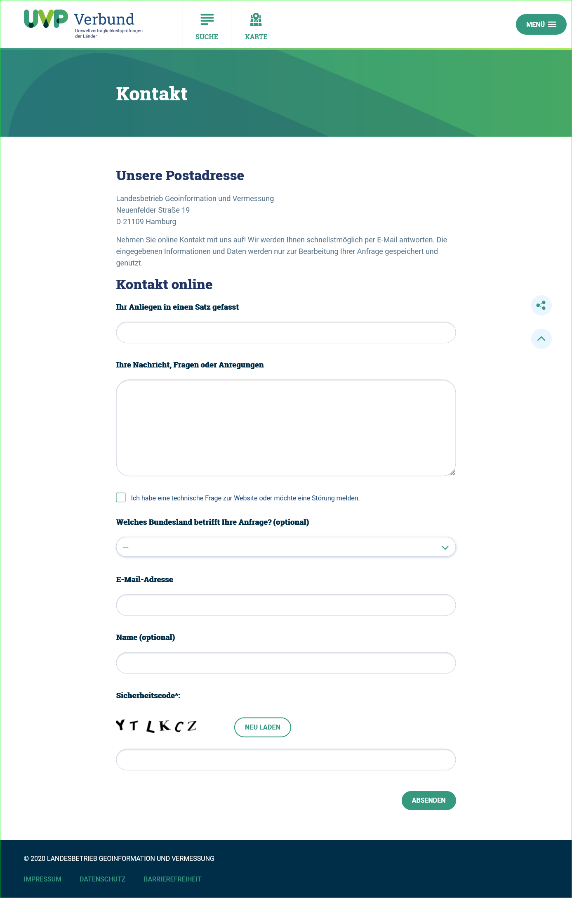

Registrierung und Anmeldung
============================

Zugang zum UVP-Editor
---------------------

Sie erreichen das UVP-Verbund und damit den Einstieg zum UVP-Editor unter folgender Internetadresse: https://www.uvp-verbund.de/log-in

Über das linke Anmeldeformular gelangen Sie zur Anmeldemaske für den neuen UVP-Editor.

Abb.: UVP-Portal - Anmeldung

Bevor Sie UVP-Verfahren erfassen und pflegen können, muss Ihnen Ihr Katalog-Administrator einen Zugang einrichten, mit dem Sie sich beim UVP Editor anmelden können. Schicken Sie Ihrem Katalogadministrator eine E-Mail oder rufen Sie ihn an. Teilen Sie ihm mit, dass Sie zum Erfassen von UVP-Verfahren einen Zugang zum UVP-Editor benötigen. Ihnen werden dann die Berechtigungen eingerichtet und Sie bekommen die Zugangsdaten zugeschickt.

Anmeldung
---------

Wenn Sie eine Benutzerkennung haben und als UVP-Editor-Nutzer eingetragen sind, können Sie sich direkt am UVP Editor anmelden. Geben Sie bitte Ihren Benutzernamen sowie Ihr Passwort ein und schließen die Anmeldung mit dem Button "LOGIN" ab.

**Hinweis:** Wenn der Katalog auf den neuen Editor umgestellt (migriert) wurde, dann kann der alte Editor nicht mehr aufgerufen werden.

Abb.: UVP-Editor - Anmeldung (links Anmeldung für den neuen Editor, rechts Anmeldung für den alten Editor)

**Hinweis:** In der neuen UVP Software wird nach der Anmeldung direkt der Editor mit der Übersichtsseite geöffnet, weitere Klicks entfallen.

Passwort vergessen
------------------

1. Aufruf der *Anmeldung*-Seite: https://www.uvp-verbund.de/log-in
2. Klick auf den Link *Passwort vergessen?*

Abb.:  UVP-Portal - Passwort vergessen?

3. Es öffnet sich die *Passwort vergessen*-Seite mit der Aufforderung: *Bitte geben Sie Ihre E-Mail-Adresse an. Ihr Passwort wird Ihnen dann zugesendet.*
4. Pflichtfeld *E-Mail*: Tragen Sie hier Ihre E-Mail-Adresse ein, anschließend den Button *Passwort anfordern* anklicken.

Abb.: UVP-Portal - Passwort vergessen?

5. Es öffnet sich die *Passwort vergessen*-Bestätigungsseite: *Passwort versendet Ihr neues Passwort wurde erfolgreich an Sie versendet.*

Abb.: UVP-Portal - Bestätigung Passwort versendet

6. Es erfolgt eine automatische E-Mail aus dem System mit Betreff *UVP: Ihre Anfrage* Hier auf die URL unterhalb von *Sie können Ihr Passwort über folgende URL ändern:* klicken.

Abb.: UVP-Portal - Bestätigung Passwort versendet

7. Es öffnet sich die *Passwort vergessen* Änderungsseite: *Passwort ändern - Ändern Sie bitte Ihr Passwort und melden Sie sich dann bitte erneut an.* Hier im Feld *Benutzername* den Benutzernamen und darunter zweimal das neue Passwort eintragen. Abschließend auf den Button *Speichern* klicken.

Abb.:

8. Es wird automatisch auf die *Anmeldung* Seite weitergeleitet, auf der man sich direkt mit dem neuen Passwort einloggen kann.

Abb.:

Benutzername vergessen
----------------------

Wenn Sie den Benutzernamen vergessen haben, füllen Sie das Kontaktformular aus und senden es ab: https://uvp-verbund.de/kontakt

Abb.: UVP-Portal - Kontaktformular

