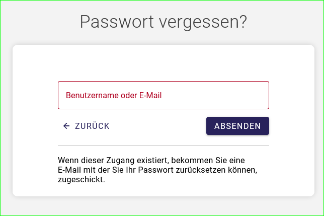
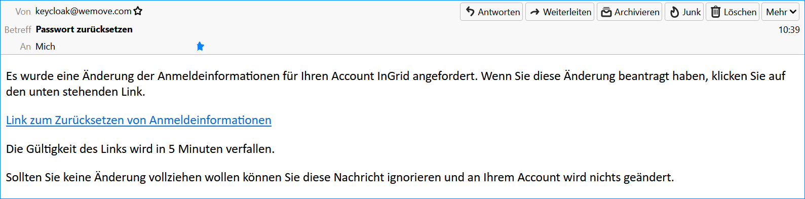

Registrierung und Anmeldung
============================

Registrierung
-------------

Bevor Sie UVP-Verfahren erfassen und pflegen können, muss Ihnen Ihr Katalog-Administrator einen Zugang einrichten, mit dem Sie sich im UVP Editor anmelden können.
Nutzen Sie dafür das Kontaktformular mit Angabe Ihres Bundeslandes (https://uvp-verbund.de/kontakt). Teilen Sie ihm mit, dass Sie zum Erfassen von UVP-Verfahren einen Zugang zum UVP-Editor benötigen. Ihnen werden dann die Berechtigungen erteilt und Sie bekommen die Zugangsdaten zugesendet.

Anmeldung im UVP Editor
-----------------------

Sie erreichen die UVP-Verbund Anmeldeseite und damit den Einstieg zum UVP-Editor unter folgender Internetadresse: https://www.uvp-verbund.de/log-in

Wenn Sie die Zugangsdaten bekommen haben und als Benutzer registriert sind, können Sie sich direkt am UVP Editor anmelden. Geben Sie bitte Ihren Benutzernamen sowie Ihr Passwort ein und schließen die Anmeldung mit dem Button "LOGIN" ab.

Abb.: UVP-Editor - Anmeldung

**Hinweis:** In der neuen UVP Software wird nach der Anmeldung direkt der Editor mit der Übersichtsseite geöffnet, weitere Klicks entfallen.

Passwort vergessen
------------------

1. Aufruf der *Anmeldung*-Seite: https://www.uvp-verbund.de/log-in
2. Klick auf den Link *Passwort vergessen?*

.. image:: ../img-ige-ng/portal/uvp-igeng_anmeldung_02.png
   :width: 500

Abb.: UVP-Portal Anmeldeseite - Link: Passwort vergessen?

3. Es öffnet sich die *Passwort vergessen?*-Seite mit den Hinweis: *Wenn dieser Zugang existiert, bekommen Sie eine E-Mail mit der Sie Ihr Passwort zurücksetzen können, zugeschickt.*

4. Tragen Sie Ihre E-Mail-Adresse ein und betätigen Sie den Button *ABSENDEN*.

Abb.: UVP-Portal Anmeldeseite - Angabe Ihrer E-Mail-Adresse

5. Es öffnet sich die *Passwort vergessen*-Bestätigungsseite: *Sie sollten in Kürze eine E-Mail mit weiteren Instruktionen erhalten.*

.. image:: ../img-ige-ng/portal/uvp-portal_link-passwort-vergessen_bestaetigung.png
   :width: 500

Abb.: E-Mail Versand Bestätigung

6. Es wird eine E-Mail aus dem System mit den Betreff: *Passwort zurücksetzen* gesendet. Hier auf *Link zum Zurücksetzen von Anmeldeinformationen* klicken.

Abb.: E-Mail mit Anweisungen

7. Es öffnet sich die Seite  *Passwort aktualisieren*

Abb.: Passwort aktualisieren - Folgen Sie der Passwortrichtlinie, achten Sie auf die Passworteigenschaften.

8. Haben Sie nicht schnell genug den Link in der E-Mail angeklickt (5 Minuten), bekommen Sie folgende Meldung angezeigt.

Abb.: Aktion nicht mehr gültig

9. Führen Sie in dem Fall den *"Passwort vergessen?"* Vorgang erneut aus.

Benutzername vergessen
----------------------

Wenn Sie den Benutzernamen vergessen haben, füllen Sie das Kontaktformular aus und senden es ab: https://uvp-verbund.de/kontakt

