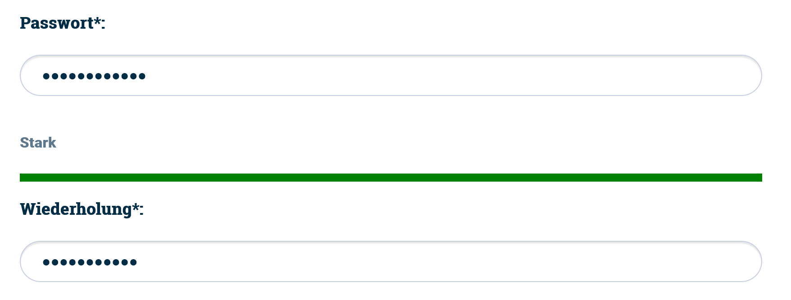
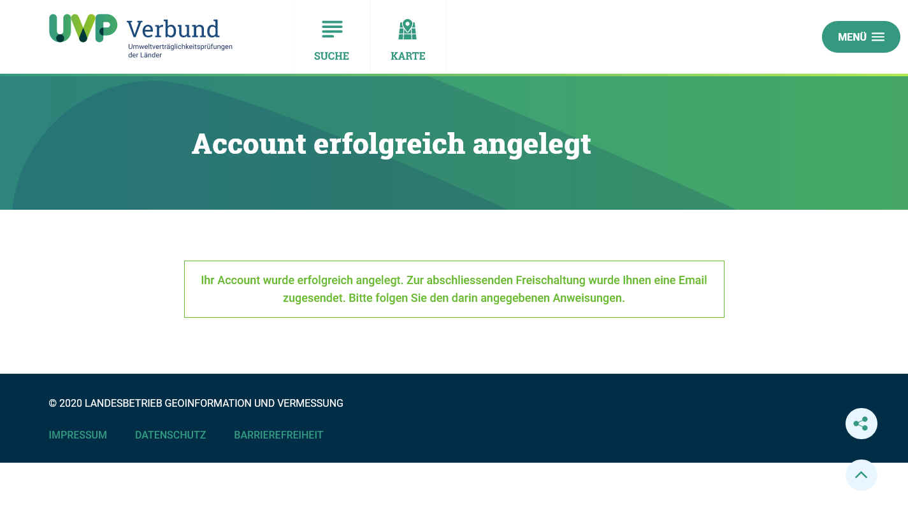
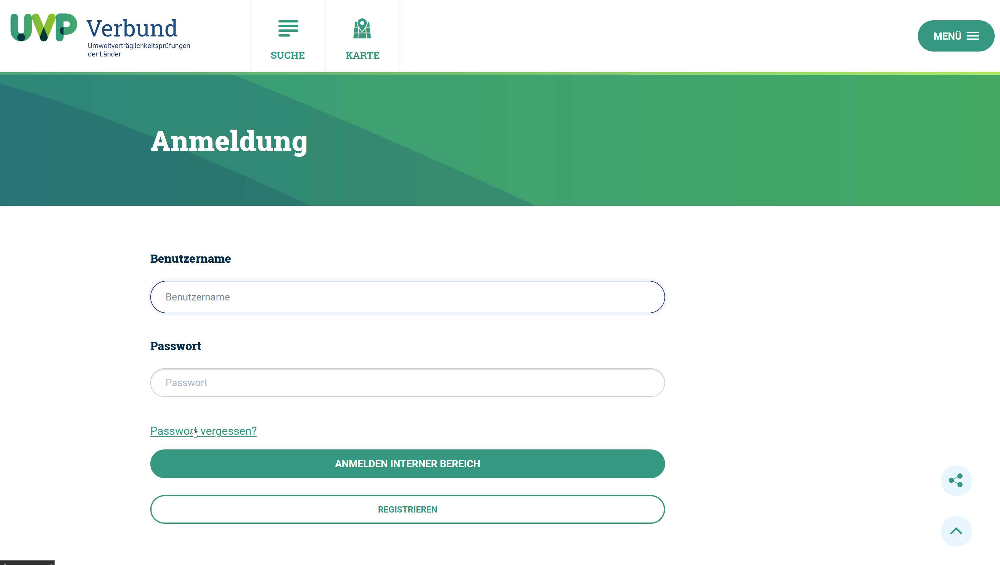
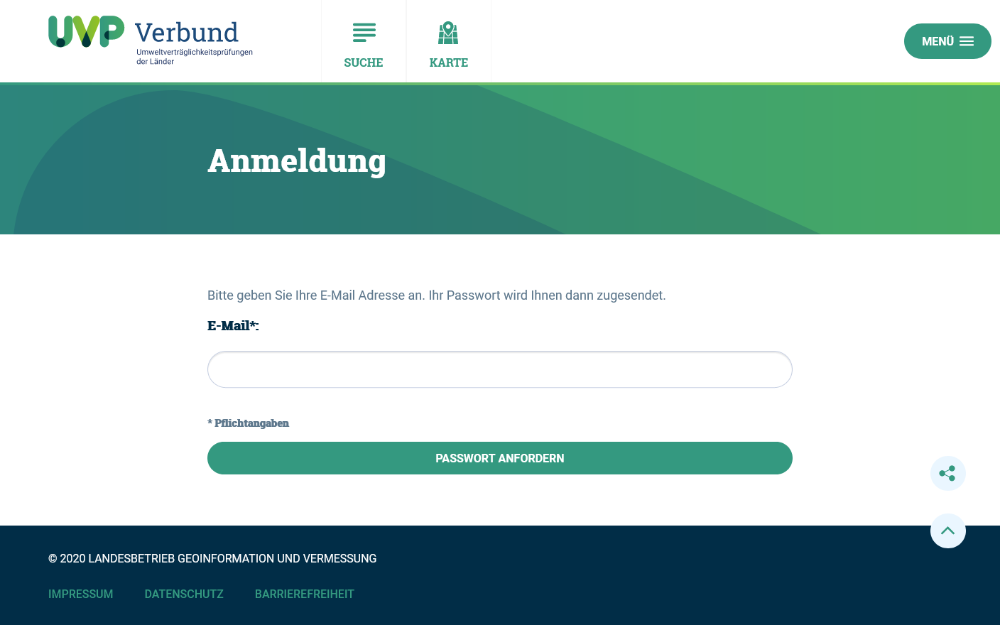
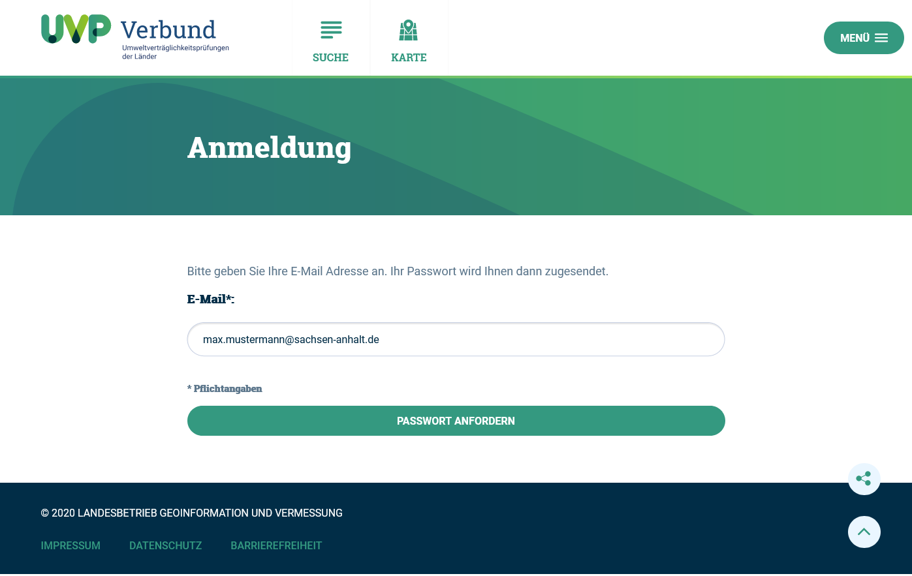
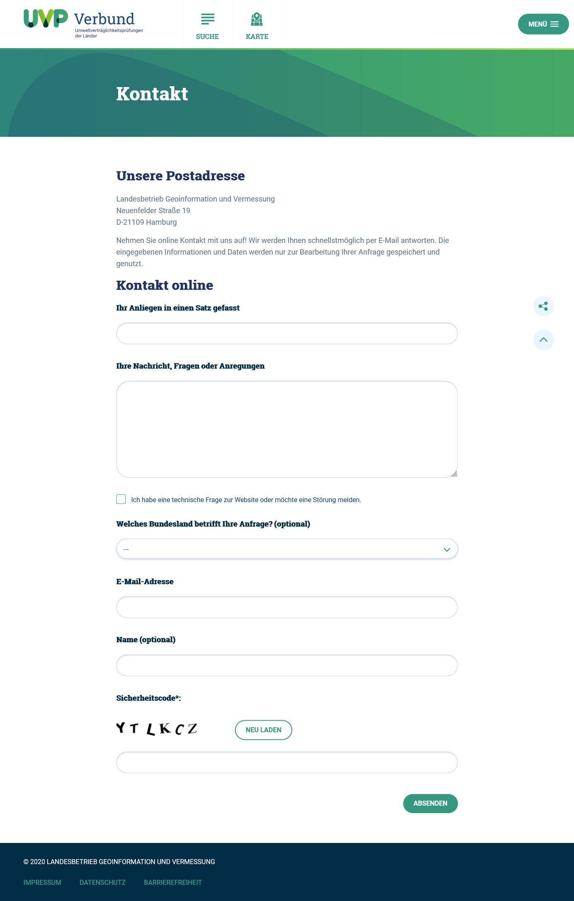

Registrierung und Anmeldung
============================

Zugang zum UVP-Editor
---------------------

Sie erreichen das UVP-Verbund und damit den Einstieg zum UVP-Editor unter folgender Internetadresse: https://www.uvp-verbund.de/log-in

.. image:: ../img/portal/uvp-portal_anmeldung.png
   :width: 500

Abb.: UVP-Portal - Anmeldung

Für eine neue Registrierung als Nutzer wählen Sie bitte den unteren Button:
*REGISTRIEREN*. 

.. image:: ../img/portal/uvp-portal_anmeldeformular.png
   :width: 500

Abb.: UVP-Portal - Anmeldeformular für die Registrierung

In dem sich öffnenden Fenster müssen mindestens alle Pflichtfelder (Kennzeichnung durch ein Sternchen) ausgefüllt werden.
Ihren zukünftigen Benutzernamen sowie das zugehörige Passwort können Sie frei wählen. Ihr Benutzername darf jedoch weder Sonder- noch Leerzeichen beinhalten. Bei Ihrer Passwortwahl verwenden Sie bitte eine Kombination aus Buchstaben, Zahlen und Sonderzeichen, um den unerlaubten Zugriff zu erschweren.

**Hinweis zur Passwortprüfung:**
Wird ein neues Passwort angelegt, erscheint die Passwortprüfung. Die Passwortprüfung enthält einen Balken, der seine Farbe von Rot bis Grün verändert, je nach Stärke des verwendeten Passwortes. Zusätzlich werden folgende Wörter angezeigt: Ganz Schlecht, Schlecht, Schwach, Gut und Stark.

Abb.: UVP-Portal - Passwortprüfung

Verwenden sie möglichst starke Passwörter!
Für die Vergabe von Passwörtern können Sie verwenden: große und kleine Buchstaben, Zahlen und Sonderzeichen. Verzichten sollten Sie auf Umlaute und Leerzeichen.

Für das Abschließen der Registrierung klicken Sie den Button *KONTO ERSTELLEN* an.

Sie bekommen folgende Nachricht im Browserfenster angezeigt:

*Ihr Account wurde erfolgreich angelegt. Zur abschließenden Freischaltung wurde Ihnen eine Email zugesendet. Bitte folgen Sie den darin angegebenen Anweisungen.*

Abb.: UVP-Portal - Account erfolgreich angelegt

Sie erhalten aus dem System von relay@uvp-verbund.de eine E-Mail mit dem Betreff: „UVP: Für Sie wurde ein Account angelegt“ 

**Hinweis:**
*Es kann vorkommen, dass Ihr Email-Programm die Nachricht in den Spam-Ordner verschiebt. Sollte dies der Fall sein, kann es bis zu einer Stunde dauern, bis die E-Mail mit dem Freischaltungslink bei Ihnen ankommt.*

Zur Freischaltung Ihrer neuen Benutzerkennung klicken Sie bitte auf den Link in Ihrer E-Mail. Es öffnet sich daraufhin der Browser mit folgender Anzeige: *Ihr Account wurde erfolgreich freigeschaltet. Sie können sich nun am Portal anmelden*

Abb.: UVP-Portal - Account erfogreich freigeschaltet

Bevor Sie UVP-Verfahren erfassen und pflegen können, muss ihre neue Benutzerkennung noch für die Erfassung und Pflege der UVP-Verfahren freigeschaltet werden. Bisher dürfen Sie sich nur am Portal anmelden und persönliche Einstellungen vornehmen, aber noch keine UVP-Verfahren erfassen oder bearbeiten. 
Schicken Sie Ihrem Katalogadministrator eine E-Mail oder rufen Sie ihn an. Teilen Sie ihm mit, dass Sie zum Erfassen von UVP-Verfahren einen Zugang zum UVP-Editor benötigen. Ihnen werden dann die Berechtigungen eingerichtet.

Anmeldung
---------

Wenn Sie eine Benutzerkennung haben und als UVP-Editor-Nutzer eingetragen sind, können Sie sich im UVP-Portal anmelden. Geben Sie bitte Ihren Benutzernamen sowie Ihr Passwort ein und schließen die Anmeldung mit dem Button "ANMELDEN INTERNER BEREICH" ab.

.. image:: ../img/portal/uvp-portal_anmeldung.png
   :width: 500

Abb.: UVP-Portal - Anmeldung

Im Unterschied zu einem Nutzer ohne Zugang zum UVP-Editor, finden Sie nach der Anmeldung im Menü den Punkt "UVP-KATALOG". Diesen Menüpunkt sehen Sie immer nur dann, wenn die entsprechenden Zugriffsrechte vorliegen. Hierüber erfolgt der Einstieg zum UVP-Editor. 

.. image:: ../img/portal/uvp-portal_uvp-katalog-öffnen.png
   :width: 500

Abb.: UVP-Portal - UVP-Katalog öffnen

Durch einen Klick auf den Menüpunkt "UVP KATALOG" und anschließend auf den Button "LOGIN IGE" gelangen Sie in die Datenerfassungskomponente (UVP-Editor). Der UVP-Editor öffnet sich in einer neuen Registerkarte Ihres Browsers. 

.. image:: ../img/portal/uvp-portal_login-ige.png
   :width: 500

Abb.: UVP-Portal - LOGIN IGE

Passwort vergessen
------------------

1. Aufruf der *Anmeldung*-Seite: https://www.uvp-verbund.de/log-in
2. Klick auf den Link *Passwort vergessen?*

Abb.: UVP-Portal - Passwort vergessen?

3. Es öffnet sich die *Passwort vergessen*-Seite mit der Aufforderung: *Bitte geben Sie Ihre E-Mail-Adresse an. Ihr Passwort wird Ihnen dann zugesendet.*
4. Pflichtfeld *E-Mail*: Tragen Sie hier Ihre E-Mail-Adresse ein, anschließend den Button *Passwort anfordern* anklicken.

Abb.: UVP-Portal - Passwort vergessen?

5. Es öffnet sich die *Passwort vergessen*-Bestätigungsseite: *Passwort versendet Ihr neues Passwort wurde erfolgreich an Sie versendet.*

Abb.: UVP-Portal - Bestätigung Passwort versendet

6. Es erfolgt eine automatische E-Mail aus dem System mit Betreff *UVP: Ihre Anfrage* Hier auf die URL unterhalb von *Sie können Ihr Passwort über folgende URL ändern:* klicken.

.. image:: ../img/portal/uvp-portal_bestätigung-neues-passwort.png
   :width: 500

Abb.: UVP-Portal - Bestätigung Passwort versendet

7. Es öffnet sich die *Passwort vergessen* Änderungsseite: *Passwort ändern - Ändern Sie bitte Ihr Passwort und melden Sie sich dann bitte erneut an.* Hier im Feld *Benutzername* den Benutzernamen und darunter zweimal das neue Passwort eintragen. Abschließend auf den Button *Speichern* klicken.

Abb.:

8. Es wird automatisch auf die *Anmeldung* Seite weitergeleitet, auf der man sich direkt mit dem neuen Passwort einloggen kann.

Abb.:

Benutzername vergessen
----------------------

Wenn Sie den Benutzernamen vergessen haben, füllen Sie das Kontaktformular aus und senden es ab: https://uvp-verbund.de/kontakt

Abb.: UVP-Portal - Kontaktformular

