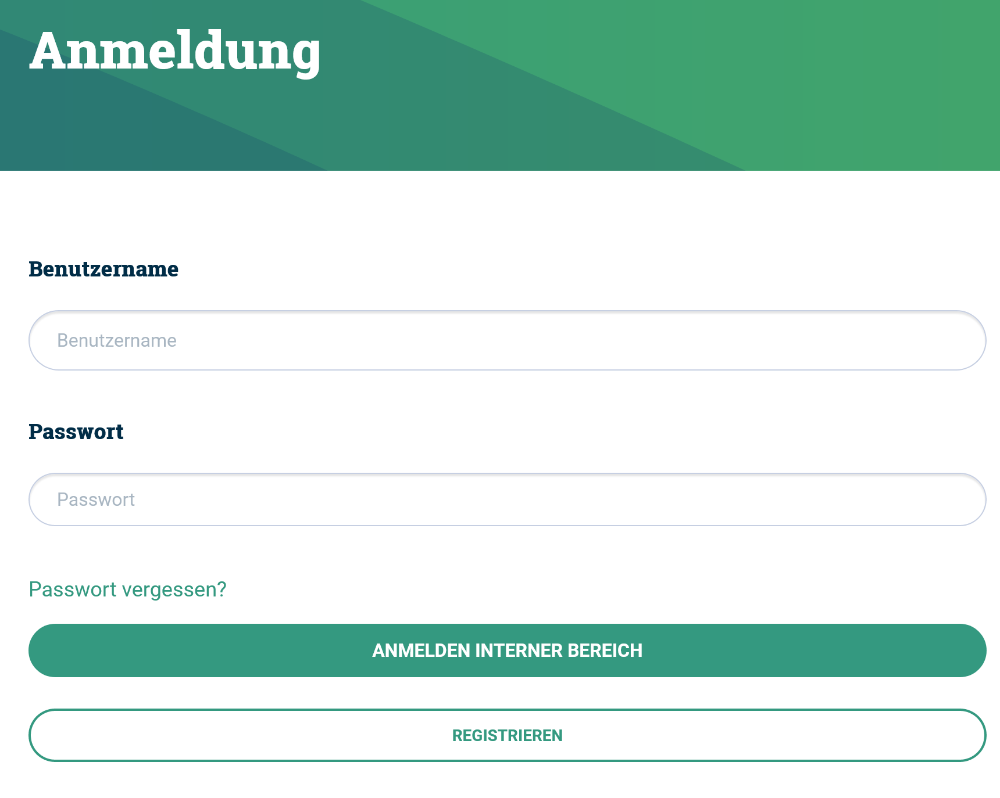
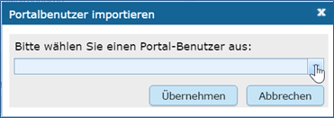
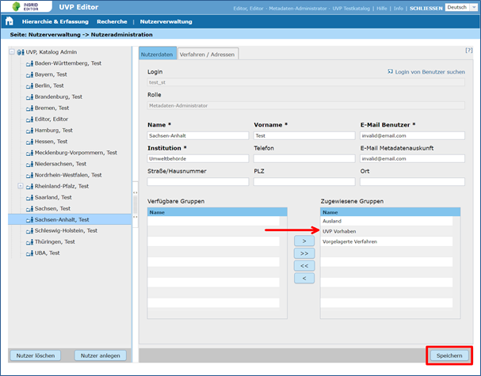

Neuanlegen eines IGE-Nutzers
============================

Vorbereitende Schritte:

Neuen Portal-Nutzer anlegen
Der Nutzer muss als Portal-Nutzer registriert sein. Er kann sich selbst unter der URL: https://www.uvp-verbund.de/log-in registrieren. Zur Bestätigung seiner Anmeldung erhält der Nutzer eine E-Mail mit einem Link. Mit der Bestätigung dieses Links wird die Anmeldung im Portal aktiviert.

Abb.: Portal-Anmeldung - Registrieren

Um dem neuen Nutzer passende Rechte für den InGrid-Editor zuordnen zu können, muss in der „Gruppenadministration“ der UVP-Editor-Nutzerverwaltung geprüft werden, ob bereits eine oder mehrere Gruppen existieren, die mit entsprechenden Rechten ausgestattet sind. Ist dies nicht der Fall, müssen eine oder mehrere neue Gruppen angelegt werden.

 
Nachdem gehen Sie bitte wie folgt vor:

Klicken Sie in der Nutzeradministration (UVP-Editor-Nutzerverwaltung) auf den Administrator, der für den neuen Nutzer zuständig sein soll (Hierarchiebaum auf der linken Seite).

Als Katalog-Administrator können Sie Metadaten-Administratoren und Metadaten-Autoren im gesamten Katalog anlegen. Als Metadaten-Administrator können Sie nur Metadaten-Autoren unterhalb ihres eigenen Eintrags anlegen. Unterhalb von Metadaten-Autoren können keine weiteren Nutzer angelegt werden.

Klicken Sie auf die Schalfläche Nutzer anlegen (unterhalb des Hierarchiebaums). Geben Sie nun in das Dialogfeld die Anfangsbuchstaben des neuen Portal-Nutzers ein und wählen Sie dann aus der Auswahlliste den entsprechenden Nutzer aus. Klicken Sie anschließend auf die Schalfläche Übernehmen, um dem neuen Nutzer den ausgewählten UVP-Editor-Administrator zuzuordnen.
 
**Hinweis:**
*Namen, die mit großen Anfangsbuchstaben beginnen, werden in der Auswahlliste zuerst gelistet.*

Abb.: Portalbenutzer importieren
 
**Hinweis**
*Ein Portal-Nutzer, der bereits einem UVP-Editor-Katalog zugeordnet ist, kann keinen zweiten Katalog zugeordnet werden. Diese Regelung betrifft auch Schulungskataloge. Deshalb werden Nutzer, die bereits mit UVP-Editor-Rechten ausgestattet sind, nicht mehr in der Auswahlliste angezeigt.*

1. Für den neuen UVP-Editor-Nutzer müssen nun einige Nutzerdaten (Name, E-Mail, Institution) erfasst werden.

2. Weisen Sie dem neuen UVP-Editor-Nutzer eine oder mehrere Gruppen zu. In der Auswahlliste werden alle in der Gruppenadministration definierten Gruppen angezeigt für die Sie die Berechtigung zur Administration besitzen.

Abb.: Nutzergruppen zuweisen
 
3.	Mit *Speichern* (Schaltfläche unten rechts) schließen Sie den Vorgang ab.

**Hinweis:**
*Eine Anleitung für die Erfassung von Verfahren, finden Sie im Teil 2 der Erfassungsanleitung.*
