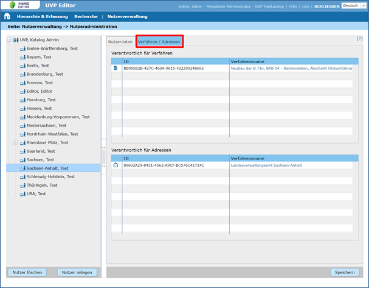

Anzeige der Verantwortlichkeiten eines IGE-Nutzers
==================================================

Über den Reiter *Verfahren / Adressen* (Nutzeradministration) werden zwei Tabellen angezeigt,
die die Verfahren und Adressen auflisten, in denen der ausgewäwhlte Benutzer als Verantortlicher eingetragen ist.
Es ist möglich direkt aus diesen Tabellen-Zeilen auf ein Verfahren bzw. Adresse zu springen.
 

Abb.: Nutzer bearbeiten
