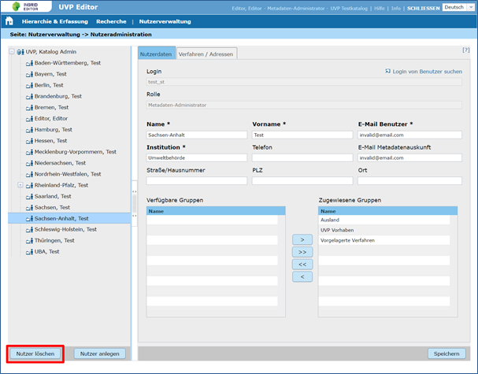

Bearbeiten und Löschen eines bereits existierenden IGE-Nutzers
==============================================================

Wählen Sie durch Mausklick im Hierarchiebaum auf der linken Seite des Fensters einen Nutzer aus, den Sie bearbeiten oder löschen wollen.

Die Nutzerdaten werden in die Felder auf der rechten Seite des Fensters geladen. Sie können das Login, die Adressdaten und die Gruppe ändern. Über Speichern sichern Sie die Änderungen.

Hinweis: Dem Katalog-Administrator ist immer automatisch die Gruppe administrators zugewiesen. Diese Zuordnung kann nicht geändert werden. Die Gruppe steht anderen Nutzern nicht zur Verfügung.

Zum Löschen des Nutzers klicken Sie auf die Schaltfläche Nutzer löschen und bestätigen den Vorgang in dem sich öffnenden Dialog.

Abb.: Nutzer bearbeiten