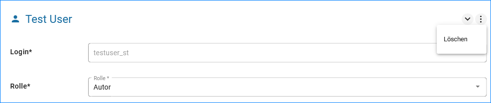

Bearbeiten und Löschen eines Nutzers
====================================

Soll ein Nutzer gelöscht werden, muss der Nutzer in der Nutzerverwaltung ausgewählt werden.

Die Nutzerdaten werden in die Felder auf der rechten Seite des Fensters geladen. Jetzt kann über das Menü (drei Punkte) die Funktion "Löschen" ausgeführt wertden.

Abb.: Nutzer löschen