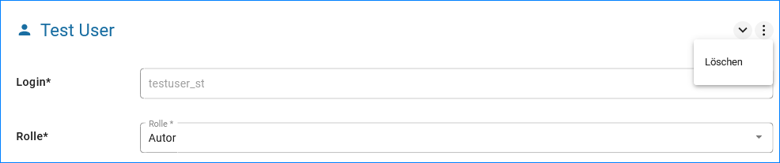

Nutzer bearbeiten / löschen
====================================

Nutzer bearbeiten
-----------------

Soll ein Nutzer bearbeitet werden, muss die Nutzerverwaltung über die Navigation (NUTZER & RECHTE) aufgerufen werden. Darin den entsprechenden Nutzer auswählen und anschließend, in der Eingabemaske auf der rechten Seite, die Daten bearbeiten.

.. image:: ../img-ige-ng/nutzerverwaltung/ige-ng_nutzerverwaltung_gruppenberechtigung.png

Abb.: Nutzer bearbeiten

Nutzer löschen
--------------

Soll ein Nutzer gelöscht werden, muss der Nutzer in der Nutzerverwaltung ausgewählt werden.

Die Nutzerdaten werden in die Felder auf der rechten Seite des Fensters geladen. Jetzt kann über das Menü (drei Punkte) die Funktion "Löschen" ausgeführt wertden.

Abb.: Nutzer löschen

