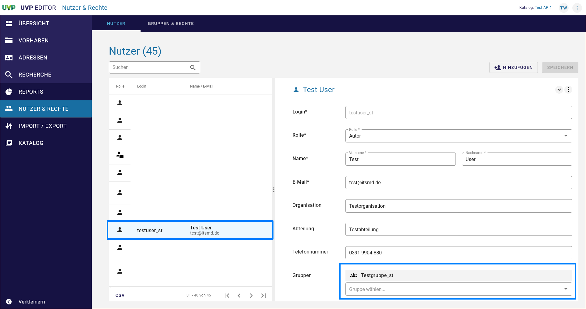

Benutzer bearbeiten / löschen
====================================

Benutzer bearbeiten
-----------------

Soll ein Benutzer bearbeitet werden, muss die Benutzerverwaltung über die Navigation (NUTZER & RECHTE) aufgerufen werden. Darin den entsprechenden Benutzer auswählen und anschließend, in der Eingabemaske auf der rechten Seite, die Daten bearbeiten.

Abb.: Benutzer bearbeiten

Benutzer löschen
--------------

Soll ein Benutzer gelöscht werden, muss der Benutzer in der Benutzerverwaltung ausgewählt werden.

Die Benutzerdaten werden in die Felder auf der rechten Seite des Fensters geladen. Jetzt kann über das Menü (drei Punkte) die Funktion "Löschen" ausgeführt wertden.

.. image:: ../img-ige-ng/nutzerverwaltung/ige-ng_nutzerverwaltung_nutzer-loeschen.png

Abb.: Benutzer löschen

