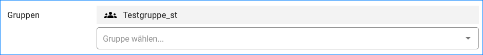

Benutzer anlegen
==============

Um einem neuen Benutzer passende Rechte für den InGrid-Editor zuordnen zu können, muss in der „Gruppenadministration“ der UVP-Editor-Benutzerverwaltung geprüft werden, ob bereits eine oder mehrere Gruppen existieren, die mit entsprechenden Rechten ausgestattet sind. Ist dies nicht der Fall, müssen eine oder mehrere neue Gruppen angelegt werden.

.. image:: ../img-ige-ng/nutzerverwaltung/ige-ng_nutzerverwaltung_gruppenberechtigung.png

Abb.: Benutzer Gruppenberechtigung zuordnen

 
Nachdem gehen Sie bitte wie folgt vor:

Durch Betätigen des Buttons "HINZUFÜGEN", wird ein Dialogfenster geöffnet.

Abb.: Button "HINZUFÜGEN"

Folgende Felder müssen ausgefüllt werden:

Feld Login
----------

Abb.: Dialogfenster - Benutzer hinzufügen

Feld Rolle
----------

Abb.: Rolle zuweisen

Hinweis: Katalog-Administratoren können Metadaten-Administratoren und Autoren anlegen. Metadaten-Administratoren können nur Autoren anlegen. Autoren können keine Benutzer anlegen.

Einem UVP-Editor-Benutzer können eine oder mehrere Gruppen zugewiesen werden. In der Auswahlliste werden alle in der Gruppenadministration definierten Gruppen angezeigt.

Feld E-Mail
-----------

An die angegebene Email-Adresse wird bei Klick auf "ANLEGEN" eine automatische E-Mail mit dem Passwort versendet.

Jede E-Mail-Adresse darf nur einmal vergeben werden, damit eine eindeutige Zuordnung von einem Benutzernamen zu einer E-Mail-Adresse gegeben ist.

Sind alle Felder im Dialogfenster ausgefüllt, muss der Button "ANLEGEN" betätigt werden. Der Benutzer ist angelegt, es können weitere Felder befüllt werden. Am Ende muss dem Benutzer noch eine Gruppe zugewiesen werden.

Abb.: Gruppe zuweisen

 
Mit "SPEICHERN" (Schaltfläche oben rechts) schließen Sie den Vorgang ab.

Abb.: Button "SPEICHERN"
