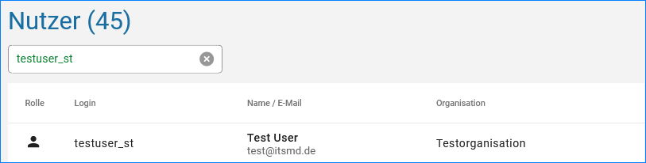
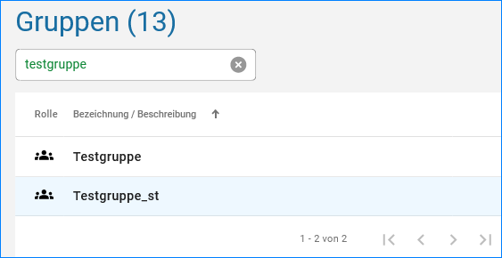

Suche und CSV-Export
====================

Suche
-----

Über die Suche in der Nutzer und Gruppenverwaltung, lassen sich einfach die Nutzer oder angelegten Gruppen finden.
Während der Eigabe des Nutzers oder der Gruppe werden schon die Einträge selektiert.

Abb.: Suche eines Nutzers

Abb.: Suche einer Gruppe

CSV-Export
----------

Über die CSV-Exportfunktion, hat der Administrator die Möglichkeit die Nutzer als CSV-Datei zu exportieren und in eine Excel-Tabelle zu importieren. Diese Funktion ermöglicht den Katalogadministrator z.B. die E-Mail-Adressen der Nutzer aktuell zu selektieren, wenn die Nutzer angeschrieben werden sollen.

Abb.: CSV-Export

Abb.: CSV-Export