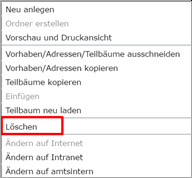
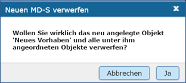
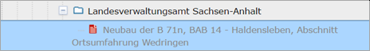

Bestehende Verfahren oder Adressen im Strukturbaum bearbeiten
=============================================================

Verfahren / Adressen löschen
----------------------------
 
Soll ein Verfahren oder eine Adresse komplett gelöscht werden, ist der Befehl *Ausgewähltes Verfahren/Teilbaum löschen* aus der Toolbar auszuwählen. Alternativ kann die Funktion *Löschen* auch über das Kontextmenü (rechte Maustaste) aufgerufen werden. 

Abb.: Symbolleiste - (Verfahren/Adressen) Löschen

Abb.: Kontextmenü - (Verfahren/Adressen) Löschen

Wichtig ist, dass zuvor das Verfahren bzw. die Adresse markiert wird, welche(s) gelöscht werden soll. Erst wenn das betreffende Verfahren rechts im Inhaltsfenster des Editors zu sehen ist, darf der Befehl aufgerufen werden. 
Es öffnet sich daraufhin ein Fenster mit einer Sicherheitsabfrage, ob das Verfahren bzw. die Adresse tatsächlich gelöscht werden soll. Mit einem Klick auf "Ok" werden die Daten endgültig gelöscht.

Abb.: Kontextmenü - (Verfahren/Adressen) Löschen

Im Strukturbaum können auch mehrere Verfahren bzw. Adressen gleichzeitig selektiert werden. Dazu wird beim Markieren eines Verfahrens per Mausklick zusätzlich die "Strg"-Taste gedrückt. Auf diese Weise sind die Operationen "verschieben", "löschen" und "kopieren" auf mehrere Verfahren gleichzeitig anwendbar. 

**Achtung!**
*Möchte man ein Verfahren oder eine Adresse löschen, welche(s) untergeordnete Verfahren bzw. Adressen besitzt, so werden diese automatisch mit gelöscht!* 

**Hinweis:** 
*Eine Adresse kann immer nur dann gelöscht werden, wenn dieser Adresse keine Verfahren zugeordnet sind. Ist die Adresse noch mit Verfahren verknüpft, müssen diese Verfahren unter „Kontaktdaten der verfahrensführenden Dienststelle“ einer anderen Adresse zugeordnet werden. Die bisherige Adresse muss dann aus der Tabelle gelöscht werden.*

Verfahren / Adressen kopieren und einfügen
------------------------------------------

Ein markiertes Verfahren oder eine markierte Adresse kann mit der Funktion „Kopieren“ in den Zwischenspeicher kopiert werden. Anschließend ist es möglich, die Kopie an einer anderen Stelle oder der gleichen Stelle im Hierarchiebaum wieder einzufügen. Sinnvoll ist dieses beispielweise, wenn Sie zwei ähnliche Verfahren oder Adressen anlegen wollen. Sie brauchen dann nur ein Verfahren bzw. eine Adresse anzulegen. Bei dem zweiten Datensatz müssen nur noch die Änderungen eingearbeitet werden. 

Zum Kopieren eines Verfahrens / einer Adresse markieren Sie bitte das Verfahren / die Adresse und wählen anschließend das Icon „Verfahren/Adresse kopieren“ aus der Toolbar aus. 

.. image:: ../img/editor/menü/ige-uvp_ige-menu_kopieren.png
   :width: 300

Abb.: Symbolleiste - (Verfahren/Adressen) kopieren

Alternativ können Sie nach dem Markieren des Verfahrens / der Adresse den Befehl auch über das Kontextmenü (rechte Maustaste) auswählen. 

.. image:: ../img/editor/menü/ige-uvp_ige-kontext-menu_kopieren.png
   :width: 400

Abb.: Kontextmenü - Verfahren/Adressen kopieren

Zum Einfügen markieren Sie bitte das Verfahren bzw. die Adresse, die hierarchisch über dem einzufügenden Verfahren bzw. der einzufügenden Adresse steht. Ist die entsprechende Adresse bzw. das entsprechende Verfahren markiert, so kann mit dem Icon „Einfügen“ der Toolbar die Kopie eingefügt werden. 

Abb.: Symbolleiste - (Verfahren/Adressen) einfügen

Alternativ ist der Befehl *Einfügen* auch über das Kontextmenü (rechte Maustaste) aufzurufen. 

Im Strukturbaum können auch mehrere Verfahren bzw. Adressen gleichzeitig selektiert werden. Dazu wird beim Markieren eines Verfahrens per Mausklick zusätzlich die "Strg"-Taste gedrückt. Auf diese Weise ist die Operation "kopieren" auf mehrere Verfahren gleichzeitig anwendbar. 

**Hinweis:**
*Kopierte Verfahren müssen im gleichen Verfahrensbereich (gleicher Verfahrenstyp) bleiben. Es ist beispielsweise nicht möglich, ein Verfahren aus dem Bereich „Zulassungsverfahren“ zu kopieren und anschließend in den Bereich "Vorgelagerte Verfahren" einzufügen.*

Nach dem Einfügen wird das Symbol der kopierten Adresse bzw. des kopierten Verfahrens im Strukturbaum rot dargestellt. Es befindet sich somit im Bearbeitungszustand. 

.. image:: ../img/editor/verfahren/ige-uvp_strukturbaum_kopieren-einfügen.png
   :width: 500

Abb.: Strukturbaum - Einfügen - Symbol rot

Vor dem abschließenden Speichern müssen Sie nun noch die Änderungen gegenüber dem kopierten Verfahren / der kopierten Adresse vornehmen. 

**Hinweis:**
*Wichtig ist zudem, dass der Verfahrensname bzw. der Adresstitel geändert werden. Geschieht dieses nicht, so existieren im Katalog zwei Verfahren / Adressen mit dem gleichen Namen. Dieses sollte unbedingt vermieden werden!* 

Verfahren/Adresse/Teilbaum ausschneiden und wieder einfügen
-----------------------------------------------------------

Es ist im InGrid-Editor möglich, ein Verfahren, eine Adresse oder einen Teilbaum (d.h. ein Verfahren mit allen hierarchisch darunterliegenden Verfahren bzw. Adressen) zu verschieben. Hierfür wird das entsprechende Verfahren ausgeschnitten und einem anderen Platz in der Hierarchie des aktuellen Kataloges wieder zugewiesen. Sinnvoll ist das Verschieben, wenn beispielsweise Personen innerhalb einer Behörde das Amt bzw. die Abteilung wechseln. 

Um ein Verfahren, eine Adresse oder einen Teilbaum zu verschieben, markieren Sie dieses. Um einen Teilbaum (d.h. ein Verfahren mit allen hierarchisch darunterliegenden Verfahren bzw. Adressen) auszuschneiden, muss das hierarchisch oberste Verfahren markiert sein. Es ist jedoch auch möglich, im Strukturbaum mehrere Verfahren bzw. Adressen gleichzeitig zu selektieren. Dazu wird beim Markieren eines Verfahrens per Mausklick zusätzlich die "Strg"-Taste gedrückt. 

Nach dem Markieren wird über das Kontextmenü (rechte Maustaste) der Befehl „Verfahren/Adresse ausschneiden / Teilbaum ausschneiden“ ausgewählt. Alternativ kann der Befehl auch über das Icon der Toolbar aufgerufen werden. 

.. image:: ../img/editor/menü/ige-uvp_ige-menu_ausschneiden.png
   :width: 500

Abb.: Symbolleiste - .. image:: ../img/editor/menü/ige-uvp_ige-menu_einfügen.png
   :width: 500

Abb.: Symbolleiste - (Verfahren/Adressen) einfügen
 
Das Verfahren, die Adresse oder der Teilbaum befinden sich nun im Zwischenspeicher. Zu erkennen ist dieses im Strukturbaum. Das ausgeschnittene Verfahren wird dort nur noch grau dargestellt. 

Abb.: Strukturbaum - Einfügen - Symbol rot

Mit dem Befehl „Einfügen“ können die Daten wieder in den Strukturbaum eingefügt werden. Markieren Sie hierzu das Verfahren bzw. die Adresse, die hierarchisch über dem einzufügenden Verfahren oder Teilbaum bzw. der einzufügenden Adresse steht. Anschließend ist der Befehl „Einfügen“ über das Kontextmenü oder über die Toolbar auszuwählen. 

Abb.: Symbolleiste - (Verfahren/Adressen) einfügen

Damit wird das ausgeschnittene Verfahren, die ausgeschnittene Adresse bzw. der Teilbaum wieder im Strukturbaum eingefügt. Im Gegensatz zum Kopieren ist das eingefügte Verfahren bzw. die eingefügte Adresse nicht automatisch im Bearbeitungszustand. Beim Verschieben bleibt die Veröffentlichungsstufe bestehen. Die Ordnung innerhalb einer Hierarchiestufe erfolgt im Übrigen alphabetisch und kann durch Verschieben oder Einfügen nicht geändert werden. 

**Hinweis:**
*Verfahren müssen im gleichen Verfahrensbereich (gleicher Verfahrenstyp) bleiben. Es ist beispielsweise nicht möglich, ein Verfahren aus dem Bereich „Zulassungsverfahren“ in den Bereich „Ausländische Vorhaben“ zu verschieben.*

Adressangaben in nachgeordnete Adressen übernehmen
--------------------------------------------------

Auf zwei Wegen können Adressangaben einer übergeordneten Adresse in eine nachgeordnete (=untergeordnete) Adresse übertragen werden: 

  a) Im Hierarchiebaum die Adresse auswählen, die in die nachgeordneten Adressen übernommen werden sollen. Über das Kontextmenu (rechter Mausklick) die Option "Neu anlegen" auswählen. Die Adressangabe der gewählten Adresse wird in der neuen nachgeordneten Adresse übernommen.

  b) Im Hierarchiebaum die Adresse auswählen, die in die nachgeordneten Adressen übernommen werden sollen. Über das Kontextmenu (rechter Mausklick) die Option *Adressangaben in nachgeordnete Adressen übernehmen* auswählen. Die Adressangaben der gewählten Adresse werden in alle nachgeordneten Adressen übernommen. 
  
  .. image:: ../img/editor/menü/ige-uvp_ige-kontext-menu_adressen-übernehmen.png
   :width: 300

Abb.: Kontextmenü - Adressangaben in nachgeordnete Adressen übernehmen
  
