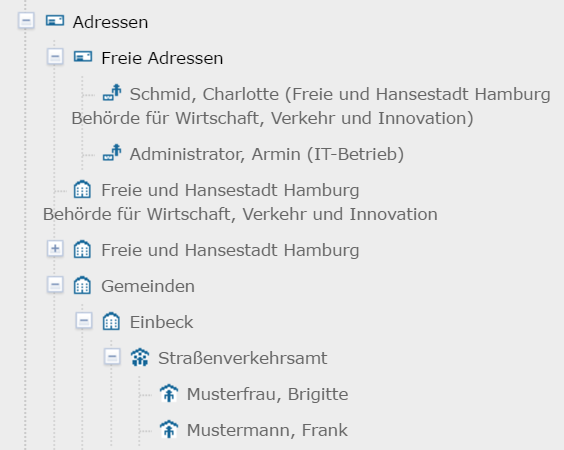
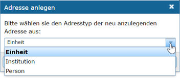

Adressen erfassen
=================

Für eine effiziente Adressverwaltung empfiehlt es sich, hierarchische Strukturen aufzubauen, so dass erkennbar wird, welchem Referat bzw. welchem Fachbereich innerhalb welcher Institution der jeweilige Ansprechpartner angehört. Für Personen, die keiner Institution zugeordnet werden können, besteht die Möglichkeit, diese im Adress-Strukturbaum unterhalb des Bereiches *Freie Adressen* anzulegen. 

Abb.: Anlegen einer Adressstruktur

Zum Anlegen einer neuen Adresse muss zunächst eine Odnerstruktur erstellt werden. Darunter können dann die Entsprechenden Adresstypen angelegt werden. 

**Anlegen eines Ordners oder einer Adresse**

Im Strukturbaum den entsprechenden Odner oder eine vorhandene Adresse anklicken und warten bis die Initialisierung abgeschlossen ist. Sobald die Eingabefelder im rechten Fenster (Inhaltsfenster) angezeigt werden, kann die neue Adresse mit Hilfe des Toolbar-Symbols „Neu anlegen“ oder über das Kontextmenü (rechte Maustaste – „Neu anlegen“) erzeugt werden. Für die Strukturierung der Adressdaten kann zwischen folgenden Adresstypen gewählt werden: Institution, Einheit und Person.

Abb.: Auswahl der Adresstypen

  - Institution (z. B. Behörde)
  - Einheit (z. B. Amt, Referat, Fachbereich oder Abteilung)
  - Person (Ansprechpartner für ein Verfahren)
 
 
Nach Auswahl des Adresstyps erscheint die neue Adresse rechts im Inhaltsfenster. Hier sehen Sie alle verfügbaren Felder und Informationen zur ausgewählten Adresse. Diese Felder sind je nach Adresstyp unterschiedlich.

Standardmäßig werden zunächst nur die Pflichtfelder angezeigt. Neben den verpflichtenden Angaben können weitere Adressangaben (Anschrift, usw.) zur Kontaktstelle gespeichert werden. Sie öffnen diese optionalen Felder durch einen Klick auf das Symbol *Alle Felder aufklappen* in der Toolbar. 

**Achtung!**
*Obwohl die Adresse neu ist und gerade erst angelegt wurde, sind bestimmte Felder bereits gefüllt. Diese Angaben stammen von der übergeordneten Adresse und sind als Vorschläge/Eingabehilfe zu verstehen und müssen unbedingt auf ihre Richtigkeit überprüft werden. Bitte klappen Sie daher immer alle Felder auf, um die automatisch eingefügten Daten kontrollieren zu können.*

In der nachfolgenden Abbildung sind die zu überprüfenden, automatisch gefüllten Felder rot umrandet. 

Abb.:

Die Kopfzeilen der Adressen werden nach dem Abspeichern automatisch befüllt.

Das Feld Adresstitel erhält seinen Eintrag (das richtet sich nach gewählten Adresstyp) aus den Feldern Institution, Einheit oder Name, Vorname. Das Feld *Adresstyp* bekommt seinen Eintrag automatisch nach dem vorher ausgewählten Adresstyp. Das Feld Verantwortlicher wird mit den Angaben der am System angemeldeten Person befüllt. Datum und Adress-ID werden beim Abspeichern automatisch generiert.

Abb.:

**Hinweis:**
*Das Feld „Kommunikation“ ist ein Pflichtfeld und muss gefüllt werden (es muss mindestens eine E-Mail-Adresse angegeben werden). Fehlt die Angabe, kann die Adresse nicht abschließend gespeichert werden und es kommt zu folgender Fehlermeldung:*

Abb.:

Soll ein bestehender Eintrag einer Adresse gelöscht werden, bitte die entsprechende Zeile mit der rechten Maustaste anklicken und den Punkt „Zeile löschen“ auswählen bzw. bei Textfeldern einfach den Eintrag markieren und löschen und bei Auswahlfeldern einen anderen Listeneintrag auswählen.

Abb.:

**Datenschutz:**
*In den Adressen vom Typ "Person" gibt es die Checkbox "Daten nicht anzeigen". Wird diese Option ausgewählt, so wird in der Portaldarstellung in allen Datensätzen, denen diese Adresse zugeordnet ist, stattdessen die Adresse der übergeordneten Institution angezeigt.*
 
App.:

**Achtung:**
*Es besteht keine Verpflichtung zur Veröffentlichung von persönlichen Adressen. Die Angabe einer Institution ist vollkommend ausreichend und wird empfohlen.* 

Unter der Rubrik „Zugeordnete Verfahren“ können keine Einträge per Hand vorgenommen werden. Hier sind alle Verfahren sichtbar, die mit dem Adressdatensatz verknüpft sind. Beim Neuanlegen einer Adresse ist dieser Bereich noch leer. Wird jedoch bei einem Verfahren diese Adresse als Kontaktadresse (Ansprechpartner) angegeben, so erscheint dieses Verfahren anschließend automatisch in der Liste der zugeordneten Verfahren bei der angegebenen Adresse. 

Abb.:

**Hinweis**
*Eine Adresse kann immer nur dann gelöscht werden, wenn dieser Adresse keine Verfahren mehr zugeordnet sind, d.h. die oben abgebildete Liste der zugeordneten Verfahren muss leer sein.*

Sind alle erforderlichen und zusätzlich gewünschten Felder gefüllt, kann die Adresse mit dem Toolbar-Button *Abschließendes Speichern & Veröffentlichen* für das Internet freigegeben werden. 
