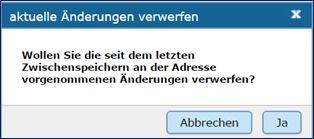
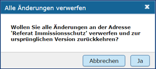

Bestehende Adressen oder Verfahren bearbeiten
=============================================

Bearbeiten eines UVP-Verfahrens
-------------------------------

Ein bestehendes Verfahren kann geändert werden, in dem es im UVP-Editor aufgerufen wird. Sobald das Verfahren im rechten Inhaltsfenster angezeigt wird, können die betreffenden Felder geändert werden. Bei Freitextfeldern einfach in das Feld hineinklicken und den Text ändern. Bei Dropdownlisten über den Pfeil an der rechten Seite des Feldes die Liste aufklappen und einen anderen Eintrag auswählen. Soll die Zeile gelöscht werden, mit der rechten Maustaste in die Zeile klicken und über das Kontextmenü „Zeile löschen“ auswählen. Sollen Tabellen geändert werden, müssen Sie einen Doppelklick mit der linken Maustaste auf das gewünschte Feld ausführen. Gleiches gilt z.B. auch für die Eingabe von Datumsangaben in einer Tabelle. 

Änderungen anzeigen
-------------------

Mit dem Befehl „Änderungen anzeigen“ haben Sie die Möglichkeit, sich das Verfahren bzw. die Adresse einmal vor und einmal nach dem Editieren anzusehen und zu vergleichen.

Abb.: Symbolleiste - Änderungen anzeigen

Es öffnet sich ein gesondertes Dialog-Fenster „Vergleichsansicht“, welches die Informationen vor der Bearbeitung eines Verfahrens bzw. einer Adresse anzeigt (Ausgangsversion) und nach der Bearbeitung (Bearbeitungsversion). In der Differenz-Ansicht sind die gelöschten Daten in Rot dargestellt, die neu eingefügten Daten werden dagegen grün angezeigt. Hilfreich ist diese Ansicht beispielsweise, wenn ein Verfahren bzw. eine Adresse vor längerem zwischengespeichert wurden. Mit einem Blick auf die Vergleichsansicht kann schnell festgestellt werden, was geändert wurde und ob das Verfahren bzw. die Adresse abschließend gespeichert werden kann oder die Änderungen eventuell verworfen werden müssen.

Rückgängig machen
-----------------

Mit dem Befehl „Rückgängig“ können Ihre Änderungen seit dem letzten Zwischenspeichern verworfen werden. Die Funktion „Rückgängig“ ist immer dann aktiv, wenn in einem Feld eine Veränderung vorgenommen und das Feld verlassen wurde.

Abb.: Symbolleiste - Rückgängig machen
 
Klickt man auf den Rückgängig-Button, so öffnet sich ein kleines Fenster, in dem bestätigt werden muss, dass die aktuellen Änderungen tatsächlich verworfen werden sollen.

Abb.: Dialogfenster - aktuelle Änderung verwerfen
 
"Ja" bewirkt, dass alle Bearbeitungen seit dem letzten Zwischenspeichern gelöscht werden - nicht nur die Änderungen, die im letzten bearbeiteten Feld vorgenommen wurden. Um das Verfahren bzw. die Adresse auf die Version der letzten Veröffentlichung zurückzusetzen, nutzen Sie bitte die Funktion *Änderungen am aktuellen Verfahren/Adresse verwerfen*.

Änderungen verwerfen
--------------------

Mit dieser Funktion können Verfahren und Adressen, die schon veröffentlicht wurden, auf den Stand zurückgesetzt werden, den sie bei der Veröffentlichung hatten. Die Bearbeitungen, auch die mit der Funktion Zwischenspeichern gesichert wurden, werden zurückgesetzt und gelöscht. Sie finden den Befehl in Toolbar:

.. image:: ../img/editor/menü/ige-uvp_aktuelle-änderungen-verwerfen.png
   :width: 300

Abb.: Symbolleiste - aktuelle Änderung verwerfen
 
Das Icon ist immer dann auswählbar, wenn Änderungen vorgenommen wurden und das Verfahren bzw. die Adresse zwischengespeichert wurden. Klickt man auf das Symbol, so kommt eine Sicherheitsabfrage.

Abb.: Dialogfenster - alle Änderungen verwerfen
 
Wird an dieser Stelle mit "Ja" geantwortet, so werden alle Änderungen verworfen und das Verfahren bzw. die Adresse wird auf die Version der letzten Veröffentlichung zurückgesetzt.

