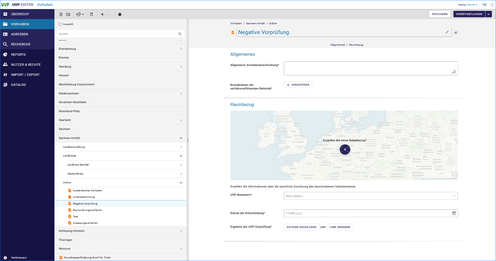
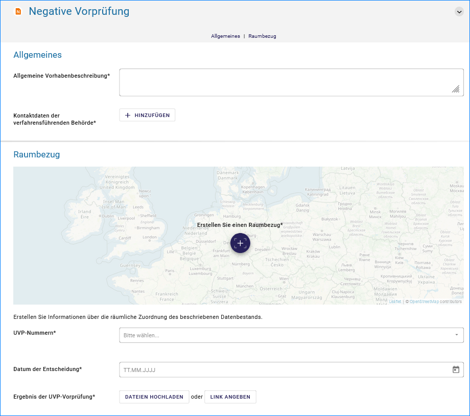

Erfassung von negativen Vorprüfungen
====================================

In den Katalogeinstellungen der Länder kann festgelegt werden, ob die erfassten negativen Vorprüfungen im Portal verfügbar sein sollen oder nicht.

**Achtung!** *Diese Entscheidung sollte in jedem Bundesland vorab getroffen werden, weil das Erfassungsformular sich je nach Einstellung anpasst.*

Abb.: Erfassungsformular für den Datensatztyp „Negative Vorprüfung“ 

Abb.: Erfassungsformular für den Datensatztyp „Negative Vorprüfung“ 
 

**Hinweis:** *Wenn eine negative Vorprüfung ohne Veröffentlichung für das UVP-Portal erfasst wurde, muss trotzdem ein „Veröffentlichen“ ausgeführt werden. Dabei wechselt die Symbolfarbe im Strukturbaum von orange nach schwarz. Die Einstellung, ob negative Verfahren im Portal erscheinen oder nicht, trifft der Katalogadministrator in den Katalogeinstellungen.*
