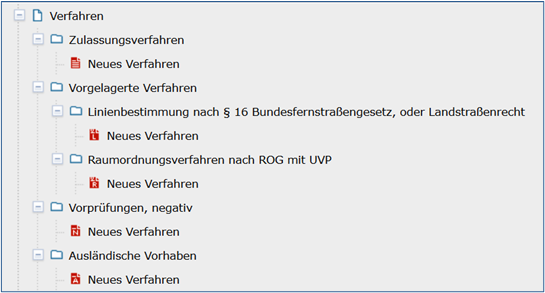
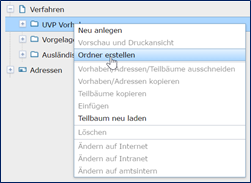
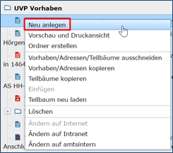

UVP-Verfahren erfassen
======================

Verfahrenstypen
---------------

Die Verfahren werden in vier Verfahrenstypen untergliedert:
  - Zulassungsverfahren
  - Vorgelagerte Verfahren
  - (Linienbestimmung nach § 16 Bundesfernstraßengesetz, oder Landstraßenrecht und Raumordnungsverfahren nach ROG mit UVP)
  - Vorprüfung, negativ
  - Ausländische Verfahren
  

Abb.: Verfahrenstypen

Anlegen eines UVP-Verfahrens
------------------------

Soll ein neues UVP-Verfahren angelegt werden, empfiehlt es sich zunächst zu prüfen, ob die Adresse, auf die bei dem neuen Verfahren verwiesen werden soll, bereits im Adressstrukturbaum erfasst ist. Ist dieses nicht der Fall, sollte zunächst die neue Adresse und anschließend erst das neue Verfahren angelegt werden. Grund hierfür ist, dass die Adressverweise beim Verfahren nicht frei eingegeben werden können, sondern aus den bereits bestehenden Adresseinträgen ausgewählt werden. Existiert die gewünschte Adresse noch nicht, so ist der betreffende Eintrag nicht auswählbar. Der Bearbeiter muss in diesem Fall das neu angelegte Verfahren zunächst zwischenspeichern und erst einmal die Adresse durch Anlegen einer neuen Adresse erzeugen. Diesen Umweg erspart man sich, wenn immer zuerst die Adresse angelegt und anschließend das Verfahren beschrieben wird.
Die Verfahren werden im Verfahren-Strukturbaum des UVP-Editors verwaltet. Für eine effiziente Verwaltung der Verfahren können hierarchische Strukturen mit Hilfe von Ordnern angelegt werden. 
 

Abb.: Ordner anlegen

**Hinweis:**
*Wenn Sie im Strukturbaum (z.B. unter Verfahren) keine Ordner oder Verfahren anlegen können, so fehlen Ihnen dafür die Schreibrechte. Wählen Sie einen entsprechenden Ordner für den Sie Schreibrechte erhalten haben oder wenden Sie sich an Ihren Administrator.*

Zum Anlegen eines neuen Verfahrens muss zunächst das Verfahren ausgewählt werden, unterhalb dessen das neue Verfahren erstellt werden soll. Dafür das entsprechende Verfahren im Strukturbaum anklicken und warten, bis die Initialisierung abgeschlossen ist.
 
.. image:: ../img/verfahren/ige-uvp_menü_verfahren-anlegen.png
   :width: 150
   
Abb.: UVP-Verfahren anlegen über die Symbolleiste
   

Abb.: UVP-Verfahren anlegen über das Kontextmenü (rechte Maustaste)

Sobald die Eingabemaske des Verfahrens im rechten Fenster (Inhaltsfenster) angezeigt wird, kann das neue Verfahren mit Hilfe des Toolbar-Symbols („Neu anlegen“) oder über das Kontextmenü (rechte Maustaste – „Neu anlegen“) angelegt werden. 

Verfahrensschritte
-------------------

**Abschnitt – Allgemein**

Abb.:

**Titel (Pflichtfeld)**

Abb.:

In dieses Feld geben Sie eine kurze und prägnante Bezeichnung des Verfahrens an.

Abb.:
 
**Allgemeine Vorhabenbeschreibung (Pflichtfeld)**
 
Hier soll das Vorhaben kurz beschrieben werden, damit die Öffentlichkeit erfährt, worum es bei diesem Verfahren überhaupt geht. Auf Verständlichkeit für fachfremde Dritte ist zu achten. Die Beschreibung bildet auch auf der Portalseite die Grundinformation, die dauernd und unabhängig vom aktuellen Verfahrensstand abgebildet wird. Anders als hier bei der Eingabe ist dort der ganze Text ohne Scroll-Notwendigkeit zu lesen.

Es bietet sich an, für den Text die entsprechenden Teile aus dem Bekanntmachungstext für die Auslegung zu verwenden. Dies dient auch der Minimierung des Aufwands. Denn dort wird das Vorhaben bereits allgemein verständlich beschrieben. Die Information, dass ein Antrag bei … auf Zulassung dieses Vorhabens gestellt wurde und der Hinweis auf die UVP-Pflicht nach … können daraus ebenfalls übernommen werden. Statt der Übernahme von Teilen des Bekanntmachungstextes kommt ggf. auch die Übernahme einer aussagekräftigen Betreffzeile des Bekanntmachungstextes in Betracht.

Das Feld muss ausgefüllt werden, damit das Zulassungsverfahren abgespeichert werden kann - Pflichtfeld.

**Kontaktdaten der verfahrensführenden Dienststelle / 
Kontakt deutsche Behörde (Pflichtfeld)**

An dieser Stelle sind Personen, Einheiten oder Institutionen anzugeben, die weitergehende Informationen zum aktuellen Verfahren/Datensatz geben können. Es besteht dabei keine Verpflichtung zur Veröffentlichung von persönlichen Adressen. Die Angabe einer Institution ist vollkommend ausreichend.
 
Der Bereich der Adressen ist eine Tabelle. In der linken Spalte wird die Art des Verweises (Ansprechpartner) automatisch mit der Verknüpfung einer Adresse eingetragen. In der rechten Spalte erscheint der Link zur eigentlichen Adresse.

Abb.:

Über „Adresse hinzufügen“ wird eine Referenz auf eine bereits im Teilbaum Adressen erstellte Adresse hergestellt. Hierfür einfach auf den Link "Adresse hinzufügen" klicken. Es öffnet sich daraufhin folgendes Fenster.

.. image:: ../img/verfahren/ige-uvp_ordner_anlegen.png
   :width: 300

Abb.:

Die Adresse kann entweder über eine *Direkte Suche* oder den *Hierarchiebaum* ausgewählt werden. 

**Direkte Suche**
In der *Direkten Suche* können Sie entweder nach der Einheit bzw. Institution, dem Nachnamen, Vornamen oder einer Kombination aus den Feldern suchen. Es wird immer eine Suche nach einer Teilzeichenkette durchgeführt. Werden Zeichenketten in mehreren Feldern angegeben, wird eine Adresse nur dann gefunden, wenn alle Zeichenketten übereinstimmen (UND-Verknüpfung). 
Die gefundenen Adressen werden in der Trefferliste angezeigt. Durch einfaches Klicken auf einen dieser Einträge wird dieser markiert und durch ein anschließendes Klicken auf „Übernehmen“ zu den Adresskontakten des Verfahrens übernommen.

**Hierarchiebaum**
Im Hierarchiebaum können Sie in der üblichen Weise navigieren. Ein einfacher Klick auf eine Adresse markiert diese. Durch ein anschließendes Klicken auf *Übernehmen* wird die markierte Referenz auf die Adresse in das Verfahren übernommen. 

.. image:: ../img/verfahren/ige-uvp_menü_verfahren-anlegen.png
   :width: 150
   

Abb.:

Im Feld *Kontaktdaten der verfahrensführenden Dienststelle* kann eine Adresszeile per Copy & Paste kopiert und in einer neuen Zeile eingefügt werden. Hierfür gibt es im Kontextmenu der rechten Maustaste für diese Tabelle die Befehle *Adresse kopieren* und *Adresse einfügen*. 

Abb.:

Die Adresszeilen sind zwischen verschiedenen Verfahren und (Adress-) Elementen kopierbar. Eine Adresse wird kopiert, indem mit der rechten Maustaste eine Adresszeile angeklickt und die Option *Adresse kopieren* gewählt wird. Die kopierte Adresse kann nun in einem beliebigen Objekt in einer leeren oder auch in einer befüllten Adresszeile eingetragen werden. Beim Einfügen in eine leere Zeile wird eine Kopie der Adresse eingetragen. 

**Raumbezug hinzufügen**

Im Bereich Allgemein wird die räumliche Ausdehnung des betreffenden Verfahrens angezeigt. Es wird ein Begrenzungsrechteck (Bounding Box) aus geografischen Koordinaten („Min“ und „Max“) angegeben, in dem das Gebiet liegt. 

Für die Eingabe eines geografischen Bereichs, geben Sie in das Feld Suche nach einer Adresse/Raumbezug einen Ort ein. Sie haben die Möglichkeit aus dem Feld rechts, neben der Karte eine Auswahl zutreffen.  Ziehen Sie den entsprechenden Kartenausschnitt in das Rechteck. Verschieben Sie die Eckpunkte, bis der angegebene Raum im Rechteck liegt. Betätigen Sie abschließend unter der Karte den Button „Übernehme Ausschnitt“.

Abb.: 

**Eingang des Antrags (*neues Feld*)**

Abb.:
 
Geben Sie das Datum des Einganges des Antrags an. Das Datum wird im Portal nicht veröffentlicht, es dient nur statistischen Zwecken.

**UVP-Nummer auswählen**

Abb.:
 
Hier ist die UVP-Nummer auszuwählen, die für das Zulassungsverfahren zutrifft (Mehrfach-Nennungen möglich). Beim Klicken in die Zeile erscheint am Ende der Zeile ein Pfeil mit dem die Auswahlliste geöffnet wird. In der Auswahlliste werden die bundesrechtlichen und die für Ihr Land maßgeblichen UVP-Nummern (z.B. Nummer des Vorhabens gemäß § 1 Abs. 1 Nr. 1 UVPG in Verbindung mit Anlage 1) angeboten. Die UVP-Nummern dienen der Einordnung des Zulassungsverfahrens in die Kategorien, nach denen auf der Portalseite gesucht werden kann. Außerdem sind sie wichtig zur Erfüllung der Berichtspflicht nach § 73 UVPG (Umsetzung von Artikel 12 der UVP-Richtlinie 2011/92/EU), wonach alle sechs Jahre die bis dahin durchgeführten Vorprüfungen und UVP-Verfahren ausgezählt und der EU-Kommission unter Zuordnung zu den Kategorien mitgeteilt werden müssen.

**Vorprüfungen durchgeführt**
 
Bei Änderungen/Erweiterungen wie auch bei kumulierenden Vorhaben wurde häufig eine Vorprüfung zur Feststellung der UVP-Pflicht durchgeführt. Hierfür gibt es nicht immer eine genau passende UVP-Nummer (z.B. wenn es nur eine UVP-Nummer für UVP-pflichtige Zulassungsverfahren („X“) gibt). Andererseits kann aufgrund § 7 Abs. 3 UVPG eine UVP auch freiwillig durchgeführt werden, wenn eine Vorprüfung vorgesehen ist. Hier lässt die anzugebende UVP-Nummer den Schluss darauf zu, dass eine Vorprüfung durchgeführt wurde, obwohl dies nicht erfolgte. Wegen der Berichtspflicht nach § 73 UVPG werden daher die Zulassungsverfahren, bei denen eine Vorprüfung die UVP-Pflicht ergab, nunmehr durch diese Checkbox erfasst.

**Verfahrensschritt hinzufügen**

Möchten Sie einen weiteren Verfahrensschritt hinzufügen, dann wählen Sie unter den Abschnitten den Button „Verfahrensschritt hinzufügen“.

Abb.:
 
Es öffnet sich ein Auswahlfenster. Wählen Sie eine der drei Möglichkeiten.
 
Abb.:

**Verfahrensschritt - Öffentliche Auslegung**
 
**Zeitraum der Auslegung von/bis (Pflichtfeld)**
 
Eintragung des Zeitraums der Auslegung von/bis (Pflichtfeld).

**Wichtig:** *Genau in diesem Zeitraum müssen die Unterlagen auch im UVP-Portal zu lesen sein. Die nach dem UVPG auszulegenden Unterlagen können auch danach im UVP-Portal lesbar bleiben. Die Lesbarkeit wird durch die Eingabe des Auslegungszeitraums nicht beeinflusst.

Beispiel: von: TT.MM.JJJJ bis: TT.MM.JJJJ*

**Erst mit Beginn des Auslegungszeitraus veröffentlichen**

Wenn diese Checkbox aktiviert ist, werden die Dokumente in der oberen Tabelle erst bei Erreichen des Beginns des Auslegungszeitraums veröffentlicht.

Abb.:
 
**Hinweis:** *Die Checkbox finden Sie unter jeder Tabelle.*

**Auslegungsinformationen (Pflichtfeld)**

Abb.:

Auslegungsinformationen (= Bekanntmachungstext) hochladen/verlinken. Der Namen des Dokuments sollte erkennen lassen, um was es sich handelt.

In der Spalte „Gültig bis“ kann eingegeben werden, bis zu welchem Tag (diesen eingeschlossen) das hochgeladene/verlinkte Dokument im UVP-Portal lesbar sein soll. Es bleibt auch nach Ablauf der Frist im Editor lesbar und kann ggf. auch wieder veröffentlicht werden. Für die Bekanntmachungstexte und die ausschließlich nach UVPG auszulegenden Unterlagen wird die Ausfüllung dieses Feldes erst am Ende der Darstellung des Zulassungsverfahrens im UVP-Portal in Frage kommen.

Beispiel: 170719 A26O1 Amtl. Anz Auslegung

**Das “gültig-bis” Datum in mehreren Zeilen einer Tabelle in einem Schritt setzen**

Markieren Sie die Zeilen, welche ein Gültigkeitsdatum bekommen sollen. Klicken Sie mit der rechten Maustaste auf eine der markierten Zeilen, wählen Sie aus dem Kontextmenü den Punkt „Gültig bis Datum festlegen“. Es öffnet sich der Dialog „Datum wählen“. Wählen Sie aus dem Kalender das entsprechende Datum aus und betätigen Sie „Übernehmen“. In den ausgewählten Zeilen wurde das angegebene Datum eingetragen.
 
Abb.: 

**Sortierfunktion für Zeilen in Dokumententabellen**

Über Drag&Drop kann die Reihenfolge von Zeilen in den Dokumententabellen verändert werden. Die Reihenfolge wirkt sich auch auf die Darstellung im Portal aus.

Abb.:

**UVP Bericht / Antragsunterlagen (Pflichtfeld)**

Abb.:
 
UVP-Bericht/Antragsunterlagen hochladen/verlinken. Die Namen der Dokumente sollten erkennen lassen, um was es sich handelt.

Hier ist der UVP-Bericht nach § 16 UVPG einzustellen. Der Vorhabenträger hat den UVP-Bericht auch elektronisch vorzulegen, § 16 Abs. 9 UVPG. Sollen auf freiwilliger Basis zusätzlich auch die anderen Antragsunterlagen in das UVP-Portal gestellt werden, kann dies an dieser Stelle geschehen.

In der Spalte „Gültig bis“ kann im Format TT.MM.JJJJ eingegeben werden, bis zu welchem Tag (diesen eingeschlossen) das hochgeladene/verlinkte Dokument im UVP-Portal lesbar sein soll. Es bleibt auch nach Ablauf der Frist im Editor lesbar und kann ggf. auch wieder veröffentlicht werden. Für die Bekanntmachungstexte und die ausschließlich nach UVPG auszulegenden Unterlagen wird die Ausfüllung dieses Feldes erst am Ende der Darstellung des Zulassungsverfahrens im UVP-Portal in Frage kommen.

**Hochladen und automatisches Entpacken von ZIP Archiven**

Es besteht die Möglichkeit gepackte Dateien in das UVP-Portal zuladen. Dazu muss der Punkt „Archive entpacken“ vor der Auswahl der hochzuladenden Dateien angeklickt werden.

Abb.:
 
Der Name der ZIP Datei bleibt erhalten, die Ordnerstrukturen bleiben erhalten und werden nach Ordnern und Dateien alphabetisch sortiert übernommen.

Abb.:
 
Im Portal erfolgt die Darstellung hierarchisch, die Struktur innerhalb des ZIP Archives bleibt erhalten.

**Berichte und Empfehlungen (optionales Feld)**
 
Ggf. Berichte und Empfehlungen hochladen/verlinken. Die Namen der Dokumente sollten erkennen lassen, um was es sich handelt.

Wenn zum Zeitpunkt des Beginns des Beteiligungsverfahrens entscheidungserhebliche Berichte und Empfehlungen betreffend das Vorhaben bei der zuständigen Behörde vorgelegen haben, sind diese nach § 19 Abs. 2 Nr. 2 UVPG zur Einsicht für die Öffentlichkeit auszulegen und daher auch in das UVP-Portal einzustellen. Hierbei kann es sich um bereits vorab eingegangene Stellungnahmen der zu beteiligenden Behörden, aber auch von der zuständigen Behörde eingeholte besondere Gutachten zu dem beabsichtigten Vorhaben handeln (so Wagner in: Hoppe/Beckmann, UVPG-Kommentar, § 9 Rdnr. 32). Da solche Unterlagen nicht unbedingt vorliegen, handelt es sich um kein Pflichtfeld.
In der Spalte „Gültig bis“ kann im Format TT.MM.JJJJ eingegeben werden, bis zu welchem Tag (diesen eingeschlossen) das hochgeladene/verlinkte Dokument im UVP-Portal lesbar sein soll.

Es bleibt auch nach Ablauf der Frist im Editor lesbar und kann ggf. auch wieder veröffentlicht werden. Für die Bekanntmachungstexte und die ausschließlich nach UVPG auszulegenden Unterlagen wird die Ausfüllung dieses Feldes erst am Ende der Darstellung des Zulassungsverfahrens im UVP-Portal in Frage kommen.

Beispiel: 2016-10-10 Zustandsanalyse FFH-Gebiet Oberes Hochtal

**Weitere Unterlagen (optionales Feld)**

Abb.:
 
Ggf. weitere Unterlagen - auch nach Ende der Auslegung - hochladen/verlinken. Die Namen der Dokumente sollten erkennen lassen, um was es sich handelt.

Abgesehen von den nach § 19 Abs. 2 UVPG auszulegenden Unterlagen kann es weitere Unterlagen geben, deren Veröffentlichung im UVP-Portal sich anbietet, ohne dass hierzu eine Pflicht bestünde. Dies kann z.B. für weitere Informationen im Sinne des § 19 Abs. 3 UVPG, die für die Entscheidung über die Zulässigkeit des Vorhabens von Bedeutung sein können, die der zuständigen Behörde aber erst nach Beginn des Beteiligungsverfahrens vorliegen, gelten. Solche Informationen sind nach den Bestimmungen des Bundes und der Länder über den Zugang zu Umweltinformationen zugänglich zu machen, also nach Antrag auf Zugang zu den Umweltinformationen bei der zuständigen Behörde.

In der Spalte *Gültig bis* kann im Format TT.MM.JJJJ eingegeben werden, bis zu welchem Tag (diesen eingeschlossen) das hochgeladene/verlinkte Dokument im UVP-Portal lesbar sein soll. Es bleibt auch nach Ablauf der Frist im Editor lesbar und kann ggf. auch wieder veröffentlicht werden. Für die Bekanntmachungstexte und die ausschließlich nach UVPG auszulegenden Unterlagen wird die Ausfüllung dieses Feldes erst am Ende der Darstellung des Zulassungsverfahrens im UVP-Portal in Frage kommen.

**Verfahrensschritt - Erörterungstermin**
 
*Erörterungstermin (Pflichtfeld)*
 
Eintragung des Zeitraums der Erörterung.

Wenn der Erörterungstermin an einem Tag stattfinden wird, reicht es aus, das Feld „Am/vom“ auszufüllen. Wird der Erörterungstermin in mehrere Termine aufgeteilt, ist der Zeitraum vom ersten bis zum letzten Termin einzugeben. Eine Listung einzelner Termine ist nicht möglich. Diese Information wird sich aber aus dem Bekanntmachungstext bzw. den Informationen zum Erörterungstermin ergeben, auf die der Nutzer bzw. die Nutzerin des UVP-Portals durch einen Hinweis verwiesen wird.

Beispiel: Am/vom: TT.MM.JJJJ bis: TT.MM.JJJJ

**Information zum Erörterungstermin (optionales Feld)**

Abb.:
 
Informationen zum Erörterungstermin hochladen/verlinken. Die Namen der Dokumente sollten erkennen lassen, um was es sich handelt – Pflichtfeld.

In der Spalte „Gültig bis“ kann im Format TT.MM.JJJJ eingegeben werden, bis zu welchem Tag (diesen eingeschlossen) das hochgeladene/verlinkte Dokument im UVP-Portal lesbar sein soll. Es bleibt auch nach Ablauf der Frist im Editor lesbar und kann ggf. auch wieder veröffentlicht werden. Für die Bekanntmachungstexte und die ausschließlich nach UVPG auszulegenden Unterlagen wird die Ausfüllung dieses Feldes erst am Ende der Darstellung des Zulassungsverfahrens im UVP-Portal in Frage kommen.

Beispiel: 170815 Bekanntmachung Ferienpark Garlau

**Verfahrensschritt - Entscheidung über die Zulassung**

Abb.:
 
Datum der Entscheidung (Pflichtfeld)

Abb.:
 
Eintragung des Datums der Entscheidung.

Beispiel: TT.MM.JJJJ

**Auslegungsinformationen (Pflichtfeld)**

Abb.:
 
Auslegungsinformationen (= Bekanntmachungstext) hochladen/verlinken. Der Namen des Dokuments sollte erkennen lassen, um was es sich handelt.

In der Spalte „Gültig bis“ kann im Format TT.MM.JJJJ eingegeben werden, bis zu welchem Tag (diesen eingeschlossen) das hochgeladene/verlinkte Dokument im UVP-Portal lesbar sein soll. Es bleibt auch nach Ablauf der Frist im Editor lesbar und kann ggf. auch wieder veröffentlicht werden. Für die Bekanntmachungstexte und die ausschließlich nach UVPG auszulegenden Unterlagen wird die Ausfüllung dieses Feldes erst am Ende der Darstellung des Zulassungsverfahrens im UVP-Portal in Frage kommen.

Beispiel: 2017-04-04 Biblis Staatsanzeiger

**Entscheidung (Pflichtfeld)**
 
Entscheidung über die Zulassung, ggf. mit Anlagen hochladen/verlinken. Die Namen der Dokumente sollten erkennen lassen, um was es sich handelt.

In der Spalte „Gültig bis“ kann im Format TT.MM.JJJJ eingegeben werden, bis zu welchem Tag (diesen eingeschlossen) das hochgeladene/verlinkte Dokument im UVP-Portal lesbar sein soll. Es bleibt auch nach Ablauf der Frist im Editor lesbar und kann ggf. auch wieder veröffentlicht werden. Für die Bekanntmachungstexte und die ausschließlich nach UVPG auszulegenden Unterlagen wird die Ausfüllung dieses Feldes erst am Ende der Darstellung des Zulassungsverfahrens im UVP-Portal in Frage kommen.

Beispiel: 17.03.30 Genehmigung Biblis

Dokument-Upload & Verfahrensschritt löschen
-------------------------------------------

**Dokument Upload**

**Dateien hochladen**
Über den Link *Dokument-Upload* können Dokumente zum beschreibenden Verfahren hochgeladen werden. Die Upload-Funktionalität steht jedoch erst nach dem ersten Speichern zur Verfügung.
 
Abb.:
 
Wählen Sie Dokumente durch Betätigen des Dateiauswahl Buttons oder per Drag and Drop auf die weiße Fläche aus. Der Upload beginnt automatisch. Durch Betätigung des Buttons Übernehmen übertragen Sie anschließend die hochgeladenen Dokumente in die Tabelle.

**Link angeben**

Abb.:

Tragen Sie hier einen Link zu einem Dokument ein.

**Hinweis:**
*Grundsätzlich ist das Hochladen eines Dokumentes gegenüber der Verlinkung zu Seiten der jeweiligen Dienststellen vorzuziehen, da die Verlinkung fehleranfällig ist. Jede Änderung des Pfades führt zur Nichterreichbarkeit des Dokuments. In diesem Fall ist das entsprechende Dokument nicht im UVP-Portal veröffentlicht. Es ist davon auszugehen, dass dies von den Gerichten als zumindest relativer Verfahrensfehler gewertet werden wird. Außerdem erhöht sich der Pflegeaufwand des UVP-Portals, wenn wegen fehlerhafter Links die Kontakt-Adresse (technische oder juristische Ansprechperson) angesprochen wird.*

**Verfahrensschritt löschen**
Möchten Sie einen Verfahrensschritt löschen, so wählen Sie unter dem Abschnitt den Button „Verfahrensschritt löschen“.

Abb.:

