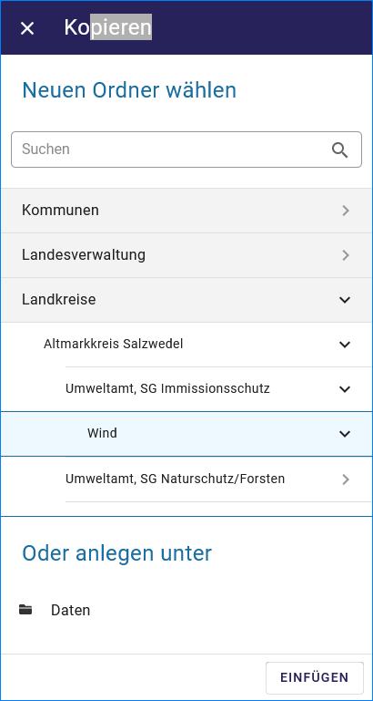

Verfahren oder Adressen bearbeiten
==================================

Verfahren / Adressen löschen
----------------------------
 
Soll ein Verfahren oder eine Adresse komplett gelöscht werden, muss das Verfahren in der Ordnerstruktur angeklickt werden, so dass es blau hinderlegt ist. Anschließend ist das Papierkorbsymbol (Löschen) in der Symbolleiste zu wählen. Es öffnet sich das Fenster "Löschen", darin muss das Löschen bestätigt werden.

.. image:: ../img-ige-ng/bearbeiten/ige-ng_bearbeiten_ordnerstruktur.png
   :width: 400

Abb.: Markiertes Vorhaben in der Ordnerstruktur

Abb.: Symbolleiste - Verfahren/Adressen Löschen

.. image:: ../img-ige-ng/bearbeiten/ige-ng_bearbeiten_datensatz-loeschen.png
   :width: 400

Abb.: Fenster "Löschen" - Mit "LÖSCHEN" bestätigen

Im Strukturbaum können auch mehrere Verfahren bzw. Adressen gleichzeitig selektiert werden. Dazu wird beim Markieren eines Verfahrens per Mausklick zusätzlich die "Strg"-Taste gedrückt. Auf diese Weise sind die Operationen "verschieben", "löschen" und "kopieren" auf mehrere Verfahren gleichzeitig anwendbar. 

**Hinweis:** 
*Eine Adresse kann immer nur dann gelöscht werden, wenn dieser Adresse keine Verfahren mehr zugeordnet sind. Ist die Adresse noch mit Verfahren verknüpft, müssen diese Verfahren unter „Kontaktdaten der verfahrensführenden Behörde“ einer anderen Adresse zugeordnet werden. Die bisherige Adresse muss dann aus der Tabelle gelöscht werden.*

Verfahren / Adressen kopieren und einfügen
------------------------------------------

Ein markiertes Verfahren oder eine markierte Adresse kann mit der Funktion „Kopieren“ in den Zwischenspeicher übernommen werden. Anschließend ist es möglich, die Kopie an einer anderen Stelle oder der gleichen Stelle in der Ordnerhierachie wieder einzufügen. Sinnvoll ist dieses beispielweise, wenn Sie zwei ähnliche Verfahren oder Adressen anlegen wollen. Sie brauchen dann nur ein Verfahren bzw. eine Adresse anzulegen. In der Kopie müssen nur noch die Änderungen eingearbeitet werden. 

Zum Kopieren eines Verfahrens oder einer Adresse markieren Sie das Verfahren / die Adresse und wählen anschließend das Symbol „Kopieren“ aus der Symbolleiste aus. 

Abb.: Symbolleiste - Verfahren/Adressen kopieren

Es öffnet sich das Fenster Kopieren. Hier einen Ordner wählen unter dem der Datensatz eingefügt werden soll, dann den Vorgang mit "EINFÜGEN" abschließen.

Abb.: Symbolleiste - Verfahren/Adressen kopieren

Im Strukturbaum können auch mehrere Verfahren bzw. Adressen gleichzeitig selektiert werden. Dazu wird beim Markieren eines Verfahrens per Mausklick zusätzlich die "Strg"-Taste gedrückt. Auf diese Weise ist die Operation "kopieren" auf mehrere Verfahren gleichzeitig anwendbar. 
 

Abb.: Checkbox - Verfahren/Adressen kopieren

.. image:: ../img-ige-ng/bearbeiten/ige-ng_bearbeiten_alle-auswaehlen.png

Abb.: Checkbox - "Alle" markieren

**Hinweis:**
*Wurde eine Kopie angelegt, muss der Verfahrensname bzw. die Adresse geändert werden. Geschieht dieses nicht, so existieren im Katalog zwei Verfahren / Adressen mit dem gleichen Namen. Dieses sollte unbedingt vermieden werden!* 

Adressangaben in nachgeordnete Adressen übernehmen
--------------------------------------------------

Auf zwei Wegen können Adressangaben einer übergeordneten Adresse in eine nachgeordnete (=untergeordnete) Adresse übertragen werden: 

  a) Im Hierarchiebaum die Adresse auswählen, die in die nachgeordneten Adressen übernommen werden sollen. Über das Kontextmenu (rechter Mausklick) die Option "Neu anlegen" auswählen. Die Adressangabe der gewählten Adresse wird in der neuen nachgeordneten Adresse übernommen.

  b) Im Hierarchiebaum die Adresse auswählen, die in die nachgeordneten Adressen übernommen werden sollen. Über das Kontextmenu (rechter Mausklick) die Option *Adressangaben in nachgeordnete Adressen übernehmen* auswählen. Die Adressangaben der gewählten Adresse werden in alle nachgeordneten Adressen übernommen. 
  
  .. image:: ../img/editor/menü/ige-uvp_ige-kontext-menu_adressen-übernehmen.png
   :width: 150

Abb.: Kontextmenü - Adressangaben in nachgeordnete Adressen übernehmen
  
