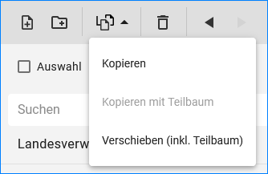

Verfahren oder Adressen bearbeiten
==================================

Verfahren / Adressen löschen
----------------------------
 
Soll ein Verfahren oder eine Adresse komplett gelöscht werden, muss das Verfahren in der Ordnerstruktur angeklickt werden, so dass es blau hinterlegt ist. Anschließend ist das Papierkorbsymbol (Löschen) in der Symbolleiste zu wählen. Es öffnet sich das Fenster "Löschen", darin muss das Löschen bestätigt werden.

Abb.: Markiertes Vorhaben in der Ordnerstruktur

.. image:: ../img-ige-ng/bearbeiten/ige-ng_bearbeiten_symbolleiste.png
   :width: 300

Abb.: Symbolleiste - Verfahren/Adressen Löschen

Abb.: Fenster "Löschen" - Mit "LÖSCHEN" bestätigen

**Hinweis:** 
*Eine Adresse kann immer nur dann gelöscht werden, wenn dieser Adresse keine Vorhaben mehr zugeordnet sind. Ist die Adresse noch mit Vorhaben verknüpft, öffnet sich das Fenster Adresse ersetzen. Darin muss der Button "ADRESSE AUSWÄHLEN" betätigt werden. Es öffnet sich das nächste Fenster  mit der Suche und der Ordnerstruktur der Adressen. Darin kann eine Adresse gewählt werden, mit der die bisherige Adresse ersetzt werden soll. Abschließend muss der Button "ADRESSE ERSETZEN" betätigt werden.*

Abb.: Fenster Adresse ersetzen

Abb.: Fenster Adresse ersetzen mit Ordnerstruktur und Suche

Verfahren / Adressen kopieren und einfügen
------------------------------------------

Ein markiertes Verfahren oder eine markierte Adresse kann mit der Funktion „Kopieren“ in den Zwischenspeicher übernommen werden. Anschließend ist es möglich, die Kopie an einer anderen Stelle oder der gleichen Stelle in der Ordnerhierarchie wieder einzufügen. Sinnvoll ist dieses beispielsweise, wenn Sie zwei ähnliche Verfahren oder Adressen anlegen wollen. Sie brauchen dann nur ein Verfahren bzw. eine Adresse anzulegen. In der Kopie müssen nur noch die Änderungen eingearbeitet werden. 

Zum Kopieren eines Verfahrens oder einer Adresse markieren Sie das Verfahren / die Adresse und wählen anschließend das Symbol „Kopieren“ aus der Symbolleiste aus. 

Abb.: Symbolleiste - Verfahren/Adressen kopieren

Es öffnet sich das Fenster Kopieren. Hier einen Ordner wählen unter dem der Datensatz eingefügt werden soll, dann den Vorgang mit "EINFÜGEN" abschließen.

.. image:: ../img-ige-ng/bearbeiten/ige-ng_bearbeiten_einfuegen.png
   :width: 300

Abb.: Symbolleiste - Verfahren/Adressen einfügen

In der Ordnerstruktur können auch mehrere Verfahren bzw. Adressen gleichzeitig markiert werden. Dafür in die Checkbox "Auswahl" eine Haken setzen oder die "STRG" Taste auf der Tastaturdrücken und einen Ordner oder einen Datensatz anklicken.

Abb.: Verfahren/Adressen - Checkbox Auswahl
 

.. image:: ../img-ige-ng/bearbeiten/ige-ng_bearbeiten_ausgewaehlte-kopieren.png
   :width: 500

Abb.: Checkbox - Verfahren/Adressen kopieren

Abb.: Checkbox - "Alle" markieren

**Hinweis:**
*Wurde eine Kopie angelegt, muss der Verfahrensname bzw. die Adresse geändert werden. Geschieht dieses nicht, so existieren im Katalog zwei Verfahren / Adressen mit dem gleichen Namen. Dieses sollte unbedingt vermieden werden!*

Verfahren / Adressen / Teilbäume verschieben
--------------------------------------------

Markierte Adressen / Verfahren oder ganze Teilbäume können innerhalb der Ordnerstruktur an eine andere Stelle verschoben werden. Dazu die Auswahl aktivieren, die betreffenden Dateien oder den Teilbaum markieren, "Verschieben" in der Symbolleiste wählen. Es öffnet sich das Fenster "Verschieben". Darin den Ordner wählen unter dem die markierten Datensätze eingefügt werden sollen. Abschließend den Button "EINFÜGEN" betätigen.

Abb.: Fenster - Verschieben

