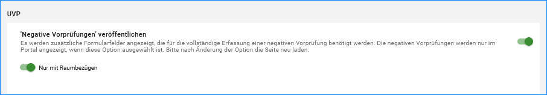
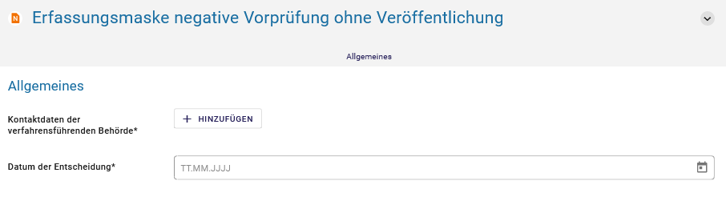
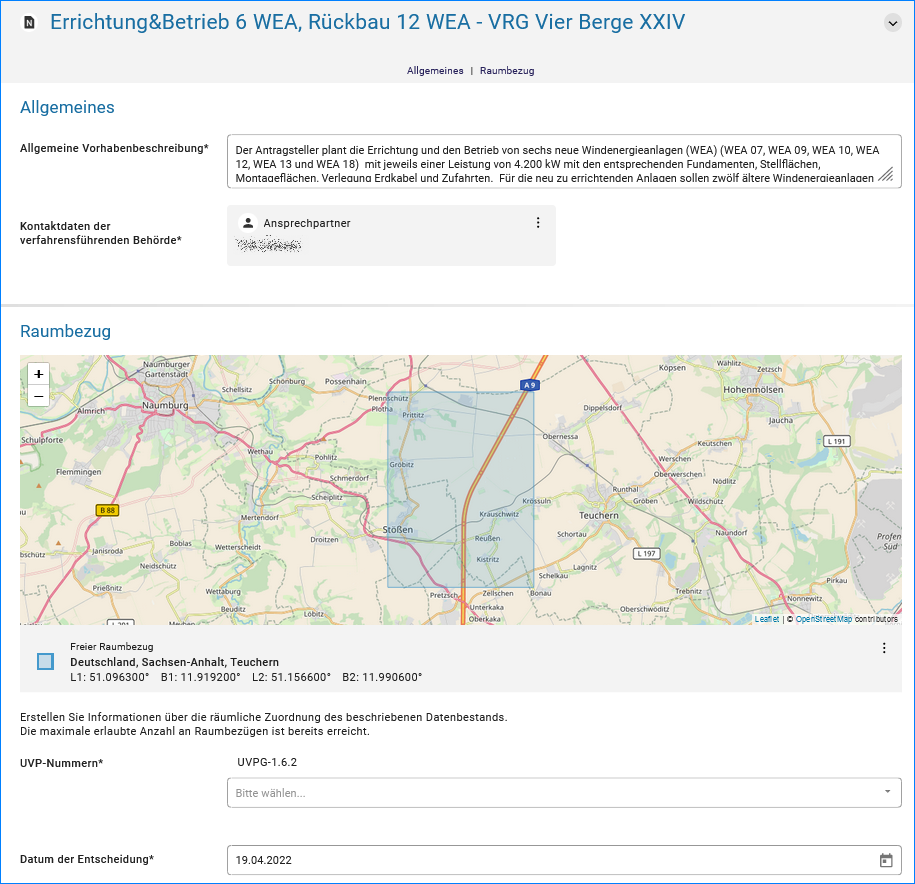

Negative Vorprüfungen erfassen
===============================

In den Katalogeinstellungen der Länder kann festgelegt werden, ob die erfassten negativen Vorprüfungen im Portal verfügbar sein sollen oder nicht. Diese Entscheidung sollte in jedem Bundesland vorab getroffen werden, weil das Erfassungsformular sich je nach Einstellung anpasst.

.. hint:: Katalogeinstellungen: Negative Vorprüfungen veröffentlichen - Es werden zusätzliche Formularfelder angezeigt, die für die vollständige Erfassung einer negativen Vorprüfung benötigt werden. Die negativen Vorprüfungen werden nur im Portal angezeigt, wenn diese Option ausgewählt ist. Nach der Einstellungsänderung muss die Seite neu geladen werden.

Abb.: Katalogeinstellungen für negative Vorprüfungen

**Optionen:**

- negative Vorprüfungen nicht veröffentlichen
- negative Vorprüfungen veröffentlichen - nur mit Raumbezügen
- negative Vorprüfungen veröffentlichen

**Option negative Vorprüfungen veröffentlichen - nur mit Raumbezügen**

Mit der Aktivierung der Veröffentlichung der negativen Vorprüfungen muss zwingend ein Raumbezug mit angegeben werden. Dieser kann genutzt werden, um die Unterscheidung zwischen zuvor erfassten Vorprüfungen (ohne Raumbezüge) und vollständig erfassten Vorprüfungen zu treffen. Wenn die Option "Nur mit Raumbezügen" aktiviert wird, werden nur die neu-erstellten negativen Vorprüfungen, die Raumbezüge enthalten müssen, im Portal angezeigt. Ohne diese aktivierte Option würden auch die zuvor erfassten negativen Vorprüfungen ohne Raumbezüge im Portal angezeigt.

**Erfassungsmasken für die Optionen nicht im Portal veröffentlichen und im Portal veröffentlichen**

   
Abb.: Erfassungsmaske Option negative Vorprüfung ohne Veröffentlichung im Portal

   
Abb.: Erfassungsmaske Option Veröffentlichung von negativen Vorprüfungen

.. hint:: Wenn eine negative Vorprüfung ohne Veröffentlichung für das UVP-Portal erfasst wurde, muss trotzdem ein „Veröffentlichen“ ausgeführt werden! Dabei wechselt die Symbolfarbe im Strukturbaum von orange nach schwarz.

