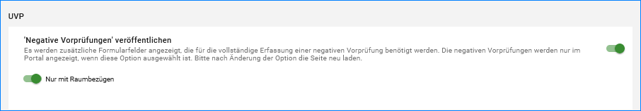
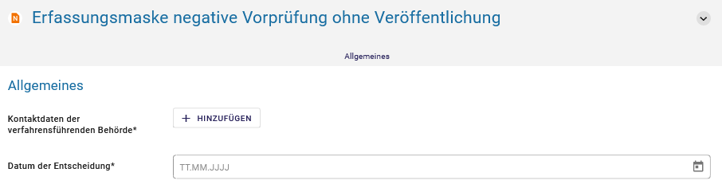
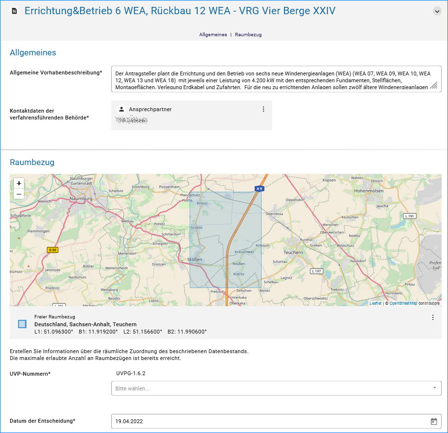
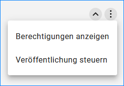
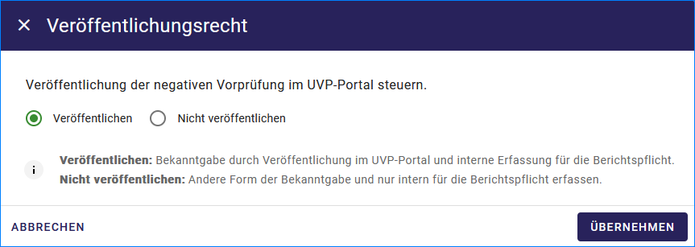

Negative Vorprüfungen erfassen
===============================

In den Katalogeinstellungen der Länder kann festgelegt werden, ob die erfassten negativen Vorprüfungen im Portal verfügbar sein sollen oder nicht. Diese Entscheidung muss in jedem Bundesland vorab getroffen werden, da sich das Erfassungsformular je nach Einstellung anpasst.

.. hint:: Katalogeinstellungen: Negative Vorprüfung veröffentlichen - Es werden zusätzliche Formularfelder angezeigt, die für die vollständige Eingabe einer negativen Vorprüfung erforderlich sind. Negative Vorprüfungsergebnisse werden im Portal nur angezeigt, wenn diese Option ausgewählt ist. Nach Änderung der Einstellungen muss die Seite neu geladen werden.

Abb.: Katalogeinstellungen für negative Vorprüfungen

**Optionen:**

- negative Vorprüfungen nicht veröffentlichen
- negative Vorprüfungen veröffentlichen
- negative Vorprüfungen veröffentlichen - nur mit Raumbezügen
- Veröffentlichung im Portal auf Datensatzebene steuern

**Option negative Vorprüfungen veröffentlichen - nur mit Raumbezügen**

Bei der Aktivierung der Veröffentlichung negativer Vorprüfungen muss zwingend ein Raumbezug angegeben werden. Dieser kann zur Unterscheidung zwischen bereits erfassten Vorprüfungen (ohne Raumbezug) und vollständig erfassten Vorprüfungen verwendet werden. Wird die Option "Nur mit Raumbezug" aktiviert, werden nur neu erstellte negative Vorprüfungen, die einen Raumbezug enthalten müssen, im Portal angezeigt. Ohne diese aktivierte Option werden auch bereits erfasste negative Vorprüfungen ohne Raumbezug im Portal angezeigt.

**Erfassungsmasken für die Optionen nicht im Portal veröffentlichen und im Portal veröffentlichen**

   
Abb.: Erfassungsmaske Option negative Vorprüfung ohne Veröffentlichung im Portal

   
Abb.: Erfassungsmaske Option Veröffentlichung von negativen Vorprüfungen

.. hint:: Wenn eine negative Vorprüfung ohne Veröffentlichung für das UVP-Portal erfasst wurde, muss trotzdem eine „Veröffentlichung“ erfolgen! In diesem Fall wechselt die Symbolfarbe im Gliederungsbaum von orange nach schwarz.

**Steuerung der Veröffentlichung im Portal auf Datensatzebene**

Die erfassende Behörde kann für jede negative Vorprüfung selbst angeben, ob eine negative Vorprüfung veröffentlicht werden soll oder nicht.

   
Abb.: Menü - Veröffdentlichung steuern

   
Abb.: Fenster - Veröffentlichung der negativen Vorprüfungen im UVP-Portal steuern

.. important:: Die Änderung des Merkmals wird erst nach der vollständigen Indexierung des Katalogs wirksam. Eine Einstellung des Parameters beim Anlegen des Datensatzes wird jedoch berücksichtigt.