======================
UVP-Vorhaben erfassen
======================

Verfahrenstypen
---------------

Die Verfahren werden in vier Verfahrenstypen untergliedert:
Zulassungsverfahren, Raumordnungsverfahren + Linienbestimmung, Ausländische Vorhaben, und negative Vorprüfungen.

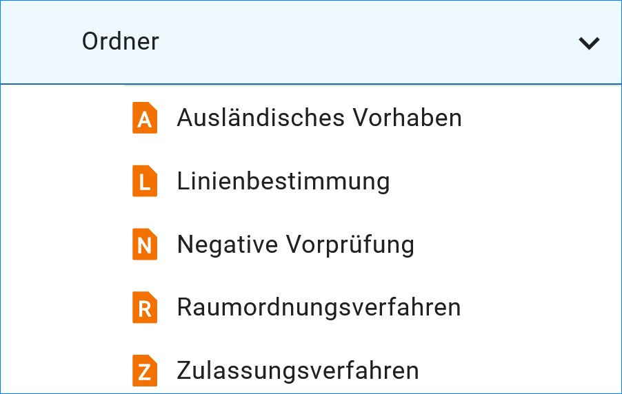


Vorhaben erfassen
-----------------

Soll ein neues Vorhaben angelegt werden, empfiehlt es sich zunächst zu prüfen, ob die Adresse, auf die bei dem neuen Vorhaben verwiesen werden soll, bereits im Adressstrukturbaum erfasst ist. Ist dieses nicht der Fall, sollte zunächst die neue Adresse und anschließend erst das neue Vorhaben angelegt werden. Grund hierfür ist, dass die Adressverweise im Vorhaben nicht frei eingegeben werden können, sondern aus den bereits bestehenden Adresseinträgen ausgewählt werden müssen. Existiert die gewünschte Adresse noch nicht, so ist der betreffende Eintrag nicht auswählbar. Der Bearbeiter muss in diesem Fall das neu angelegte Vorhaben zunächst zwischenspeichern und erst einmal die Adresse anlegen. Diesen Umweg erspart man sich, wenn immer zuerst die Adresse angelegt und anschließend das Vorhaben beschrieben wird.
Die Vorhaben werden in der Ordnerstruktur des UVP-Editors verwaltet. Für eine effiziente Verwaltung der Vorhaben können hierarchische Strukturen mit Hilfe von weiteren Ordnern angelegt werden. 
 
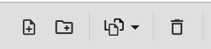

Abb.: Symbolleiste: neues Vorhaben oder neuen Ordner anlegen (+)

Zum Anlegen eines neuen Vorhabens muss zunächst der Ordner ausgewählt werden, unter dem das neue Vorhaben angelegt werden soll. Über die Symbolleiste kann jetzt das Symbol "Neues Vorhaben anlegen" gewählt werden. Es öffnet sich das Fenster "Neues Vorhaben anlegen". Hier den entsprechenden Datensatztyp wählen und einen Titel eingeben. Anschließend den Button "ANLEGEN" betätigen.


Verfahrensschritte
------------------

Abschnitt – Allgemein
``````````````````````

**Titel (Pflichtfeld)**

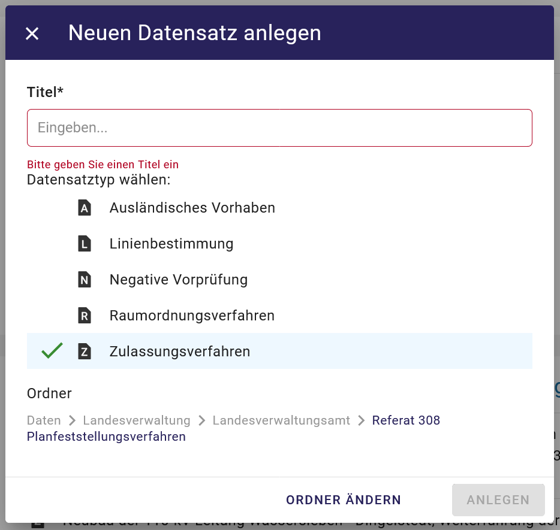

Abb.: Eingabefeld: Titel - Eingabe einer kurzen und prägnanten Bezeichnung des Verfahrens.
 
**Allgemeine Vorhabenbeschreibung (Pflichtfeld)**

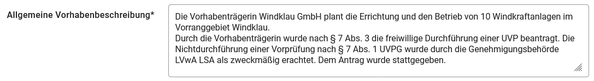

Abb.: Eingabefeld: Allgemeine Vorhabenbeschreibung
 
Im Textfeld Allgemeine Vorhabenbeschreibung soll das Vorhaben beschrieben werden (auf Verständlichkeit für fachfremde Dritte ist zu achten). Die Beschreibung bildet auch auf der Portalseite die Grundinformation, die dauernd und unabhängig vom aktuellen Verfahrensstand abgebildet wird. 

Es bietet sich an, für den Text die entsprechenden Teile aus dem Bekanntmachungstext für die Auslegung zu verwenden. Dies dient auch der Minimierung des Aufwands. Die Information, dass ein Antrag bei … auf Zulassung dieses Vorhabens gestellt wurde und der Hinweis auf die UVP-Pflicht nach … können daraus ebenfalls übernommen werden. Statt der Übernahme von Teilen des Bekanntmachungstextes kommt ggf. auch die Übernahme einer aussagekräftigen Betreffzeile des Bekanntmachungstextes in Betracht.

**Kontaktdaten der verfahrensführenden Dienststelle / Kontakt deutsche Behörde (Pflichtfeld)**

An dieser Stelle sind Personen oder Organisationen anzugeben, die weitergehende Informationen zum aktuellen Vorhaben/Datensatz geben können. Es besteht dabei keine Verpflichtung zur Veröffentlichung von persönlichen Adressen. Die Angabe einer Organisation ist ausreichend.


Abb.: Verknüpfung mit den Kontaktdaten der verfahrensführenden Dienststelle

Über „HINZUFÜGEN“ wird eine Referenz auf eine bereits in der Ordnerstruktur der Adressen erstellten Datensatz hergestellt. Wird der Button "HINZUFÜGEN" betätigt, öffnet sich folgendes Fenster.

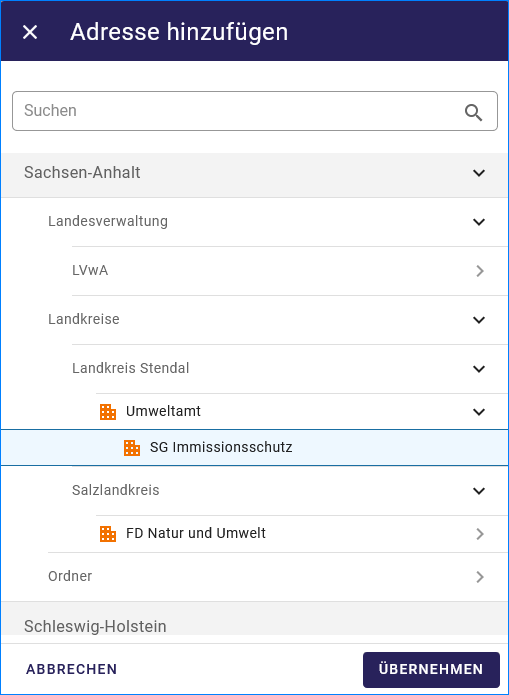

Abb.: Fenster  "Adresse hinzufügen"

Die Adresse kann entweder über eine *Direkte Suche* oder der *Adressstruktur* ausgewählt werden. 

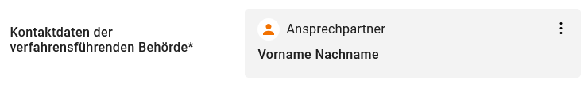
   
Abb.: Feld Adresse: Angabe einer Person


   
Abb.: Feld Adresse: Angabe einer Organisation


**Adressen suchen**

In der Suche kann entweder nach der Organisation, den Nachnamen oder den Vornamen oder einer Kombination aus den Feldern gesucht werden.
Die gefundenen Adressen werden in einer Trefferliste angezeigt. Durch ein einfaches Klicken auf eine Adresse, wird diese markiert und durch ein anschließendes Klicken auf "ÜBRERNEHMEN" in die Kontaktdaten des Vorhabens übernommen.

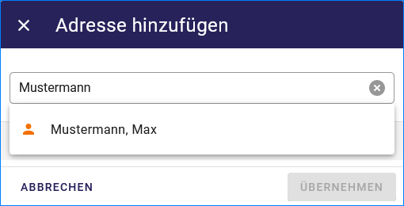

Abb.: Suche in den Adressen

**Adressenstruktur**

In der Adressstruktur kann in der üblichen Weise navigiert werden. Ein einfacher Klick auf eine Adresse markiert diese. Durch ein anschließendes Klicken auf "ÜBERNEHMEN" wird die markierte Referenz auf die Adresse in das Verfahren übernommen. 

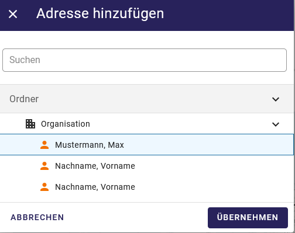

Abb.: Adresse übernehmen

Über das Menü (drei Punkte) kann die Adresse bearbeitet werden oder es kann direkt zu dieser Adresse gesprungen werden.

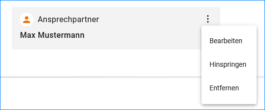

Abb.: Auswahlmenü (drei Punkte)


**Raumbezug hinzufügen**

Im Bereich Allgemein wird die räumliche Ausdehnung des betreffenden Verfahrens angezeigt. Es wird ein Begrenzungsrechteck (BoundingBox) aus geografischen Koordinaten („Min“ und „Max“) angegeben, in dem das Gebiet liegt. 

Raumbezug erstellen - in der Karte auf das blaue Kreuz klicken. Es öffnet sich das Fenster "Raumbezug hinzufügen".

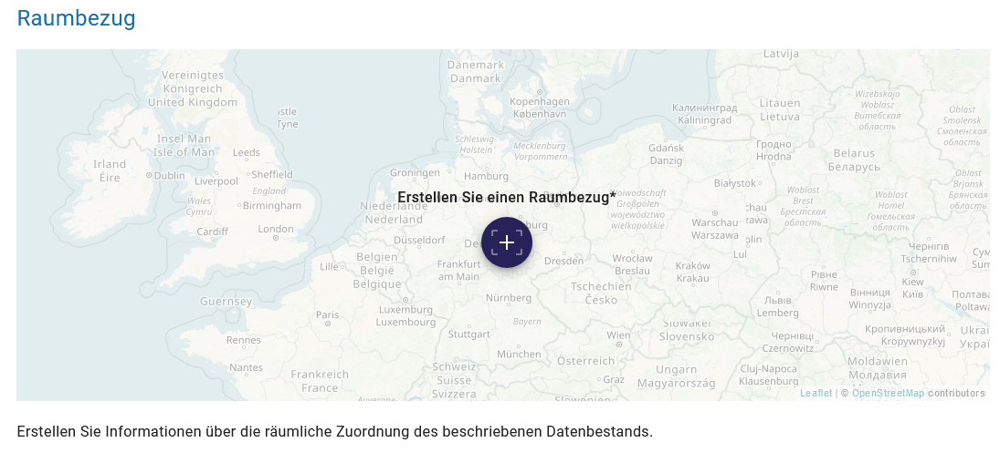

Abb.: Raumbezug hinzufügen

Für die Definition eines geografischen Bereichs, geben Sie in das Feld "Ort" einen Ortsnamen oder einen Naturraum ein. Während der Eingabe werden Vorschläge angezeigt. Durch die Auswahl eines vorgeschlagenen Ortes, wird in der Karte eine BoundingBox für den gewählten Ort oder das Gebiet erzeugt.

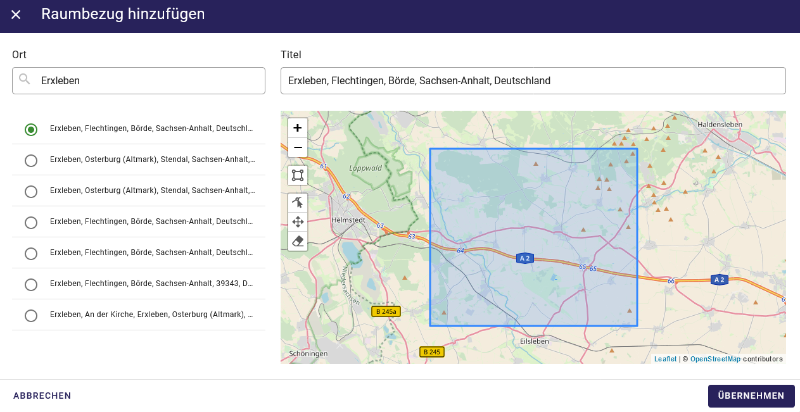

Abb.: Raumbezug nach Orten suchen

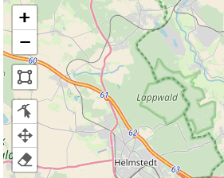

Abb.: Symbole im Kartenviewer

Die Symbole im Kartenviewer haben folgende Bedeutung (von oben nach unten): 

1. Plus - in die Karte Zoomen, 
2. Minus - heraus zoomen, 
3. Rechteck zeichnen - eine BaundingBox aufziehen - Dazu in die Karte klicken und BondingBox über ein Gebiet spannen, 
4. Layer editieren - BoundinBox verändern - mit der Maus auf einen Punkt klicken und das Rechteck verändern, 
5. Layer bewegen - in die BoundingBox klicken und das Rechteck auf der Karte verschieben, 
6. Layer löschen - Symbol anklicken und anschließend das Rechteck in der Karte

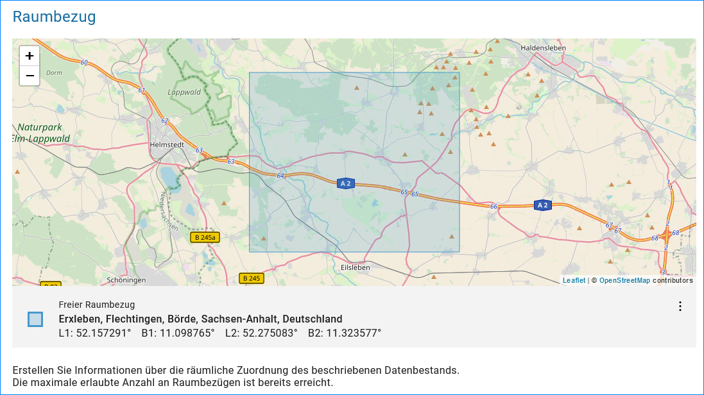

Abb.: Freier Raumbezug und BoundingBox

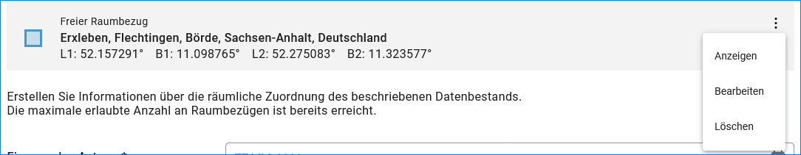

Abb.: Raumbezug bearbeiten

Für das Bearbeiten des Raumbezuges, auf der rechten Seite auf die drei Punkte klicken, dann öffnet sich ein Menü.

**Eingang des Antrags (*neues Feld*)**


Abb.: Auswahlfeld: Eingang des Antrags
 
Angabe des Datums des Antragseingangs. 

**Hinweis:**
*Das Datum wird im Portal nicht veröffentlicht, es dient nur statistischen Zwecken.*

**UVP-Nummer auswählen**

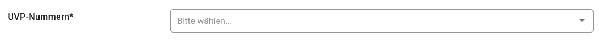


Abb.: Auswahlfeld: UVP-Nummer

.. image:: ../img-ige-ng/vorhaben/ige-ng_felder_uvp-nummern_auswahl.png
 
 
Hier ist die UVP-Nummer auszuwählen, die für das Zulassungsverfahren zutrifft. Beim Klicken in die Zeile erscheint am Ende der Zeile ein Pfeil mit dem die Auswahlliste geöffnet wird. In der Auswahlliste werden die bundesrechtlichen und die für Ihr Land maßgeblichen UVP-Nummern (z.B. Nummer des Vorhabens gemäß § 1 Abs. 1 Nr. 1 UVPG in Verbindung mit Anlage 1) angeboten.

Verweis auf UVPG-Anlage 1: https://www.gesetze-im-internet.de/uvpg/anlage_1.html

**Hinweis:** *Die UVP-Nummern dienen der Einordnung des Zulassungsverfahrens in die Kategorien, nach denen auf der Portalseite gesucht werden kann. Außerdem sind sie wichtig zur Erfüllung der Berichtspflicht nach Artikel 12 der UVP-Richtlinie 2011/92/EU, nach der alle sechs Jahre die bis dahin durchgeführten UVP-Verfahren ausgezählt und der EU-Kommission unter Zuordnung zu den Kategorien mitgeteilt werden müssen. Die Angabe einer UVP Nummer ist daher verpflichtend für alle Verfahren.*

*Es kann lediglich eine UVP-Nummer ausgewählt werden, die in den Listen der UVP-pflichtigen Vorhaben zum UVPG und den jeweiligen Landes-UVP-Gesetzen (in der Regel Anlage 1 zum jeweiligen Gesetz) oder in der UVP-Verordnung Bergbau enthalten und entsprechend auf der Portalseite hinterlegt sind. Sofern für das Vorhaben im Einzelfall keine der zur Verfügung stehenden UVP-Nummern passt, sollte eine UVP-Nummer gewählt werden, der sich das Vorhaben thematisch am ehesten zuordnen lässt.*


**Vorprüfungen durchgeführt**

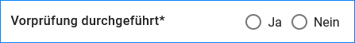

Abb.: Checkbox: Vorprüfung durchgeführt
 
Bei Änderungen/Erweiterungen wie auch bei kumulierenden Vorhaben wurde häufig eine Vorprüfung zur Feststellung der UVP-Pflicht durchgeführt. Hierfür gibt es nicht immer eine genau passende UVP-Nummer (z.B. wenn es nur eine UVP-Nummer für UVP-pflichtige Zulassungsverfahren gibt). Andererseits kann aufgrund § 7 Abs. 3 UVPG eine UVP auch freiwillig durchgeführt werden, wenn eine Vorprüfung vorgesehen ist. Hier lässt die anzugebende UVP-Nummer den Schluss darauf zu, dass eine Vorprüfung durchgeführt wurde, obwohl dies nicht erfolgte. Wegen der Berichtspflicht nach § 73 UVPG werden daher die Zulassungsverfahren, bei denen eine Vorprüfung die UVP-Pflicht ergab, nunmehr durch diese Checkbox erfasst.

Verfahrensschritt hinzufügen
````````````````````````````

Soll einem Vorhaben ein weiterer Verfahrensschritt hinzu gefügt werden, dann muss bis an das untere Ende der Eingabemaske gescrollt werden. In der Fußzeile der Eingabemaske, unter Verfahrensschritte, muss der Button „HINZUFÜGEN“ angeklickt werden. Es öffnet sich ein Menü aus dem der entsprechende Verfahrensschritt gewählt werden kann.
 
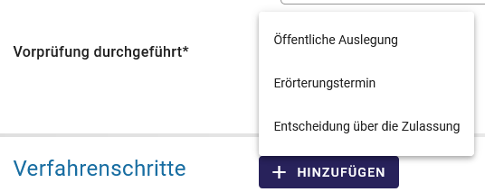

Abb.: Auswahlmenü der Verfahrensschritte

Verfahrensschritt - Öffentliche Auslegung
`````````````````````````````````````````

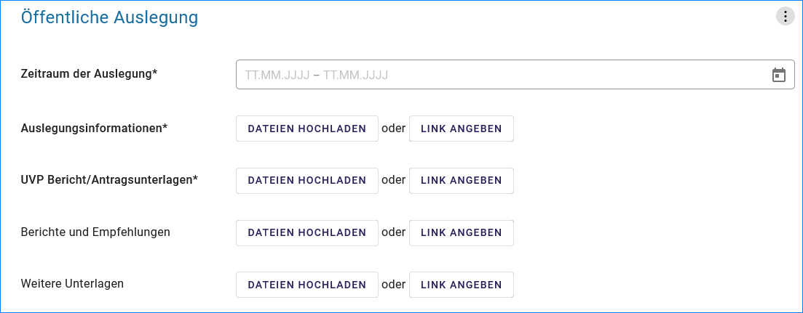

Abb.: Felder in Abschnitt Öffentliche Auslegung

 
**Zeitraum der Auslegung von/bis (Pflichtfeld)**

.. image:: ../img-ige-ng/vorhaben/ige-ng_felder_zeitraum-der-auslegung.png

Abb.: Eintragung des Zeitraums der Auslegung von/bis (Pflichtfeld)

**Wichtig:** 
*Genau in diesen Zeitraum müssen die Unterlagen auch im UVP-Portal zu lesen sein. Die nach dem UVPG auszulegenden Unterlagen können auch danach im UVP-Portal lesbar bleiben. Die Lesbarkeit wird durch die Eingabe des Auslegungszeitraums nicht beeinflusst.*

*Beispiel: von: TT.MM.JJJJ bis: TT.MM.JJJJ*

**Erst mit Beginn des Auslegungszeitraums veröffentlichen**

Wenn diese Checkbox aktiviert ist, werden die Dokumente in der oberen Tabelle erst bei Erreichen des Beginns des Auslegungszeitraums veröffentlicht.

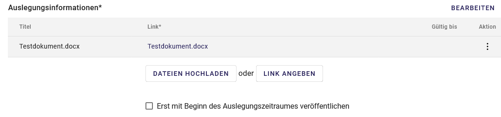

Abb.: Checkbox - Erst mit Beginn des Auslegungszeitraumes veröffentlichen
 
**Hinweis:** *Die Checkbox finden Sie unter jeder Auflistung.*

**Auslegungsinformationen (Pflichtfeld)**


   
Abb.: Auflistung Auslegungsinformationen

Auslegungsinformationen (= Bekanntmachungstext) hochladen oder verlinken. Der Namen des Dokuments sollte erkennen lassen, um was es sich handelt.

In der Spalte „Gültig bis“ kann eingegeben werden, bis zu welchem Tag das hochgeladene/verlinkte Dokument im UVP-Portal lesbar sein soll. Es bleibt auch nach Ablauf der Frist im Editor lesbar und kann ggf. auch wieder veröffentlicht werden. Für die Bekanntmachungstexte und die ausschließlich nach UVPG auszulegenden Unterlagen wird das Ausfüllen dieses Feldes erst am Ende der Darstellung des Zulassungsverfahrens im UVP-Portal in Frage kommen.

Beispiel: 170719 A26O1 Amtl. Anz Auslegung


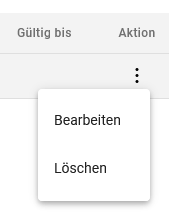

Abb.: Aktion - Gültig bis - Datum eintragen


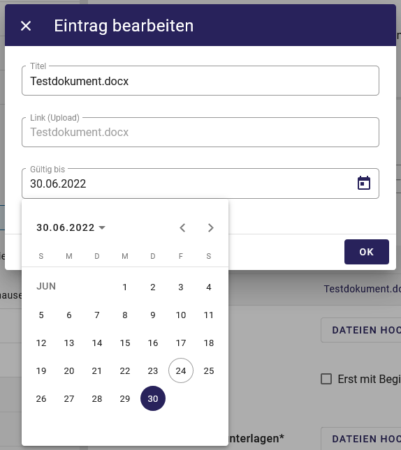

Abb.: Datum wählen


**Funktion "BEARBEITEN"**

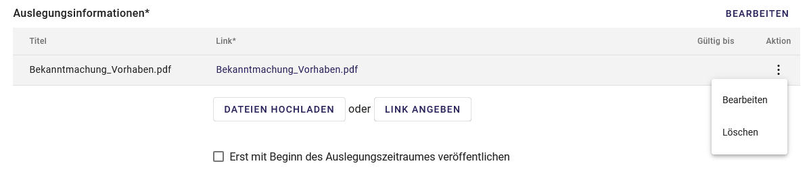

Abb.: Menü Bearbeiten / Aktion

Für das Bearbeiten eines hochgeladenen Dokumentes, auf der rechten Seite auf die drei Punkte klicken, es öffnet sich das Menü, darin Bearbeiten auswählen.


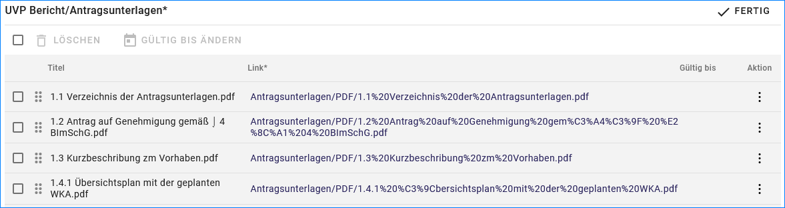

Abb.: Sortierfunktion (sechs Punkte)

Soll die Reihenfolge der hochgeladenen Dokument geändert werden, dann müssen mit der Maus auf der linken Seite die sechs Punkte festgehalten werden. Jetzt kann das Dokument nach oben oder nach unten verschoben werden.


**UVP Bericht / Antragsunterlagen (Pflichtfeld)**

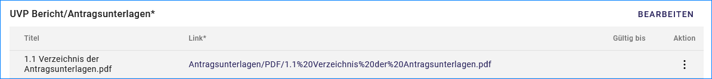

Abb.: Feld - UVP Bericht / Antragsunterlagen
 
UVP-Bericht/Antragsunterlagen hochladen oder verlinken. Die Namen der Dokumente sollten erkennen lassen, um was es sich handelt.

Hier ist der UVP-Bericht nach § 16 UVPG einzustellen. Der Vorhabenträger hat den UVP-Bericht auch elektronisch vorzulegen, § 16 Abs. 9 UVPG. Sollen auf freiwilliger Basis zusätzlich auch die anderen Antragsunterlagen in das UVP-Portal gestellt werden, dann kann das an dieser Stelle erfolgen.

In der Spalte „Gültig bis“ kann im Format TT.MM.JJJJ eingegeben werden, bis zu welchem Tag das hochgeladene oder verlinkte Dokument im UVP-Portal lesbar sein soll. Ein in den UVP-Editor geladenes Dokument bleibt auch nach Ablauf der Frist lesbar und kann ggf. auch wieder veröffentlicht werden. Für die Bekanntmachungstexte und die ausschließlich nach UVPG auszulegenden Unterlagen wird die Ausfüllung dieses Feldes erst am Ende des Zulassungsverfahrens im UVP-Portal in Frage kommen.

**Hochladen und automatisches Entpacken von ZIP Archiven**

Es besteht die Möglichkeit gepackte Dateien in das UVP-Portal zuladen. Dazu muss der Schalter „ZIP-Archive nach dem Übernehmen entpacken“ angeklickt nach rechts geschoben werden.

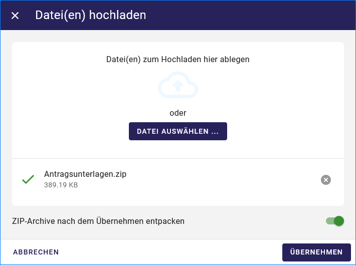

Abb.: Dialog Datei(en) hochladen mit Schalter für das Entpacken von ZIP-Dateien
 
Der Name der ZIP Datei bleibt erhalten, die Ordnerstrukturen bleiben erhalten und werden nach Ordnern und Dateien alphabetisch sortiert übernommen.

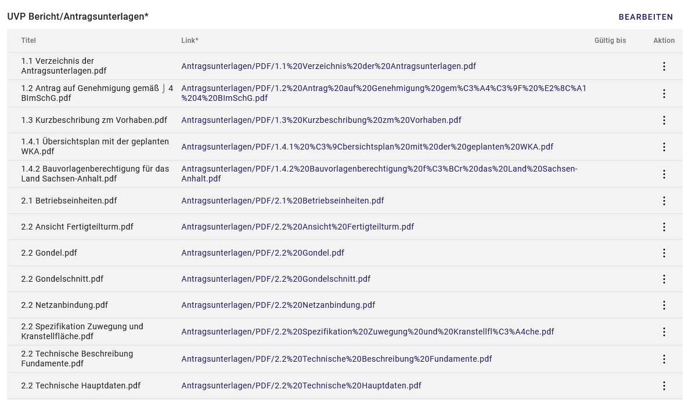

Abb.: Auflistung UVP Bericht/Antragsunterlagen mit entpackten Dateien
 
Im Portal erfolgt die Darstellung hierarchisch, die Struktur innerhalb des ZIP-Archives bleibt erhalten.


**Berichte und Empfehlungen (optionales Feld)**
 
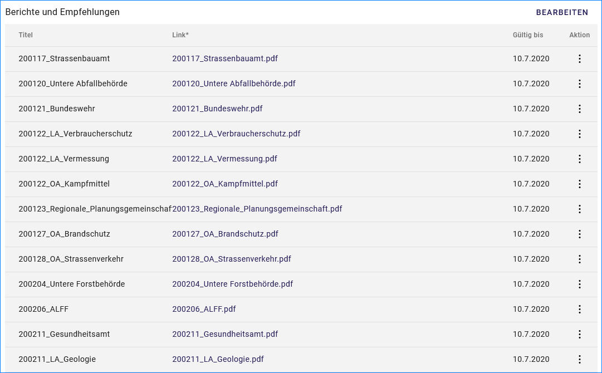

Abb.: Auflistung der Berichte und Empfehlungen

Berichte und Empfehlungen hochladen oder verlinken. Die Namen der Dokumente sollten erkennen lassen, um was es sich handelt.

Wenn zum Zeitpunkt des Beginns des Beteiligungsverfahrens entscheidungserhebliche Berichte und Empfehlungen betreffend das Vorhaben bei der zuständigen Behörde vorgelegen haben, sind diese nach § 19 Abs. 2 Nr. 2 UVPG zur Einsicht für die Öffentlichkeit auszulegen und daher auch in das UVP-Portal einzustellen. Hierbei kann es sich um bereits vorab eingegangene Stellungnahmen der zu beteiligenden Behörden, aber auch von der zuständigen Behörde eingeholte besondere Gutachten zu dem beabsichtigten Vorhaben handeln (so Wagner in: Hoppe/Beckmann, UVPG-Kommentar, § 9 Rdnr. 32). Da solche Unterlagen nicht unbedingt vorliegen, handelt es sich um kein Pflichtfeld.
In der Spalte „Gültig bis“ kann im Format TT.MM.JJJJ eingegeben werden, bis zu welchem Tag das hochgeladene oder verlinkte Dokument im UVP-Portal lesbar sein soll.

Ein in den UVP-Editor geladenes Dokument bleibt auch nach Ablauf der Frist im Editor lesbar und kann ggf. auch wieder veröffentlicht werden. Für die Bekanntmachungstexte und die ausschließlich nach UVPG auszulegenden Unterlagen wird das Ausfüllen dieses Feldes erst am Ende der Darstellung des Zulassungsverfahrens im UVP-Portal in Frage kommen.

Beispiel: 2022-06-29 Zustandsanalyse FFH-Gebiet Oberes Hochtal


**Weitere Unterlagen (optionales Feld)**

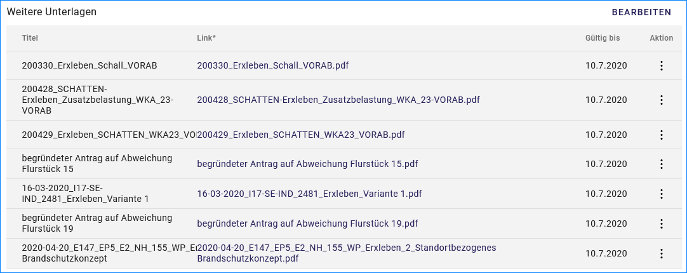

Abb.: Auflistung weiterer Unterlagen
 
Ggf. weitere Unterlagen, auch nach Ende der Auslegung, hochladen oder verlinken. Die Namen der Dokumente sollten erkennen lassen, um was es sich handelt.

Abgesehen von den nach § 19 Abs. 2 UVPG auszulegenden Unterlagen kann es weitere Unterlagen geben, deren Veröffentlichung im UVP-Portal sich anbietet, ohne dass hierzu eine Pflicht besteht. Dies kann z.B. für weitere Informationen im Sinne des § 19 Abs. 3 UVPG, die für die Entscheidung über die Zulässigkeit des Vorhabens von Bedeutung sein können, die der zuständigen Behörde aber erst nach Beginn des Beteiligungsverfahrens vorliegen, gelten. Solche Informationen sind nach den Bestimmungen des Bundes und der Länder über den Zugang zu Umweltinformationen zugänglich zu machen, also nach Antrag auf Zugang zu den Umweltinformationen bei der zuständigen Behörde.

In der Spalte *Gültig bis* kann im Format TT.MM.JJJJ eingegeben werden, bis zu welchem Tag das hochgeladene oder verlinkte Dokument im UVP-Portal lesbar sein soll. Es bleibt auch nach Ablauf der Frist im UVP-Editor lesbar und kann ggf. auch wieder veröffentlicht werden. Für die Bekanntmachungstexte und die ausschließlich nach UVPG auszulegenden Unterlagen wird die Ausfüllung dieses Feldes erst am Ende der Darstellung des Zulassungsverfahrens im UVP-Portal in Frage kommen.


Verfahrensschritt - Erörterungstermin
``````````````````````````````````````

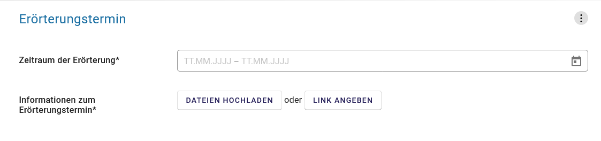

Abb.: Felder im Abschnitt Erörterungstermin


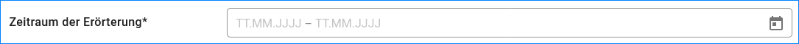

Abb.: Zeitraum der Erörterung


Eintragung des Zeitraums der Erörterung.

Wenn der Erörterungstermin an einem Tag stattfinden wird reicht es aus, das genaue Datum anzugeben. Wird der Erörterungstermin in mehrere Termine aufgeteilt, ist der Zeitraum vom ersten bis zum letzten Termin einzugeben. Eine Listung einzelner Termine ist nicht möglich. Diese Information wird sich aber aus dem Bekanntmachungstext bzw. den Informationen zum Erörterungstermin ergeben, auf die der Nutzer bzw. die Nutzerin des UVP-Portals durch einen Hinweis verwiesen wird.

Beispiel: Am/vom: TT.MM.JJJJ bis: TT.MM.JJJJ


**Information zum Erörterungstermin (Pflichtfeld)**


Abb.: Auflistung Informationen zum Erörterungstermin
 
Informationen zum Erörterungstermin hochladen oder verlinken. Die Namen der Dokumente sollten erkennen lassen, um was es sich handelt.

In der Spalte „Gültig bis“ kann im Format TT.MM.JJJJ eingegeben werden, bis zu welchem Tag das hochgeladene oder verlinkte Dokument im UVP-Portal lesbar sein soll. Es bleibt auch nach Ablauf der Frist im UVP-Editor lesbar und kann ggf. auch wieder veröffentlicht werden. Für die Bekanntmachungstexte und die ausschließlich nach UVPG auszulegenden Unterlagen wird das Ausfüllen dieses Feldes erst am Ende der Darstellung des Zulassungsverfahrens im UVP-Portal in Frage kommen.

Beispiel: 170815_Bekanntmachung_EÖT_WKA-Erxleben


Verfahrensschritt - Entscheidung über die Zulassung
````````````````````````````````````````````````````

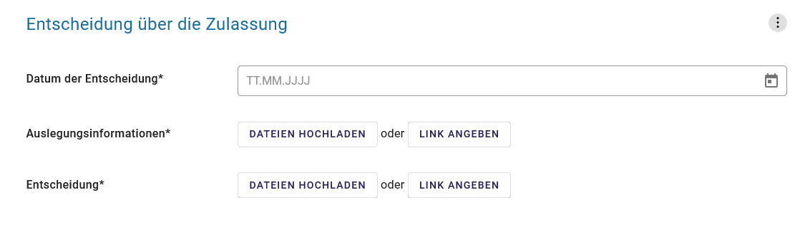

Abb.: Felder im Abschnitt Entscheidung über die Zulassung


Datum der Entscheidung (Pflichtfeld)

.. image:: ../img-ige-ng/vorhaben/ige-ng_felder_datum-der-entscheidung.png

Abb.: Feld Datum der Entscheidung
 
In dieses Feld wird das Datum der Entscheidung eingetragen.

Beispiel: 25.05.2021


**Auslegungsinformationen (Pflichtfeld)**


Abb.: Auflistungen Auslegungsinformationen
 
Auslegungsinformationen (= Bekanntmachungstext) hochladen oder verlinken. Der Namen des Dokuments sollte erkennen lassen, um was es sich handelt.

In der Spalte „Gültig bis“ kann im Format TT.MM.JJJJ eingegeben werden, bis zu welchem Tag das hochgeladene oder verlinkte Dokument im UVP-Portal lesbar sein soll. Es bleibt auch nach Ablauf der Frist im UVP-Editor lesbar und kann ggf. auch wieder veröffentlicht werden. Für die Bekanntmachungstexte und die ausschließlich nach UVPG auszulegenden Unterlagen wird die Ausfüllung dieses Feldes erst am Ende der Darstellung des Zulassungsverfahrens im UVP-Portal in Frage kommen.

Beispiel: 2021-05-25_Bekanntmachung_Entscheidung

**Entscheidung (Pflichtfeld)**


Abb.: Tabelle Entscheidung

 
Entscheidung über die Zulassung, ggf. mit Anlagen hochladen/verlinken. Die Namen der Dokumente sollten erkennen lassen, um was es sich handelt.

In der Spalte „Gültig bis“ kann im Format TT.MM.JJJJ eingegeben werden, bis zu welchem Tag (diesen eingeschlossen) das hochgeladene/verlinkte Dokument im UVP-Portal lesbar sein soll. Es bleibt auch nach Ablauf der Frist im Editor lesbar und kann ggf. auch wieder veröffentlicht werden. Für die Bekanntmachungstexte und die ausschließlich nach UVPG auszulegenden Unterlagen wird die Ausfüllung dieses Feldes erst am Ende der Darstellung des Zulassungsverfahrens im UVP-Portal in Frage kommen.

Beispiel: 2021-05-25_Bekanntmachung-Entscheidung_WKA-Erxleben


Dateien hochladen & Verfahrensschritt löschen
````````````````````````````````````````````

**Dateien hochladen**
Über den Button "Dateien Hochladen" können Dokumente zum beschreibenden Verfahren hochgeladen werden.
 


Abb.: Auflistung Auslegungsinformationen

Durch das Betätigen des Buttons "DATEIEN HOCHLADEN", öffnet sich das Fenster mit der Bezeichnung "Datei(en) hochladen". Darin den Button "DATEI AUSWÄHLEN ..." betätigen. Es werden die Dateien des eigene PC angezeigt. Hier die entsprechenden Dateien markieren und unten rechts den Button "Öffnen" betätigen. Die Dateien werden in das System geladen und im Fenster "Datei(en) hochladen" angezeigt. Wenn das Hochladen ohne Fehler funktioniert hat, bekommen die Dateibezeichnungen im Fenster einen grünen Haken. Durch Betätigung des Buttons "ÜBERNEHMEN" übertragen Sie anschließend die hochgeladenen Dokumente in die Liste.

Neben den Hochladen von einzelnen Dokumenten, besteht auch die Möglichkeit alle Dokumente als Zip-Datei in den Editor zu laden. Dazu muss vor dem Hochladen im Fenster "Datei(en) hochladen" der Schalter "ZIP-Archive nach dem Übernehmen entpacken" angeklickt werden, so dass er sich nach rechts bewegt und grün erscheint. Jetzt können die ZIP-Archive in den Editor geladen werden. Sie entpacken sich selbständig.

Wurden die Dateien schon einmal hochgeladen, zeigt der Editor verschiedene Optionen an, wie weiter verfahren werden kann.

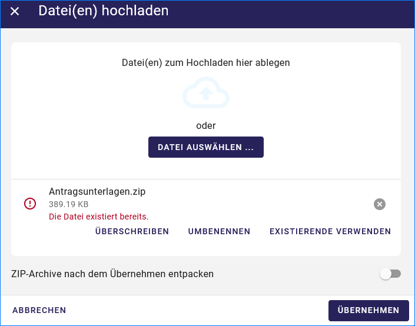

Abb.: Meldung: Die Datei existiert bereits. Optionen: ÜBERSCHREIBEN, UMBENENNEN oder EXISTIERENDE VERWENDEN


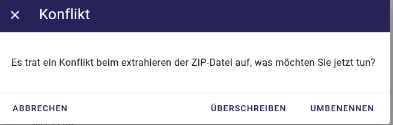

Abb.: Dialogfenster Konflikt: Es trat ein Konflikt beim extrahieren der ZIP-Datei auf, was möchten Sie tun? Optionen: ÜBERSCHREIBEN oder UMBENENNEN


**Link angeben**

Statt Dokumente in den UVP-Editor zu laden, besteht die Möglichkeit eine Verlinkung auf eine externe Internetseite, auf der die Dokumente bereitgestellt werden, anzulegen.
Durch die Betätigung der Buttons "LINK ANGEBEN", öffnet sich ein Fenster mit dieser Bezeichnung. Hier kann ein beschreibender Titel eingetragen werden und es muss die URL zu der entsprechenden Download-Seite angegeben werden. Durch das Betätigen des Buttons "ÜBERNEHMEN", wird die Verlinkung in das angelegte Verfahren übernommen.

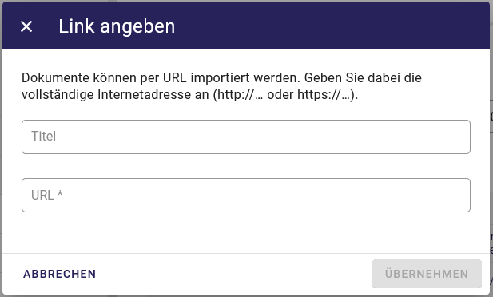

Abb.: Dialogfenster Link angeben


In der Zeile des Eintrages erscheinen rechts drei Punkte, werden diese betätigt, erscheinen die Optionen "Bearbeiten" und "Löschen". Wird hier bearbeiten gewählt, öffnet sich das Fenster "Eintrag bearbeiten". Darin kann der Titel und die Verlinkung bearbeitet werden und es kann ein Gültigkeitsdatum für die Verlinkung gewählt werden.

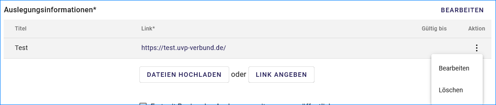

Abb.: Verlinkung bearbeiten


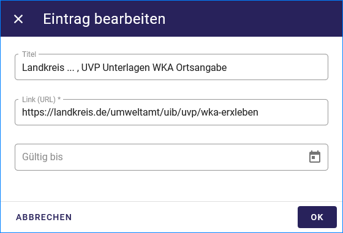

Abb.: Dialogfenster Eintrag bearbeiten

**Hinweis:**
**Grundsätzlich ist das Hochladen eines Dokumentes gegenüber der Verlinkung zu Seiten der jeweiligen Dienststellen vorzuziehen, da die Verlinkung fehleranfällig ist. Jede Änderung des Pfades führt zur Nichterreichbarkeit des Dokuments. In diesem Fall ist das entsprechende Dokument nicht im UVP-Portal veröffentlicht. Es ist davon auszugehen, dass dies von den Gerichten als zumindest relativer Verfahrensfehler gewertet werden wird. Außerdem erhöht sich der Pflegeaufwand des UVP-Portals, wenn wegen fehlerhafter Links die Kontakt-Adresse (technische oder juristische Ansprechperson) angesprochen wird.**

**Verfahrensschritt löschen**
Soll ein Verfahrensschritt gelöscht werden, so müssen die drei Punkte (auf der rechten Seite neben der Überschrift des Verfahrensschrittes) betätigt werden, dann öffnet sich die Option Löschen. 

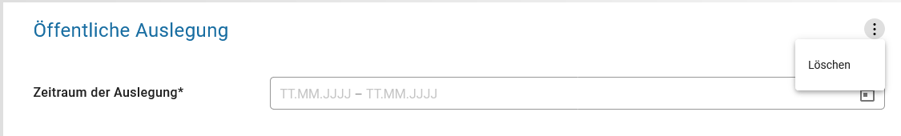

Abb.: Option Verfahrensschritt löschen


